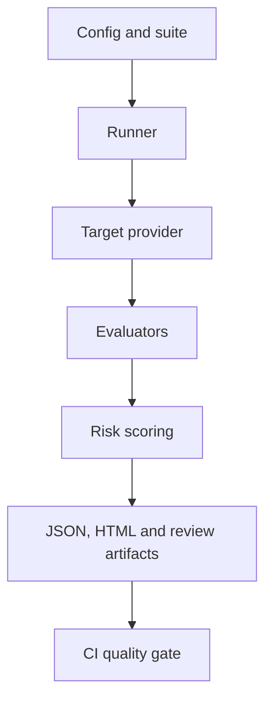

# Architecture

`llm-eval-kit` is a CLI-first, file-based quality engineering framework. A run loads a versioned project configuration and evaluation suite, selects cases, calls one target provider, executes configured evaluators, applies risk-aware scoring, and writes immutable evidence.

## Package boundaries

| Package      | Responsibility                                                        |
| ------------ | --------------------------------------------------------------------- |
| `apps/cli`   | Commands, stable exit codes and dependency composition                |
| `core`       | Domain contracts, filtering, concurrency, retry and run orchestration |
| `config`     | Versioned JSON/YAML validation                                        |
| `providers`  | Mock, OpenAI and Gemini adapters with injectable HTTP transport       |
| `evaluators` | Deterministic checks, JSON Schema and LLM-as-a-Judge                  |
| `scoring`    | Case aggregation, severity rules and quality gates                    |
| `artifacts`  | Atomic run and explicitly promoted baseline persistence               |
| `reporters`  | Terminal, JSON, human-review and self-contained HTML output           |

## Trust boundaries

Provider text, judge output, datasets and referenced schemas are untrusted input. Schema references cannot escape the suite directory, HTML is escaped, secrets are centrally redacted, and raw responses are omitted by default. An `ERROR` is operational uncertainty and is never converted to a quality `FAIL`. A baseline is never promoted automatically.

## Reproducibility

Artifacts include schema versions, definition hashes, config/suite hashes, resolved provider/model identity, timestamps and per-case evidence. Baseline comparisons exclude added, removed or definition-changed cases from regression math.
