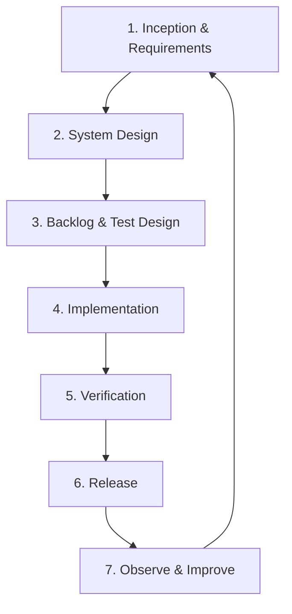

# AIDLC Phase 1 — Inception & Requirements

> **Project:** LLM Evaluation Framework  
> **Phase status:** Approved  
> **Date:** 2026-09-14  
> **Approved:** 2026-09-14 by project owner  
> **Input:** `LLM_Evaluation_Framework_Prototype.md`

## 1. AIDLC được áp dụng cho dự án này

Trong dự án này, AIDLC được hiểu là **AI-Driven Development Life Cycle**: dùng AI để tăng tốc phân tích, thiết kế, coding và kiểm thử, nhưng mọi phase đều có source of truth, quality gate và human approval.



| Phase | Deliverable chính | Gate để đi tiếp |
|---|---|---|
| 1. Inception & Requirements | Prototype baseline, requirements, acceptance criteria, risks | Scope được duyệt |
| 2. System Design | Architecture, module contracts, schemas, ADRs, threat model | Design review pass |
| 3. Backlog & Test Design | Epics, stories, tasks, test strategy, traceability | Definition of Ready pass |
| 4. Implementation | Source code theo vertical slices | CI checks pass trên từng slice |
| 5. Verification | Functional, contract, reliability, security và dogfooding results | Release criteria pass |
| 6. Release | Versioned package, Docker image, docs, demo | Reproducible release |
| 7. Observe & Improve | Usage/quality findings, defects, roadmap | Feedback thành backlog có ưu tiên |

## 2. Problem statement

Các thay đổi prompt, model và context có thể làm chất lượng AI giảm mà unit/API test truyền thống không phát hiện được. Manual evaluation chậm, khó lặp lại và không đủ dữ liệu để so sánh quality–cost–latency. Dự án cần cung cấp một regression framework chạy được local và CI, đưa ra verdict có bằng chứng và chặn thay đổi rủi ro.

## 3. Product goal và non-goals

### Goal của MVP

Trong một command, người dùng có thể chạy một evaluation suite, nhận report có thể điều tra, so sánh với baseline và nhận exit code phù hợp cho CI.

### Non-goals

- Không xây một nền tảng SaaS trong MVP.
- Không huấn luyện hoặc fine-tune model.
- Không thay thế hoàn toàn human review.
- Không hứa “phát hiện hallucination tuyệt đối”.
- Không dùng điểm tổng trung bình để đại diện cho toàn bộ business risk.

## 4. Giả định đã chốt để bắt đầu

| ID | Giả định / quyết định | Lý do |
|---|---|---|
| A-01 | TypeScript/Node.js là stack chính | Tận dụng thế mạnh QA automation hiện tại và phù hợp CLI/CI |
| A-02 | CLI-first, dashboard sau | Chứng minh evaluation engine trước UI |
| A-03 | File-based trong MVP | Giảm dependency và làm CI reproducible |
| A-04 | OpenAI + Gemini + mock provider | Có multi-provider nhưng vẫn chạy demo miễn phí |
| A-05 | Deterministic evaluator có precedence | Business rule rõ ràng cần kết quả ổn định |
| A-06 | LLM judge chỉ dùng cho tiêu chí semantic | Không lạm dụng model để chấm rule đơn giản |
| A-07 | Critical failure luôn block | Bảo toàn tư duy risk-based testing |

## 5. Functional requirements

| ID | Requirement | Priority | Acceptance summary |
|---|---|---|---|
| FR-001 | Load config và suite từ file | Must | File hợp lệ được load; file sai trả lỗi có path và field |
| FR-002 | Validate dataset trước khi gọi provider | Must | Dataset invalid không phát sinh API cost |
| FR-003 | Chạy một hoặc nhiều test case | Must | Có filter theo ID/category/severity |
| FR-004 | Hỗ trợ OpenAI provider | Must | Chuẩn hóa response, usage, latency và error |
| FR-005 | Hỗ trợ Gemini provider | Must | Cùng provider contract với OpenAI |
| FR-006 | Hỗ trợ mock provider | Must | Full sample suite chạy offline, deterministic |
| FR-007 | Exact/contains/forbidden/regex evaluators | Must | Trả score, verdict, reason và evidence |
| FR-008 | JSON Schema evaluator | Must | Chỉ rõ schema violations |
| FR-009 | LLM-as-a-Judge evaluator | Must | Structured judge output được validate; malformed output được xử lý |
| FR-010 | Aggregate result theo test/category/run | Must | Không che critical failure bằng average |
| FR-011 | Gán severity cho test case | Must | Hỗ trợ LOW/MEDIUM/HIGH/CRITICAL |
| FR-012 | Lưu run metadata | Must | Có config hash, prompt ID/version, provider/model và timestamp |
| FR-013 | Thu latency, token và estimated cost | Must | Report phân biệt unavailable với zero |
| FR-014 | Sinh terminal report | Must | Summary ngắn và liệt kê failures/actionable reasons |
| FR-015 | Sinh machine-readable JSON report | Must | Schema versioned và parse được |
| FR-016 | Sinh static HTML report | Should | Mở local không cần server |
| FR-017 | So sánh candidate với baseline | Must | Hiển thị delta ở overall và category |
| FR-018 | Áp dụng quality gate | Must | Trả exit code non-zero khi gate fail |
| FR-019 | Retry transient provider errors | Should | Retry theo policy; không retry assertion failure |
| FR-020 | Redact secrets khỏi output | Must | API keys không xuất hiện trong logs/reports |
| FR-021 | Export low-confidence cases | Should | Tạo danh sách để human review, chưa cần UI |
| FR-022 | Lưu current run làm baseline | Should | Chỉ lưu khi command rõ ràng và file target hợp lệ |

## 6. Non-functional requirements

| ID | Requirement | Target |
|---|---|---|
| NFR-001 | Reproducibility | Mock suite cho cùng kết quả ở mọi lần chạy |
| NFR-002 | Testability | Core logic coverage ≥ 80% |
| NFR-003 | Performance | Overhead nội bộ p95 ≤ 100 ms/test, không tính provider latency |
| NFR-004 | Scalability MVP | Chạy ổn định suite 500 cases với concurrency cấu hình được |
| NFR-005 | Reliability | Không mất partial results khi một case/provider call fail |
| NFR-006 | Security | Secrets qua env; redact logs; dependency scan trong CI |
| NFR-007 | Maintainability | Provider và evaluator tuân theo plugin contracts |
| NFR-008 | Portability | Chạy được trên macOS, Linux và GitHub Actions |
| NFR-009 | Observability | Mỗi run/test/provider call có correlation IDs |
| NFR-010 | Cost control | Có max cases/concurrency và optional cost budget |

## 7. Evaluation contract

Mỗi evaluator phải trả về một contract thống nhất:

```ts
type EvaluationResult = {
  evaluatorId: string;
  verdict: "PASS" | "FAIL" | "WARNING" | "ERROR";
  score?: number;        // 0..1; optional với evaluator nhị phân
  confidence?: number;   // 0..1; chỉ khi evaluator có confidence
  reason: string;
  evidence?: unknown;
  metadata?: Record<string, unknown>;
};
```

Quy tắc:

- `reason` bắt buộc và phải phục vụ điều tra.
- `score` và `confidence` không được đánh đồng.
- Output của LLM judge phải qua schema validation trước khi được tin cậy.
- Judge error không tự động biến thành test failure; nó tạo `ERROR`, sau đó run policy quyết định block.
- Raw response nhạy cảm phải có tùy chọn không lưu hoặc redact.

## 8. Acceptance criteria cấp MVP

MVP được xem là hoàn thành khi toàn bộ điều kiện sau đạt:

1. Một developer clone repo và chạy sample suite với mock provider trong tối đa 10 phút theo README.
2. Sample suite có ít nhất 50 cases thuộc tối thiểu 5 categories.
3. Ít nhất 5 evaluator types hoạt động và có automated tests.
4. OpenAI và Gemini adapters tuân theo cùng contract.
5. Một run tạo terminal, JSON và HTML reports nhất quán.
6. Candidate prompt cố ý sai chính sách 30 ngày bị phát hiện ở scenario `REFUND_001`.
7. Critical failure làm CLI trả exit code non-zero.
8. Baseline comparison chỉ rõ metric/category bị regression.
9. GitHub Actions demo có một case pass và một case bị quality gate block.
10. Không có secret trong source, logs, reports hoặc CI artifacts.
11. Core logic coverage đạt ít nhất 80%.
12. README giải thích architecture, quick start, sample result, limitation và ROI.

## 9. Epics sơ bộ

| Epic | Mục tiêu | Trạng thái |
|---|---|---|
| E1 — Project Foundation | Monorepo, types, config, error model, CI cơ bản | Ready for design |
| E2 — Dataset & Runner | Load/validate/filter/execute test cases | Ready for design |
| E3 — Provider Layer | Mock, OpenAI và Gemini adapters | Ready for design |
| E4 — Evaluator Engine | Deterministic và LLM judge evaluators | Ready for design |
| E5 — Scoring & Quality Gate | Verdict, severity, thresholds, exit codes | Ready for design |
| E6 — Baseline & Regression | Candidate/baseline comparison | Ready for design |
| E7 — Reporting | Terminal, JSON, HTML | Ready for design |
| E8 — Portfolio Demo | Sample dataset, CI failure demo, docs | Ready for design |

## 10. Rủi ro và biện pháp kiểm soát

| Risk | Impact | Mitigation |
|---|---|---|
| LLM judge không ổn định | False pass/fail | Temperature thấp, structured output, repeated calibration, confidence threshold |
| Judge cùng họ model với model-under-test | Bias | Cho phép judge provider/model độc lập; ghi rõ metadata |
| API cost vượt dự kiến | Tốn tiền | Mock mặc định, dry-run, case filter, concurrency và budget cap |
| Rate limit/network làm sai kết quả | Run flaky | Retry transient errors, error classification, partial result persistence |
| Dataset quá “đẹp” | Demo không phản ánh thực tế | Thêm adversarial, ambiguous, boundary và policy-conflict cases |
| Average score che lỗi nặng | Release sai | Severity gate và category regression gate |
| Prompt/API key bị lộ | Security incident | Env-only secrets, redaction, secret scanning |
| Scope trượt sang SaaS/dashboard | Trễ MVP | CLI-first và out-of-scope gate |

## 11. Human-in-the-loop checkpoints

AI có thể hỗ trợ sinh tài liệu, code và test data, nhưng cần human review tại các điểm:

- phê duyệt product scope và business-critical categories;
- phê duyệt evaluation rubric và expected behavior;
- review các judge disagreement/low-confidence cases;
- review architecture/security decisions;
- chấp nhận baseline mới;
- phê duyệt release.

## 12. Source-of-truth hierarchy

Khi tài liệu mâu thuẫn, ưu tiên theo thứ tự:

1. Approved decision records (ADR/product decision).
2. Approved requirements và acceptance criteria.
3. System design và contracts.
4. Test specifications.
5. Tasks/backlog.
6. Source code và generated documentation phải trace về các mục trên.

AI-generated output không tự động trở thành source of truth cho đến khi được review và commit.

## 13. Definition of Ready cho Phase 2 — System Design

Phase 2 có thể bắt đầu khi:

- prototype baseline được chấp nhận;
- danh sách `Must` requirements không còn điểm mơ hồ ảnh hưởng kiến trúc;
- quality gate mặc định được chấp nhận hoặc có threshold thay thế;
- hai provider mục tiêu được xác nhận;
- quyết định file-based/CLI-first được giữ nguyên;
- demo scenario và MVP acceptance criteria được chấp nhận.

## 14. Các quyết định đã được duyệt

| Decision | Đề xuất mặc định | Ảnh hưởng nếu đổi |
|---|---|---|
| License | MIT | Ảnh hưởng khả năng dùng lại project |
| Repo visibility | Public | Portfolio cần recruiter xem được |
| Package name | `llm-eval-kit` | Ảnh hưởng CLI và npm namespace |
| First domain dataset | E-commerce customer support | Quyết định business rules và demo story |
| Default quality gate | Critical fail = block; pass rate ≥ 90%; category regression ≤ 3pp | Ảnh hưởng độ nghiêm ngặt CI |
| Provider priority | Mock → OpenAI → Gemini | Ảnh hưởng thứ tự implementation |

## 15. Output của Phase 1

- Prototype specification: baseline v0.1 đã được duyệt.
- Product goal/non-goals: đã xác định.
- Functional và non-functional requirements: đã tạo ID để trace.
- Evaluation contract: đã phác thảo.
- MVP acceptance criteria: đã định nghĩa.
- Risk register: đã khởi tạo.
- Epics sơ bộ: đã tạo.
- Decision gate: đã được project owner phê duyệt ngày 2026-09-14.

## 16. Bước tiếp theo sau khi duyệt

Phase 2 sẽ tạo:

1. system context và container architecture;
2. module/package structure;
3. domain model và versioned schemas;
4. provider/evaluator plugin interfaces;
5. run lifecycle, concurrency, retry và error handling;
6. scoring/regression algorithm;
7. threat model và secret-handling design;
8. Architecture Decision Records;
9. traceability matrix từ requirements đến design components.

---

**Phase gate:** `PASSED`  
Phase 2 — System Design được phép bắt đầu. Implementation chỉ bắt đầu sau khi Phase 2 và Phase 3 hoàn tất.
