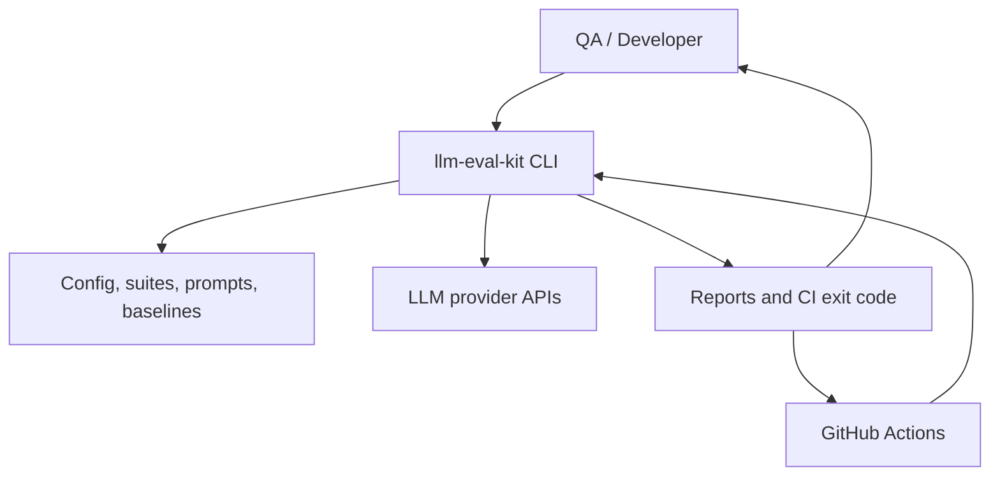
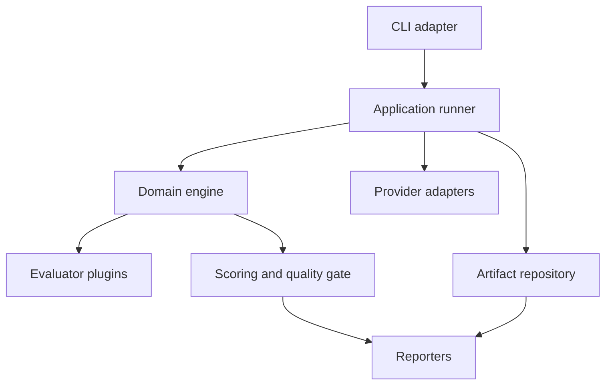
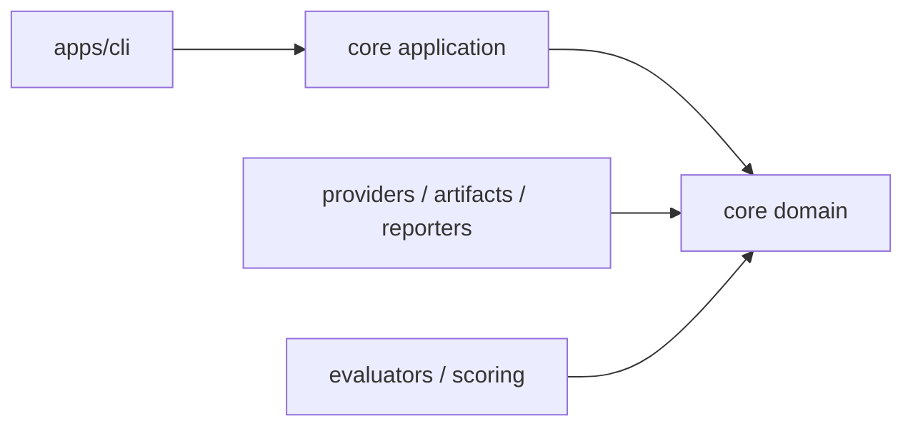
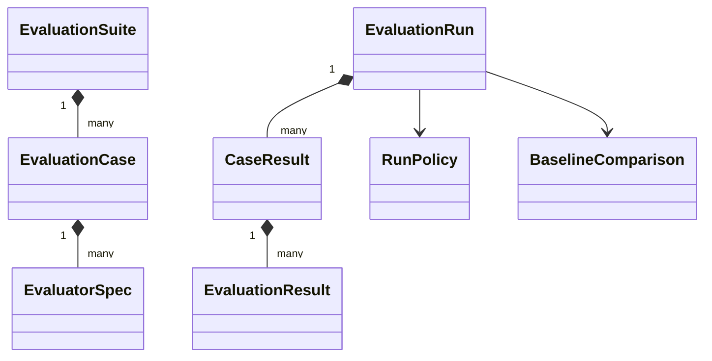
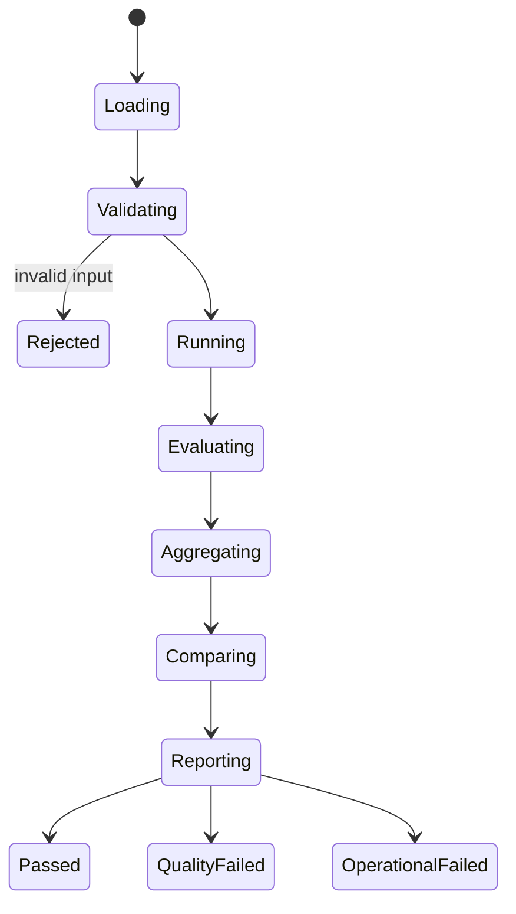
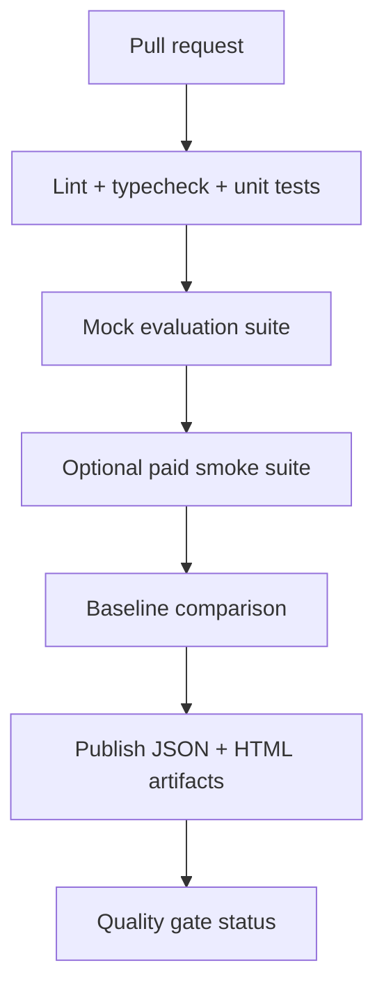

# AIDLC Phase 2 — System Design

> **Project:** LLM Evaluation Framework (`llm-eval-kit`)  
> **Phase status:** Approved  
> **Date:** 2026-09-14  
> **Approved:** 2026-09-15 by project owner  
> **Approved input:** `AIDLC_01_Inception_and_Requirements.md`  
> **Architecture style:** Modular CLI application with plugin-style contracts

## 1. Design objective

Thiết kế một evaluation engine có thể:

- chạy local và CI mà không cần server hoặc database;
- thay provider/evaluator mà không sửa orchestration core;
- ưu tiên kết quả deterministic cho business rules;
- bảo toàn partial results khi provider hoặc evaluator lỗi;
- tạo report reproducible, có thể so sánh với baseline;
- chặn deployment theo risk, không chỉ theo điểm trung bình;
- mở đường cho dashboard/SaaS sau MVP mà không làm nặng MVP.

## 2. Architectural drivers

| Driver | Requirement liên quan | Design response |
|---|---|---|
| Reproducible evaluation | FR-012, NFR-001 | Versioned schemas, config/suite/prompt hashes, immutable run artifacts |
| Multi-provider | FR-004–006 | `LlmProvider` contract và provider registry |
| Extensible evaluators | FR-007–009, NFR-007 | `Evaluator` contract và evaluator registry |
| Risk-based gate | FR-010–011, FR-017–018 | Severity-first aggregation và category regression gate |
| CI usability | FR-014–018, NFR-008 | CLI-first, stable exit codes, JSON/HTML artifacts |
| Resilience | FR-019, NFR-005 | Error taxonomy, bounded retry, partial result persistence |
| Security/cost | FR-020, NFR-006/010 | Env secrets, redaction, budget controls, mock-default samples |

## 3. System context



External dependencies của MVP chỉ gồm filesystem, provider APIs và GitHub Actions. Framework không yêu cầu application server, database hoặc browser.

## 4. Container architecture



| Container | Trách nhiệm | Không được làm |
|---|---|---|
| CLI adapter | Parse command/flags, call use case, map exit code | Không chứa scoring logic |
| Application runner | Orchestrate validate → generate → evaluate → aggregate → report | Không biết SDK chi tiết của provider |
| Domain engine | Types, invariants, verdict rules, lifecycle | Không đọc env/files trực tiếp |
| Provider adapters | Gọi SDK/API và normalize response/errors/usage | Không quyết định PASS/FAIL |
| Evaluator plugins | Đánh giá response theo contract | Không ghi report trực tiếp |
| Scoring & gate | Aggregate scores, severity, baseline delta, gate | Không gọi provider |
| Artifact repository | Atomic read/write cho run/baseline artifacts | Không thay đổi nội dung domain |
| Reporters | Terminal, JSON, HTML output | Không tự tính lại verdict |

## 5. Monorepo/package structure

```text
llm-eval-kit/
├── apps/
│   └── cli/
├── packages/
│   ├── core/
│   ├── config/
│   ├── providers/
│   ├── evaluators/
│   ├── scoring/
│   ├── artifacts/
│   └── reporters/
├── examples/
│   └── ecommerce-support/
├── schemas/
├── docs/
│   ├── aidlc/
│   └── adr/
├── .github/workflows/
└── reports/
```

### Dependency rule



`core/domain` không import SDK provider, filesystem, Commander.js hoặc reporter implementation. Các adapter phụ thuộc vào contracts trong core, không ngược lại.

## 6. Core domain model



| Entity | Identity | Nội dung chính |
|---|---|---|
| `EvaluationSuite` | `suiteId` + `schemaVersion` | Cases, defaults, categories, tags |
| `EvaluationCase` | `caseId` unique trong suite | Input, context, expected behavior, severity, evaluators |
| `PromptSpec` | `promptId` + `version` + hash | System/user templates và variables |
| `ModelTarget` | provider + model + generation config | Model under test |
| `EvaluationRun` | generated `runId` | Snapshot metadata, policy, results, aggregate metrics |
| `CaseResult` | runId + caseId | Model response, evaluator results, verdict, usage |
| `BaselineArtifact` | suiteId + baselineId | Approved comparable run snapshot |
| `HumanReviewItem` | runId + caseId + evaluatorId | Low-confidence/disagreement case để review |

## 7. Versioned input schemas

### 7.1 Project config

```ts
type ProjectConfigV1 = {
  schemaVersion: "1.0";
  project: { id: string; name: string };
  target: ModelTarget;
  judge?: ModelTarget;
  execution: {
    concurrency: number;
    timeoutMs: number;
    maxRetries: number;
    maxEstimatedCostUsd?: number;
  };
  qualityGate: QualityGatePolicy;
  output: {
    directory: string;
    formats: Array<"terminal" | "json" | "html">;
    retainRawResponses: boolean;
  };
};
```

### 7.2 Evaluation case

```ts
type EvaluationCaseV1 = {
  id: string;
  name: string;
  category: string;
  severity: "LOW" | "MEDIUM" | "HIGH" | "CRITICAL";
  tags?: string[];
  input: {
    user: string;
    context?: string;
    variables?: Record<string, string | number | boolean>;
  };
  expected?: {
    behavior?: string;
    exact?: string;
    mustContain?: string[];
    mustNotContain?: string[];
    jsonSchemaRef?: string;
  };
  evaluators: EvaluatorSpec[];
};
```

Schema validation chạy trước provider call. Unknown fields mặc định bị reject để phát hiện typo sớm; có migration path khi tăng `schemaVersion`.

## 8. Provider contract

```ts
interface LlmProvider {
  readonly id: string;
  generate(
    request: GenerationRequest,
    context: ProviderExecutionContext
  ): Promise<GenerationResult>;
}

type GenerationResult = {
  text: string;
  rawStructuredOutput?: unknown;
  finishReason?: string;
  usage: {
    inputTokens?: number;
    outputTokens?: number;
    totalTokens?: number;
    estimatedCostUsd?: number;
  };
  latencyMs: number;
  providerRequestId?: string;
};
```

Provider adapter phải normalize:

- response text/structured output;
- timeout, rate limit, authentication, invalid request và server errors;
- token usage và `unavailable` thay vì tự điền `0`;
- model/provider identifiers thực tế trả về;
- latency đo ở adapter boundary.

OpenAI/Gemini SDK objects không được rò ra ngoài adapter.

## 9. Evaluator contract

```ts
interface Evaluator<TConfig = unknown> {
  readonly id: string;
  readonly kind: "DETERMINISTIC" | "MODEL_BASED";
  evaluate(input: EvaluationInput, config: TConfig): Promise<EvaluationResult>;
}

type EvaluationResult = {
  evaluatorId: string;
  verdict: "PASS" | "FAIL" | "WARNING" | "ERROR";
  score?: number;
  confidence?: number;
  reason: string;
  evidence?: unknown;
  durationMs: number;
};
```

### Required invariants

- `score` và `confidence`, nếu có, nằm trong `[0,1]`.
- `reason` không rỗng.
- `ERROR` không được giả thành `FAIL`.
- Evidence phải serializable và được redact trước khi persist.
- LLM judge output phải validate bằng Zod trước khi tạo `EvaluationResult`.
- Deterministic evaluator không được gọi network.

## 10. Run lifecycle



### Orchestration sequence

1. Load config, suite, prompts và optional baseline.
2. Validate schemas, unique IDs, references và policy.
3. Resolve secrets và provider adapters.
4. Freeze run snapshot: config hash, suite hash, prompt hash, git SHA nếu có.
5. Filter cases; tính budget estimate nếu pricing data có sẵn.
6. Execute generation qua bounded concurrency.
7. Chạy deterministic evaluators trước.
8. Nếu required deterministic check đã fail, vẫn có thể chạy model-based evaluators khi `collectAllEvidence=true`; mặc định bỏ qua để tiết kiệm cost.
9. Aggregate case/category/run result.
10. Compare baseline nếu compatible.
11. Persist JSON artifact atomically; reporters chỉ đọc artifact đã aggregate.
12. Emit terminal/HTML output và map gate result sang exit code.

## 11. Scoring and verdict algorithm

### 11.1 Case verdict

Thứ tự quyết định:

1. Required deterministic evaluator `FAIL` → case `FAIL`.
2. Required evaluator `ERROR` → case `ERROR`.
3. Model-based `confidence < reviewThreshold` → case `WARNING`, đưa vào human-review queue.
4. Tính weighted semantic score trên evaluator có score:

```text
semanticScore = Σ(scoreᵢ × weightᵢ) / Σ(weightᵢ)
```

5. `semanticScore < minimumScore` → `FAIL`.
6. Mọi required check pass và đạt threshold → `PASS`.

Không gán score giả cho evaluator nhị phân. `PASS=1/FAIL=0` chỉ dùng trong aggregate pass rate, không trộn vào semantic score trừ khi config yêu cầu rõ ràng.

### 11.2 Run metrics

```text
passRate = passedCases / executableCases
errorRate = errorCases / selectedCases
categoryPassRate = categoryPassed / categoryExecutable
costPerPassedCase = totalEstimatedCost / passedCases
```

`WARNING` không được tính là `PASS` trong CI gate mặc định. Case bị skip bởi filter không nằm trong denominator.

### 11.3 Gate evaluation order

1. Input/run validity.
2. Operational error rate.
3. Critical case failures.
4. Category regression.
5. Overall pass rate.
6. Optional latency/cost budgets.

Gate dừng quyết định ở failure đầu tiên nhưng report phải liệt kê toàn bộ failure đã biết.

### 11.4 Default quality gate

```yaml
qualityGate:
  minimumPassRate: 0.90
  maximumErrorRate: 0.02
  blockOnCriticalFailure: true
  maximumCategoryRegressionPoints: 3
  warningCountsAsPass: false
```

## 12. Baseline comparison design

Baseline chỉ comparable khi:

- cùng `suiteId` và schema major version;
- có intersection test IDs;
- metric definitions và severity vocabulary tương thích.

Report phân loại:

- `matched`: có ở baseline và candidate;
- `added`: chỉ có ở candidate;
- `removed`: chỉ có ở baseline;
- `changed`: cùng ID nhưng case definition hash khác.

Category regression dùng matched unchanged cases mặc định để tránh dataset change làm sai delta. Added/removed/changed cases được báo riêng. Baseline chỉ được thay bằng command explicit và không tự update sau run pass.

## 13. Concurrency, timeout and retry

### Concurrency

- Global semaphore; mặc định `4` requests đồng thời.
- Provider có thể khai báo concurrency cap thấp hơn.
- Result order theo suite order, không theo completion order.

### Timeout

- Timeout trên từng provider call, mặc định 30 giây.
- Evaluator model-based có timeout riêng.
- Timeout sinh typed `ProviderTimeoutError` hoặc `EvaluatorTimeoutError`.

### Retry

- Tối đa 2 retries mặc định, exponential backoff + jitter.
- Retry: 429, network reset, timeout được cấu hình, provider 5xx.
- Không retry: authentication, invalid request, schema failure, deterministic assertion failure.
- Mỗi attempt được ghi metadata nhưng không lộ secret/request body nhạy cảm.

## 14. Cost budget behavior

- `dry-run` validate input và ước lượng số calls; không gọi provider.
- Nếu preflight estimate vượt budget, không bắt đầu run trừ khi có explicit override flag.
- Trong runtime, khi observed/estimated cost đạt budget: không schedule case mới, chờ in-flight hoàn tất, ghi partial artifact và trả operational failure.
- Cost `unknown` không được coi là `0`; report phải chỉ rõ coverage của cost estimate.

## 15. Artifact and filesystem design

```text
reports/
└── run_20260914T120000Z_ab12cd/
    ├── run.json
    ├── report.html
    ├── human-review.json
    └── logs.ndjson

baselines/
└── ecommerce-support.json
```

### Persistence rules

- Ghi file tạm cùng filesystem rồi atomic rename.
- `run.json` là canonical artifact; terminal/HTML là projections.
- Artifact có `artifactSchemaVersion`.
- Raw response mặc định được lưu cho sample project, nhưng production config có thể tắt/redact.
- Baseline artifact lưu aggregate và per-case results cần cho comparison; không phụ thuộc HTML.

## 16. CLI design

```text
llmeval validate --config <path> --suite <path>
llmeval run --config <path> --suite <path> [filters]
llmeval compare --run <path> --baseline <path>
llmeval baseline save --run <path> --output <path>
llmeval report --run <path> --format html
```

Filters:

- `--case <id>` có thể lặp;
- `--category <name>`;
- `--severity <level>`;
- `--tag <tag>`;
- `--changed-since <git-ref>` ở post-MVP.

### Exit codes

| Code | Meaning |
|---:|---|
| 0 | Run hợp lệ và quality gate pass |
| 1 | Run hợp lệ nhưng quality gate fail |
| 2 | Config/dataset/schema invalid |
| 3 | Provider, budget hoặc operational failure vượt policy |
| 4 | Internal/unclassified framework error |

## 17. Reporting design

Tất cả reporters nhận cùng immutable `RunArtifact`.

### Terminal

- run summary;
- gate verdict và reasons;
- top failed categories;
- critical failures;
- cost/latency summary;
- report paths.

### JSON

- machine-readable;
- versioned schema;
- full results/evidence theo retention policy;
- dùng cho baseline và integrations.

### HTML

- static, self-contained;
- overview cards;
- baseline delta table;
- filterable failures;
- case detail và evidence;
- không nhúng secret hoặc external runtime scripts.

## 18. Error model

```text
FrameworkError
├── ConfigurationError
├── DatasetValidationError
├── ProviderError
│   ├── ProviderAuthError
│   ├── ProviderRateLimitError
│   ├── ProviderTimeoutError
│   └── ProviderServerError
├── EvaluatorError
├── ArtifactError
└── InternalError
```

Mọi typed error có `code`, `retryable`, `safeMessage`, optional `cause` và correlation ID. User-facing output chỉ dùng `safeMessage`.

## 19. Security and privacy design

### Trust boundaries

1. Dataset/prompt input có thể chứa prompt injection hoặc sensitive data.
2. Provider response là untrusted output.
3. LLM judge nhận response/context và có thể bị prompt injection.
4. HTML report phải escape toàn bộ dynamic content.
5. CI logs/artifacts có thể bị người khác trong repo đọc.

### Controls

- API keys chỉ từ environment variables.
- Central redaction trước logging/persistence.
- Không log headers, full SDK errors hoặc environment dump.
- Escape HTML, không render response như raw HTML.
- Judge prompt phân tách rõ instructions, rubric và quoted untrusted content.
- Zod validate structured judge output.
- Secret scanning và dependency audit trong CI.
- Config cho phép `retainRawResponses=false`.
- Không gửi evaluator evidence sang provider khác nếu config không cho phép.

## 20. Observability

Mỗi log event có:

- `runId`, `caseId`, `attemptId`;
- provider/evaluator ID;
- phase/status/duration;
- safe error code;
- token/cost fields nếu có.

Log dùng NDJSON để machine-parse. Log level mặc định `info`; `debug` vẫn phải redact. Không lưu chain-of-thought hoặc hidden provider reasoning.

## 21. CI/CD design



- Mock suite chạy trên mọi PR.
- Paid provider smoke suite chỉ chạy khi secrets khả dụng và policy cho phép.
- Full benchmark chạy manual/scheduled, không chạy mỗi commit.
- Baseline update là workflow riêng có review.

## 22. Test architecture

| Layer | Focus | Ví dụ |
|---|---|---|
| Unit | Pure domain/scoring/parser logic | Critical failure precedence |
| Contract | Provider/evaluator/reporter contracts | OpenAI/Gemini normalize cùng shape |
| Integration | Runner + mock + artifacts | Full suite tạo đúng run.json |
| Golden | Stable report/schema snapshots | JSON/HTML structure |
| Fault injection | Retry, timeout, partial results | 429 rồi success; timeout exhaustion |
| Security | Redaction/escaping/input handling | API key không xuất hiện trong report |
| End-to-end | CLI process và exit codes | Candidate regression trả code 1 |

Test provider APIs thật chỉ là optional smoke tests; không dùng làm core CI vì cost và flakiness.

## 23. Performance design

- Streaming report không cần thiết trong MVP; partial JSON checkpoint sau mỗi case batch.
- Deterministic evaluators chạy in-process.
- Model-based evaluation dùng cùng scheduler và budget controls như generation.
- HTML chỉ generate sau aggregate để tránh inconsistent verdict.
- Suite 500 cases là design target; memory giữ normalized results, raw payload retention có thể tắt.

## 24. Backward compatibility

- Schemas có semantic version.
- Minor version chỉ thêm optional fields.
- Major version có migration command hoặc explicit error.
- Provider/evaluator plugin contract version độc lập với artifact schema.
- Reporters phải reject unsupported major artifact version.

## 25. Phase 2 design acceptance criteria

Phase 2 được xem là hoàn thành khi:

1. Mọi `Must` requirement có component chịu trách nhiệm.
2. Provider/evaluator contracts đủ để viết fake và contract tests.
3. Scoring/gate order không còn mơ hồ.
4. Baseline compatibility và dataset-change behavior được định nghĩa.
5. Exit codes, error taxonomy, retry và budget behavior được chốt.
6. Artifact schema/versioning/persistence strategy được chốt.
7. Threat model có controls cho secrets, injection và HTML output.
8. CI strategy tách mock suite và paid suite.
9. ADRs và traceability matrix được duyệt.
10. Không có implementation task nào yêu cầu tự quyết lại architecture cốt lõi.

## 26. Phase gate

**Status:** `PASSED`

Phase 3 được phép chuyển design thành epics → user stories → implementation tasks → test specifications → requirements traceability matrix hoàn chỉnh.
