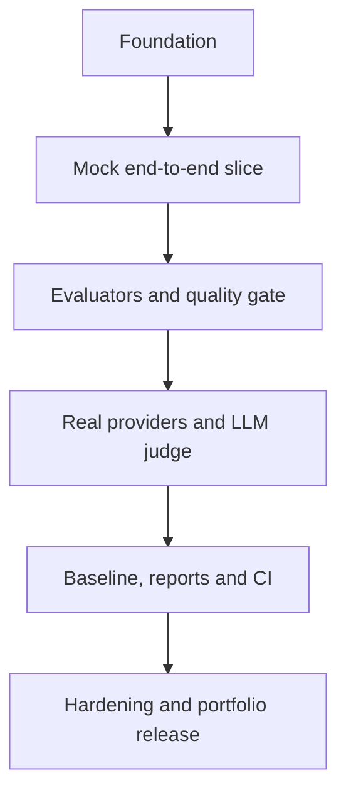

# AIDLC Phase 3 — Implementation & Sprint Plan

> **Project:** LLM Evaluation Framework (`llm-eval-kit`)  
> **Status:** Approved  
> **Date:** 2026-09-15  
> **Approved:** 2026-09-15 by project owner  
> **Planning unit:** Ideal engineering day; calendar duration phụ thuộc thời gian thực tế của solo developer

## 1. Delivery strategy

Triển khai theo vertical slices. Mỗi slice phải chạy được, có test và tạo evidence trước khi mở rộng.



Không xây đồng loạt tất cả packages rồi mới kết nối. Vertical slice đầu tiên phải chứng minh:

```text
YAML case → mock response → exact evaluator → case verdict → run.json → CLI exit code
```

## 2. Task backlog

### Sprint 0 — Foundation

| Task | Output | Story | Tests/evidence | Depends | Estimate |
|---|---|---|---|---|---:|
| T-001 | Init repo, MIT license, pnpm workspace | US-001 | Install/build succeeds | — | 0.5d |
| T-002 | TS strict, lint, format, Vitest configs | US-001 | Commands pass | T-001 | 0.5d |
| T-003 | Base GitHub Actions workflow | US-003 | PR workflow green | T-002 | 0.5d |
| T-004 | Core domain types and error base | US-002 | Type/unit tests | T-002 | 1.0d |
| T-005 | Versioned Zod schemas | US-002 | TS-001–003 unit layer | T-004 | 1.0d |

**Sprint outcome:** Repo có quality controls và contracts đủ để xây slice đầu tiên.

### Sprint 1 — First executable vertical slice

| Task | Output | Story | Tests/evidence | Depends | Estimate |
|---|---|---|---|---|---:|
| T-006 | JSON/YAML config and suite loader | US-004 | TS-001–003 | T-005 | 1.0d |
| T-007 | Fixture-driven mock provider | US-007 | TS-006 | T-004 | 1.0d |
| T-008 | Exact-match evaluator | US-012 | TS-014 subset | T-004 | 0.5d |
| T-009 | Minimal sequential runner | US-006 | One-case integration | T-006–008 | 1.0d |
| T-010 | Minimal case/run verdict aggregation | US-016 | PASS/FAIL unit tests | T-009 | 1.0d |
| T-011 | Canonical `run.json` writer | US-022 | Schema/golden test | T-010 | 1.0d |
| T-012 | `llmeval run` command + exit 0/1/2 | US-018, US-022 | CLI E2E | T-011 | 1.0d |

**Sprint outcome:** Demo offline đầu tiên chạy end-to-end; chưa cần provider thật.

### Sprint 2 — Evaluators and risk-based gate

| Task | Output | Story | Tests/evidence | Depends | Estimate |
|---|---|---|---|---|---:|
| T-013 | Case/category/severity/tag filters | US-005 | TS-004–005 | T-012 | 0.5d |
| T-014 | Contains, forbidden, regex evaluators | US-012 | TS-014–016 | T-008 | 1.0d |
| T-015 | JSON Schema evaluator | US-013 | TS-017–018, TS-035 | T-005 | 1.0d |
| T-016 | Full score/confidence/verdict aggregation | US-016 | Property + TS-022/024 | T-010, T-014–015 | 1.0d |
| T-017 | Risk-based quality gate | US-017 | TS-023–027 | T-016 | 1.0d |
| T-018 | Complete exit-code mapping | US-018 | Exit-code matrix | T-017 | 0.5d |
| T-019 | Multi-case integration/golden suite | US-006, US-022 | Stable artifact order | T-013–018 | 1.0d |

**Sprint outcome:** Framework phát hiện business-rule failures và chặn critical regression bằng mock data.

### Sprint 3 — Provider execution and semantic evaluation

| Task | Output | Story | Tests/evidence | Depends | Estimate |
|---|---|---|---|---|---:|
| T-020 | Bounded concurrency scheduler | US-008 | TS-010, ordering tests | T-019 | 1.0d |
| T-021 | Timeout/retry/error normalization layer | US-008 | TS-007–009 | T-020 | 1.0d |
| T-022 | Usage, pricing and budget controls | US-011 | TS-011–012 | T-021 | 1.0d |
| T-023 | OpenAI adapter | US-009 | Contract + optional smoke | T-021–022 | 1.0d |
| T-024 | Gemini adapter | US-010 | Contract + optional smoke | T-021–022 | 1.0d |
| T-025 | LLM-as-a-Judge evaluator | US-014 | TS-019–021 + calibration | T-021, T-023 or T-024 | 1.5d |
| T-026 | Human-review queue export | US-015 | TS-020 | T-025 | 0.5d |

**Sprint outcome:** Cùng suite chạy được với mock/OpenAI/Gemini; semantic evaluator có schema và human-review fallback.

### Sprint 4 — Regression, reports and CI productization

| Task | Output | Story | Tests/evidence | Depends | Estimate |
|---|---|---|---|---|---:|
| T-027 | Baseline compatibility/classification | US-019 | TS-028–030 | T-019 | 1.0d |
| T-028 | Candidate vs baseline comparison | US-020 | Delta/gate tests | T-017, T-027 | 1.0d |
| T-029 | Explicit baseline promotion | US-021 | TS-031 | T-027 | 0.5d |
| T-030 | Structured logs + central redaction | US-024 | TS-033 | T-021 | 1.0d |
| T-031 | Final terminal + JSON reporters | US-022 | TS-032 golden | T-028, T-030 | 1.0d |
| T-032 | Static safe HTML reporter | US-023 | TS-032, TS-034 | T-031 | 1.5d |
| T-033 | Finalize validate/compare/baseline/report CLI | US-004, US-018, US-021–023 | Command E2E suite | T-029, T-031–032 | 1.0d |

**Sprint outcome:** Prompt/model regression có report đầy đủ và command surface ổn định.

### Sprint 5 — Hardening and portfolio release

| Task | Output | Story | Tests/evidence | Depends | Estimate |
|---|---|---|---|---|---:|
| T-034 | 50+ case e-commerce dataset | US-025 | Dataset review checklist | T-033 | 2.0d |
| T-035 | Mock pass/fail GitHub Actions demos | US-026 | TS-040–042 | T-034 | 1.0d |
| T-036 | Security hardening suite | US-024 | TS-033–035 | T-030, T-032 | 1.0d |
| T-037 | 500-case performance/fault run | US-006, US-008 | TS-037–038 | T-020, T-031 | 1.0d |
| T-038 | OpenAI/Gemini smoke + judge calibration | US-009, US-010, US-014 | TS-013, calibration targets | T-023–025 | 1.0d |
| T-039 | README, architecture, limitations, ROI, examples | US-027 | TS-039 usability check | T-035–038 | 1.5d |
| T-040 | MVP release candidate verification | All Must | Full release gate | T-034–039 | 1.0d |

**Sprint outcome:** Reproducible portfolio release có technical evidence, không chỉ screenshots.

## 3. Effort and schedule forecast

| Sprint | Ideal effort | Calendar suggestion for solo full-time work |
|---|---:|---|
| Sprint 0 | 3.5 days | Week 1 |
| Sprint 1 | 6.5 days | Weeks 1–2 |
| Sprint 2 | 6.0 days | Week 3 |
| Sprint 3 | 7.0 days | Week 4 |
| Sprint 4 | 7.0 days | Week 5 |
| Sprint 5 | 8.5 days | Weeks 6–7 |
| **Total** | **38.5 ideal days** | **Khoảng 7–9 tuần full-time** |

Nếu thực hiện ngoài giờ khoảng 15–20 giờ/tuần, kế hoạch thực tế là khoảng 12–16 tuần. Ước lượng là planning baseline, không phải deadline cứng. Nếu cần rút xuống 5–6 tuần full-time, dời HTML reporter, human-review export và Gemini adapter sang v0.2; không cắt scoring/gate, mock suite, baseline hoặc security redaction.

## 4. Critical path

```text
T-001 → T-004 → T-005 → T-006 → T-009 → T-010 → T-017 →
T-019 → T-020 → T-021 → T-025 → T-028 → T-031 → T-034 → T-035 → T-040
```

Provider adapters T-023/T-024 có thể làm song song sau T-021/T-022. HTML T-032 không nằm trên critical path nếu cần cắt scope.

## 5. Pull request slicing

Mỗi PR nên nhỏ và chứng minh một behavior:

- PR-01: workspace/tooling/contracts;
- PR-02: loader + validation;
- PR-03: mock vertical slice;
- PR-04: deterministic evaluator pack;
- PR-05: scoring + gate + exit codes;
- PR-06: scheduler + retry + budgets;
- PR-07: OpenAI adapter;
- PR-08: Gemini adapter;
- PR-09: LLM judge + review queue;
- PR-10: baseline compare/promotion;
- PR-11: reports + redaction;
- PR-12: dataset + CI demo + release docs.

Một PR không nên vừa thay architecture, provider adapter, scoring và report cùng lúc.

## 6. AI-assisted implementation protocol

Mỗi task giao cho AI phải kèm:

1. source-of-truth file và requirement/story/task IDs;
2. exact scope và files được phép thay đổi;
3. acceptance criteria và test IDs cần pass;
4. architecture/ADR constraints;
5. commands để verify;
6. yêu cầu báo assumptions, unrelated findings và remaining risks.

### AI không được tự động

- đổi public contracts/ADR mà không tạo proposal;
- thêm dependency khi chưa giải thích lý do;
- dùng provider API thật trong unit/core CI;
- ghi secrets vào fixture/log/report;
- tự update baseline/golden snapshot để làm test pass;
- xóa hoặc làm yếu assertion/coverage/security gate;
- đánh dấu task Done nếu chưa chạy verification.

### Human review bắt buộc

- domain contracts và schema changes;
- scoring/gate changes;
- judge rubric/calibration labels;
- baseline promotion;
- security-sensitive logging/report changes;
- release candidate.

## 7. Task execution template

```markdown
# Task T-XXX — <title>

## Source of truth
- Requirement: FR-/NFR-
- Story: US-
- ADR: ADR-
- Tests: TS-

## Scope
<allowed changes>

## Acceptance criteria
- [ ] ...

## Verification
```bash
pnpm lint
pnpm typecheck
pnpm test
```

## Completion record
- Files changed:
- Tests added/updated:
- Commands/results:
- Assumptions/risks:
```

## 8. Definition of Ready for implementation

- Phase 3 approved.
- Task có ID, story/requirements/test links.
- Dependency tasks hoàn thành hoặc fake đã tồn tại.
- Acceptance criteria có expected result rõ.
- Schema/interface liên quan không còn pending design decision.
- Estimate tối đa 2 ideal days; task lớn hơn phải split.

## 9. Definition of Done for implementation

- Code/type/schema/test hoàn thành trong scope.
- Lint, typecheck, relevant tests và full CI pass.
- Negative/error paths có coverage.
- Không snapshot-update mù quáng.
- Không lộ secrets/canary values.
- Docs/examples/traceability được cập nhật.
- Completion record nêu commands và evidence thật.
- Reviewer chấp nhận.

## 10. Release strategy

- Version `0.1.0` là MVP portfolio release.
- Tag chỉ tạo sau T-040.
- Release artifacts: package/CLI build, source, `run.json`, HTML demo report và checksums nếu cần.
- Default demo dùng mock provider.
- OpenAI/Gemini là opt-in qua environment variables.
- Known limitations phải công khai; không quảng cáo hallucination detection như bảo đảm tuyệt đối.

## 11. Phase gate

**Status:** `PASSED`

Phase 4 — Implementation được phép bắt đầu từ Sprint 0, Task T-001.
