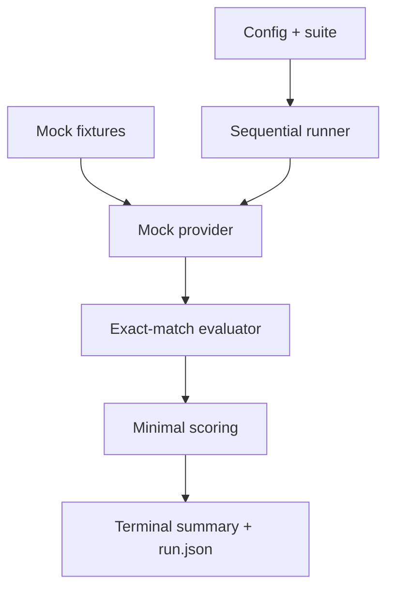

# AIDLC Phase 4 — Sprint 1 Execution Record

**Project:** LLM Evaluation Framework (`llm-eval-kit`)  
**Sprint:** Sprint 1 — First executable vertical slice  
**Execution date:** 2026-09-15  
**Status:** COMPLETED  
**Git commit:** `15fe94024dd09dfeaac551c0abb028f9a130396d`

## 1. Sprint goal

Deliver the first deterministic, offline end-to-end evaluation flow:

1. Load project configuration and an evaluation suite.
2. Generate a response from explicit mock fixtures.
3. Evaluate the response with exact match.
4. Aggregate case and run verdicts.
5. Persist a canonical `run.json` artifact.
6. Expose the flow through `llmeval run` with CI-safe exit codes.

No paid or external model API is required for this sprint.

## 2. Completed backlog

| ID | Deliverable | Result | Verification |
|---|---|---|---|
| T-006 | JSON/YAML config and suite loader | Done | Valid JSON/YAML, defaults, missing/malformed/invalid inputs tested |
| T-007 | Fixture-driven mock provider | Done | Stable normalized output and safe validation/errors tested |
| T-008 | Exact-match evaluator | Done | PASS/FAIL, normalization and invalid configuration tested |
| T-009 | Minimal sequential runner | Done | One-case integration, metadata hashes and error capture tested |
| T-010 | Minimal case/run aggregation | Done | PASS/FAIL/WARNING/ERROR and cost aggregation tested |
| T-011 | Canonical `run.json` writer | Done | Atomic write and schema round-trip tested |
| T-012 | `llmeval run` and exit 0/1/2 | Done | CLI E2E covers pass, quality failure and invalid suite |

## 3. Delivered architecture slice



Primary implementation areas:

- `packages/config`: structured file loading and schema validation.
- `packages/providers`: explicit fixture loader and mock provider.
- `packages/evaluators`: exact-match evaluator.
- `packages/core`: sequential orchestration and reproducible run metadata.
- `packages/scoring`: minimal verdict and metrics aggregation.
- `packages/artifacts`: atomic canonical artifact writer.
- `apps/cli`: `llmeval run` command.
- `examples/ecommerce-support`: runnable offline example.

## 4. Quality evidence

The following checks passed on the committed source:

| Gate | Result |
|---|---|
| ESLint | PASS |
| Prettier check | PASS |
| TypeScript build | PASS, all 8 workspace projects |
| TypeScript strict typecheck | PASS, all 8 workspace projects |
| Automated tests | PASS, 39/39 across 9 test files |
| Statement coverage | 90.94% |
| Branch coverage | 81.17% |
| Function coverage | 92.18% |
| Line coverage | 91.02% |
| Coverage threshold | PASS, minimum 80% for all four measures |
| Dependency audit | PASS, no known high-severity vulnerabilities |
| Peer dependencies | PASS, no peer dependency issues |
| Git whitespace check | PASS |

Commands used:

```bash
pnpm lint
pnpm format:check
pnpm typecheck
pnpm test:coverage
pnpm audit --audit-level high
pnpm peers check
git diff --check
```

## 5. Acceptance demonstration

Command:

```bash
node apps/cli/dist/index.js run \
  --config examples/ecommerce-support/llmeval.config.json \
  --suite examples/ecommerce-support/suite.yaml \
  --fixtures examples/ecommerce-support/fixtures.json
```

Observed result:

```text
Status: PASSED
Cases: 1 passed, 0 failed, 0 errors
Pass rate: 100.00%
```

The generated `run.json` contains versioned artifact metadata, SHA-256 config/suite hashes, normalized provider output, evaluator evidence, run metrics and gate failures.

## 6. Decisions and controls

- The mock provider requires explicit per-case responses. It never derives an answer from the expected result, avoiding a false-positive test oracle.
- Sprint 1 remains deterministic and offline so CI can run without secrets or model cost.
- Configuration and dataset failures expose safe, actionable messages without dumping sensitive file contents.
- Artifact writes use a temporary file followed by rename to avoid partially written `run.json` files.
- Coverage now includes every implemented package and CLI source file, excluding only barrel `index.ts` files.

## 7. Known limitations

- Only the `mock` provider and `exact_match` evaluator are executable.
- Case filtering, contains/forbidden/regex evaluators and weighted aggregation are deferred to Sprint 2.
- Sprint 1 scoring is intentionally minimal; full pass-rate, confidence, severity and critical-case quality-gate rules are deferred to T-016/T-017.
- Retry, timeout and concurrency controls are not yet active.
- No HTML report, baseline comparison or real-provider integration is included.
- CI configuration exists locally, but no remote GitHub repository is connected in this workspace; therefore remote GitHub Actions evidence is unavailable.

## 8. Sprint review conclusion

Sprint 1 meets its planned acceptance criteria and provides the first runnable product increment. The source is ready to enter Sprint 2 with T-013 through T-019: filters, additional deterministic evaluators, JSON Schema validation, full scoring and quality gates, CLI selection controls, and an expanded mock regression suite.

