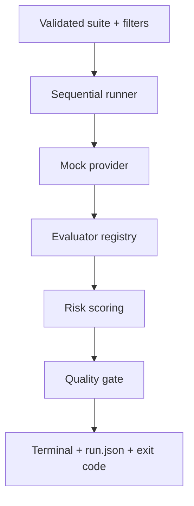

# AIDLC Phase 4 — Sprint 2 Execution Record

**Project:** LLM Evaluation Framework (`llm-eval-kit`)  
**Sprint:** Sprint 2 — Evaluators and risk-based gate  
**Execution date:** 2026-09-15  
**Status:** COMPLETED  
**Git commit:** `4025acffec2ac424ba590028fcc122f322bc7b4b`  
**Source archive SHA-256:** `7641680c484ade391e8c17832ddb96b333ac0e60d213a341e474a24c74a94ee3`

## 1. Sprint goal

Extend the offline vertical slice into a risk-based evaluation engine that can:

1. Run targeted subsets by case, category, severity, and tag.
2. Evaluate deterministic text and structured-output rules.
3. Keep score, confidence, verdict, and operational errors semantically separate.
4. Block business-critical failures even when aggregate quality looks acceptable.
5. Produce stable exit codes and a canonical multi-case artifact.

## 2. Completed backlog

| ID | Deliverable | Result | Verification |
|---|---|---|---|
| T-013 | Case/category/severity/tag filters | Done | Independent, combined, repeatable, comma-separated, and empty-selection tests |
| T-014 | Contains, forbidden, and regex evaluators | Done | Unicode, case sensitivity, any/all matching, evidence, invalid-config tests |
| T-015 | JSON Schema evaluator | Done | Parse/schema failures, path/keyword evidence, local refs, traversal/external-ref/symlink controls |
| T-016 | Full score/confidence/verdict aggregation | Done | Deterministic precedence, weighted semantic score, low-confidence warning, invalid metric tests |
| T-017 | Risk-based quality gate | Done | Critical 99%-pass scenario, error boundary, category regression, overall pass rate, multiple failures |
| T-018 | Complete exit-code mapping | Done | CLI E2E covers exit codes `0`, `1`, `2`, `3`, and `4`; original run failure is preserved |
| T-019 | Multi-case integration/golden suite | Done | Five-case demo and four-evaluator CLI integration preserve suite order |

## 3. Delivered architecture slice



Implemented evaluators:

- `exact_match`
- `contains`
- `forbidden`
- `regex`
- `json_schema`

The JSON Schema evaluator accepts an inline schema or a safe path relative to the suite directory. URL, absolute, traversal, external `$ref`, and symlink escape paths are blocked.

## 4. Scoring and gate behavior

Case aggregation follows the approved decision order:

1. Required deterministic `FAIL` becomes case `FAIL`.
2. Required evaluator `ERROR` becomes case `ERROR`.
3. Low model-based confidence becomes `WARNING`.
4. Model-based scores are weighted without mixing deterministic binary scores.
5. Semantic score below `minimumScore` becomes `FAIL`.
6. Optional failures/errors remain visible as `WARNING`.

Run gate evaluation order:

1. Operational error rate.
2. Critical case failures.
3. Category regression.
4. Overall pass rate.

All known gate failures are included in `run.json` and terminal output. Operational failure has status/exit precedence because the run is not reliable enough for a pure quality conclusion.

## 5. Quality evidence

| Gate | Result |
|---|---|
| ESLint | PASS |
| Prettier check | PASS |
| TypeScript build | PASS, all 8 workspace projects |
| TypeScript strict typecheck | PASS, all 8 workspace projects |
| Automated tests | PASS, 66/66 across 12 test files |
| Statement coverage | 92.77% |
| Branch coverage | 86.60% |
| Function coverage | 95.76% |
| Line coverage | 94.54% |
| Risk-scoring line coverage | 100% |
| Risk-scoring branch coverage | 96.51% |
| Coverage threshold | PASS, minimum 80% for all four global measures |
| Dependency audit | PASS, no known vulnerabilities at high threshold |
| Peer dependencies | PASS |
| Secret pattern scan | PASS, zero tracked `.env` files and zero matched secret files |
| Git whitespace check | PASS |
| Git worktree after commit | CLEAN |

Commands used:

```bash
pnpm lint
pnpm format:check
pnpm typecheck
pnpm test:coverage
pnpm audit --audit-level high
pnpm peers check
git diff --check
```

## 6. Acceptance demonstration

### Passing multi-case suite

```bash
node apps/cli/dist/index.js run \
  --config examples/ecommerce-support/llmeval.config.json \
  --suite examples/ecommerce-support/suite.yaml \
  --fixtures examples/ecommerce-support/fixtures.json
```

Observed:

```text
Status: PASSED
Cases: 5 passed, 0 failed, 0 warnings, 0 errors
Pass rate: 100.00%
Exit code: 0
```

### Targeted execution

Filters `--category refund_policy --severity critical --tag smoke` selected only `REFUND_001`. The artifact reported `selectedCases: 1`; the other four cases were absent from the denominator.

### Deliberate policy regression

Using `fixtures-regression.json`, `REFUND_001` answered “30 days” instead of “14 days”.

```text
Status: QUALITY_FAILED
Cases: 4 passed, 1 failed, 0 warnings, 0 errors
Gate failure: CRITICAL_CASE_FAILURE — REFUND_001
Gate failure: MINIMUM_PASS_RATE — REFUND_001
Exit code: 1
```

The artifact retains two deterministic pieces of evidence: missing required text `14 days` and found forbidden text `30 days`.

## 7. Decisions and compatibility controls

- `minimumScore` defaults to `0.70`, implementing the approved semantic scoring algorithm.
- Category metrics are now emitted in every new artifact; the parser defaults missing category metrics to an empty array so Sprint 1 artifacts remain readable.
- Filter matching is OR within one dimension and AND across dimensions. Tag matching uses any requested tag.
- Invalid regex is rejected during suite validation before provider execution.
- Malformed generated JSON is a quality `FAIL`; evaluator configuration/schema loading failures are operational `ERROR` results.
- Deterministic binary scores are deliberately excluded from semantic weighted-score calculation.
- A reporter/artifact write failure does not replace an already-established quality or operational exit code.

## 8. Known limitations and deferrals

- The executable provider remains `mock`; OpenAI and Gemini adapters are planned for Sprint 3.
- Runner execution is still sequential. Bounded concurrency, timeout, retry, and budget controls are Sprint 3 scope.
- LLM-as-a-Judge and human-review export are not yet implemented.
- Category-regression gate logic is implemented and unit-tested, but CLI baseline comparison will supply real regression data in Sprint 4.
- HTML reporting and final terminal reporter are later sprint scope.
- No GitHub remote is configured, so the local CI workflow has not produced remote GitHub Actions evidence.

## 9. Sprint review conclusion

Sprint 2 meets T-013 through T-019 and its planned acceptance criteria. The framework now detects explicit business-rule regressions, validates structured responses, preserves operational-vs-quality semantics, and blocks critical failures through a complete offline CLI path.

Sprint 3 is ready to begin with T-020 through T-026: bounded scheduling, timeout/retry/error normalization, usage and cost aggregation, OpenAI/Gemini adapters, LLM-as-a-Judge, and human-review export.
