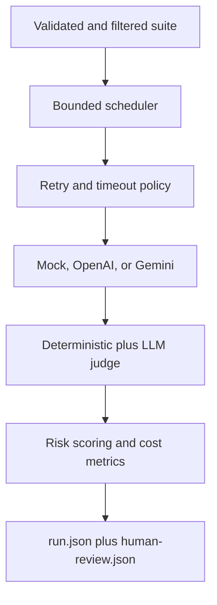

# AIDLC Phase 4 — Sprint 3 Execution Record

**Project:** LLM Evaluation Framework (`llm-eval-kit`)  
**Sprint:** Sprint 3 — Provider execution and semantic evaluation  
**Execution date:** 2026-09-15  
**Status:** COMPLETED  
**Implementation commit:** `5f014a3b02e6f1b0a77af89b823c5c07333b9f43`

## 1. Sprint goal

Extend the risk-based offline framework so that it can safely execute real model providers and semantic evaluation while preserving deterministic CI behavior:

1. Run cases with bounded concurrency while preserving suite order.
2. Normalize timeout, retry, provider errors, usage, latency, and cost.
3. Run the same suite through mock, OpenAI, or Gemini adapters.
4. Validate LLM-as-a-Judge output before using it for scoring.
5. Export low-confidence semantic decisions for human review.

## 2. Completed backlog

| ID | Deliverable | Result | Verification |
|---|---|---|---|
| T-020 | Bounded concurrency scheduler | Done | Global/provider caps, stable ordering, stop-scheduling tests |
| T-021 | Timeout/retry/error normalization | Done | 429 retry, auth no-retry, timeout, HTTP/network taxonomy tests |
| T-022 | Usage, pricing, and budget controls | Done | Token/cost coverage, explicit pricing, runtime budget exhaustion, dry-run tests |
| T-023 | OpenAI adapter | Done | Responses API fixture contract, request/usage/model/error normalization |
| T-024 | Gemini adapter | Done | `generateContent` fixture contract, usage-unavailable and retryable error tests |
| T-025 | LLM-as-a-Judge evaluator | Done | Structured schema, malformed output, low confidence, prompt-injection boundary tests |
| T-026 | Human-review queue export | Done | Atomic `human-review.json` writer and CLI end-to-end test |

## 3. Delivered architecture slice



Provider-specific response objects stay inside adapters. Core consumes only the normalized `GenerationResult` contract.

## 4. Execution and failure semantics

- Effective concurrency is the lower of project concurrency and provider concurrency.
- Results remain in suite order, not completion order.
- Retry applies only to typed transient failures: rate limit, timeout, network, and server errors.
- Authentication and invalid-request failures are not retried.
- Each successful generation records its attempt count.
- When known observed cost reaches the configured budget, no new cases are scheduled; in-flight work finishes and unscheduled cases are retained as `BUDGET_EXHAUSTED`.
- Budget exhaustion always produces an operational failure even if its raw error percentage is below the general error threshold.

## 5. Usage and cost accounting

Run metrics now include:

- total and average provider latency;
- input, output, and total tokens;
- estimated USD cost when explicit pricing is configured;
- usage coverage and cost coverage.

Unknown usage or pricing remains unavailable and is never converted into a false zero. Pricing is supplied in configuration rather than hard-coded, preventing silent drift when providers change prices.

## 6. Semantic evaluation and human review

The `llm_judge` evaluator:

- sends system instructions separately from the untrusted candidate-response envelope;
- uses an independently configurable provider/model;
- applies the same timeout, retry, and concurrency controls;
- requires strict JSON containing verdict, score, confidence, and reason;
- converts malformed/schema-invalid output to evaluator `ERROR`, not quality `FAIL`;
- exposes judge usage to aggregate token/cost metrics.

When model-based confidence is below `qualityGate.reviewThreshold`, case aggregation produces `WARNING`. The artifact layer writes the affected case, score, confidence, and reasons to `human-review.json`.

## 7. Quality evidence

| Gate | Result |
|---|---|
| ESLint | PASS |
| Prettier check | PASS |
| TypeScript build | PASS, all 8 workspace projects |
| TypeScript strict typecheck | PASS, all 8 workspace projects |
| Automated tests | PASS, 91/91 across 17 test files |
| Statement coverage | 91.26% |
| Branch coverage | 82.13% |
| Function coverage | 91.45% |
| Line coverage | 93.39% |
| Coverage threshold | PASS, minimum 80% for all four global measures |
| Dependency audit | PASS, no known vulnerabilities at high threshold |
| Peer dependencies | PASS |
| Secret pattern scan | PASS, no tracked `.env` or matched credential files |
| Git whitespace check | PASS |

Commands used:

```bash
pnpm format:check
pnpm lint
pnpm typecheck
pnpm test:coverage
pnpm audit --audit-level high
pnpm peers check
git diff --check
```

## 8. Acceptance demonstrations

### Default offline suite

The five-case e-commerce suite completed with:

```text
Status: PASSED
Cases: 5 passed, 0 failed, 0 warnings, 0 errors
Pass rate: 100.00%
Exit code: 0
```

### Real-provider dry run

The OpenAI example config selected five cases, validated without an API key, made zero provider calls, and reported preflight cost as unavailable until token usage and reviewed pricing are present.

### Offline semantic and human-review flow

The semantic mock demo produced:

```text
Deterministic policy rule: PASS
Judge score: 0.90
Judge confidence: 0.60
Case verdict: WARNING
Human-review items: 1
Usage coverage: 100%
Cost coverage: 0% (pricing intentionally absent)
```

The first version of this fixture used `14-day` while the required deterministic text was `14 days`. The critical deterministic evaluator correctly blocked the run. The fixture was corrected without weakening the assertion or threshold.

## 9. Security and compatibility controls

- API keys are read only from configured environment variables.
- Keys are placed in request headers and never included in safe errors, fixtures, artifacts, or logs.
- Provider HTTP transports are injected in tests; core CI performs no paid calls.
- OpenAI uses the Responses API adapter boundary.
- Gemini uses the `v1beta models.generateContent` adapter boundary.
- Older run artifacts that lack the new metric coverage fields remain readable through schema defaults.

## 10. Known limitations and deferrals

- Live OpenAI/Gemini smoke tests were not executed because no paid-provider credentials were supplied; fixture contract tests are the Sprint 3 acceptance evidence.
- Exact preflight dollar cost cannot be known before token usage unless a future token estimator is configured. Dry-run reports this limitation explicitly.
- Runtime budget control can exceed the exact cap by already in-flight calls; this is intentional bounded behavior.
- Provider pricing must be manually reviewed and configured; no potentially stale built-in price table is shipped.
- Judge calibration against a labeled human dataset remains part of T-038 release verification.
- Baseline comparison, final reporters, redaction pipeline, and expanded CLI commands remain Sprint 4 scope.

## 11. Sprint review conclusion

Sprint 3 meets T-020 through T-026. The framework can now execute provider calls predictably, compare implementations through one normalized contract, measure quality–cost–latency without fabricating unknown values, and route uncertain semantic decisions to a human reviewer.

Sprint 4 is ready with T-027 through T-033: baseline compatibility, candidate comparison, explicit baseline promotion, structured redacted logs, final terminal/JSON/HTML reports, and the completed CLI command surface.
