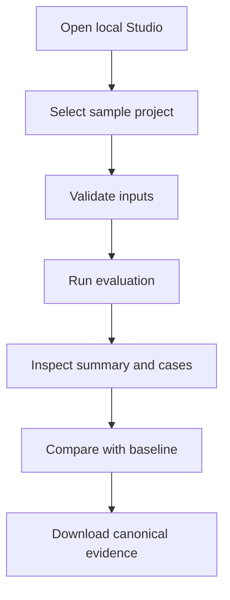

# Product Phase 2 — UI Inception & Requirements

> **Project:** LLM Evaluation Framework (`llm-eval-kit`)  
> **Product increment:** Local Evaluation Studio  
> **AIDLC stage:** 1 — Inception & Requirements  
> **Status:** REVIEW  
> **Date:** 2026-09-16  
> **Input baseline:** v0.1.0 CLI MVP and Sprint 0–5 execution evidence

## 1. Purpose

The v0.1.0 framework proves the evaluation engine through a CLI, canonical artifacts, static HTML reports, and CI quality gates. That implementation is strong for engineering use but creates friction for a recruiter, QA engineer, or first-time user who wants to understand the result without learning the command surface first.

Product Phase 2 adds a local visual application named **Evaluation Studio**. The Studio makes the existing engine easier to configure, run, inspect, and demonstrate. It does not replace the CLI, recalculate verdicts, or create a separate evaluation implementation.

## 2. Problem statement

The current demo requires users to:

1. understand config, suite, and fixture file paths;
2. run CLI commands correctly;
3. locate generated artifacts;
4. interpret JSON or a static HTML report; and
5. run separate commands for baseline comparison and promotion.

This is acceptable for CI and expert users, but it weakens the first five minutes of the portfolio demonstration. A local Studio should reduce that friction while preserving the framework's risk, security, and reproducibility guarantees.

## 3. Product goal

A new user can start the local Studio, run the 64-case mock suite, inspect a critical regression, compare it with a baseline, and download the canonical evidence without entering a paid API key or using the CLI directly.

The Studio must expose the same decisions as the CLI:

- same selected cases;
- same provider and evaluator behavior;
- same scoring and quality gate;
- same canonical `run.json`;
- same baseline compatibility rules; and
- same distinction between `FAIL`, `WARNING`, and `ERROR`.

## 4. Product principles

1. **One engine, two adapters:** CLI and Studio invoke the same application SDK.
2. **Canonical artifact first:** UI renders persisted engine output; it does not recompute verdicts.
3. **Local-first:** default execution binds to loopback and stores artifacts on the local filesystem.
4. **Mock-first demo:** the portfolio flow must work without secrets or paid calls.
5. **Risk before averages:** critical failures remain visually dominant.
6. **Evidence before decoration:** charts supplement case-level reasons and evidence.
7. **Explicit destructive actions:** baseline promotion and overwrite require clear confirmation.
8. **No secret in the browser:** provider credentials remain server-side environment variables.

## 5. Target users

| Persona | Need | Studio value |
|---|---|---|
| Recruiter or interviewer | Understand the project in minutes | Guided demo, visual result, critical regression story |
| QA/SDET | Run suites and investigate failures | Filters, case evidence, comparison, artifacts |
| AI application developer | Validate prompt/model changes | Run configuration, progress, quality gate and deltas |
| Project owner | Review release risk | Critical failures, category regression and review queue |

## 6. Primary user journeys

### Journey A — Portfolio pass demonstration

1. Start Studio from the repository.
2. Select the bundled e-commerce project.
3. Select the default mock fixtures.
4. Run all 64 cases.
5. See `PASSED`, 64/64 cases, category metrics, and generated artifact paths.

### Journey B — Critical regression demonstration

1. Select the regression fixture.
2. Filter to `REFUND_001` or run the prepared regression scenario.
3. See the incorrect “30 days” claim and required “14 days” policy evidence.
4. See `CRITICAL`, `QUALITY_FAILED`, and the blocking gate reason.
5. Compare the candidate with the approved baseline.

### Journey C — Investigation

1. Open a completed run.
2. Filter by verdict, category, severity, evaluator, or tag.
3. Select a case.
4. Inspect input, context, expected behavior, response, evaluator result, evidence, latency, usage, and cost availability.
5. Export or open the canonical artifacts.

## 7. Scope

### Must scope

- Local web application with a technical-minimalist, light visual system.
- Guided mock demonstration using the existing e-commerce dataset.
- Input validation before execution.
- Run configuration for suite, fixtures, filters, and safe execution settings.
- Live progress and final run state.
- Summary cards, category metrics, and risk-focused visualizations.
- Searchable/filterable case explorer and case evidence detail.
- Baseline comparison and explicit baseline promotion.
- Artifact access for JSON, HTML, review export, and redacted logs.
- Shared SDK/application service used by both CLI and Studio.
- Security, accessibility, automated testing, and documentation.

### Should scope

- Browse existing local runs from the configured reports directory.
- Human-review queue view and export.
- Cancel a running evaluation without corrupting completed evidence.
- OpenAI/Gemini availability indicator based on server environment.
- Desktop and tablet responsive layouts.

### Could scope

- Dark theme.
- Drag-and-drop dataset import.
- Read-only mobile layout.
- Shareable static demo snapshot.

### Out of scope

- Authentication, RBAC, teams, or multi-user collaboration.
- Cloud database or hosted artifact storage.
- Multi-tenant SaaS, billing, or subscription management.
- Browser storage of provider API keys.
- Visual prompt authoring IDE.
- Production deployment or public internet exposure.
- RAG retrieval and AI-agent evaluation features.
- Reimplementation of scoring, comparison, or provider logic in frontend code.

## 8. Functional requirements

| ID | Requirement | Priority | Acceptance summary |
|---|---|---|---|
| UI-FR-001 | Start the Studio locally | Must | One documented command starts UI and local API on loopback |
| UI-FR-002 | Load the bundled demo project | Must | E-commerce config, suite, fixtures, and schema references are resolved safely |
| UI-FR-003 | Validate inputs before a run | Must | Invalid input shows actionable field/file errors and makes zero provider calls |
| UI-FR-004 | Configure a run | Must | User can select suite, fixture/provider, filters, concurrency, timeout, retries, and cost budget within allowed bounds |
| UI-FR-005 | Run the mock evaluation | Must | Default 64-case suite completes without credentials and produces canonical artifacts |
| UI-FR-006 | Display provider readiness | Should | UI shows mock ready and real-provider availability without revealing secret values |
| UI-FR-007 | Stream progress | Must | UI shows selected, queued, running, completed, failed, warning, and error counts |
| UI-FR-008 | Cancel a run | Should | Cancellation stops new work, preserves completed evidence, and reports an explicit terminal state |
| UI-FR-009 | Display run summary | Must | Status, pass rate, critical failures, warnings/errors, latency, token/cost availability, and gate reasons are visible |
| UI-FR-010 | Explore cases | Must | Search/filter by ID, verdict, category, severity, evaluator, and tag without modifying artifact data |
| UI-FR-011 | Inspect case evidence | Must | Input, expected behavior, safe response, evaluations, reason, evidence, usage, latency, and error classification are shown |
| UI-FR-012 | Compare with a baseline | Must | Compatibility, matched/added/removed/changed cases, category deltas, and critical regression are shown |
| UI-FR-013 | Promote a baseline explicitly | Must | Promotion requires reviewed run, confirmation, target path, and separate overwrite confirmation |
| UI-FR-014 | Browse local run history | Should | Studio lists valid artifacts from the configured reports root and rejects unsafe paths |
| UI-FR-015 | Access artifacts | Must | User can open/download `run.json`, HTML report, human-review export, and redacted logs when present |
| UI-FR-016 | View human-review queue | Should | Warning/low-confidence cases are listed with their review reasons and export action |
| UI-FR-017 | Preserve CLI parity | Must | Equivalent CLI and Studio inputs produce equivalent canonical metrics, verdicts, and gates |
| UI-FR-018 | Handle operational failure | Must | Provider/config/filesystem failures remain distinct from quality failures and preserve partial results |
| UI-FR-019 | Provide guided demo scenarios | Must | Pass and deliberate regression flows are discoverable without editing repository files |
| UI-FR-020 | Provide empty/loading/error states | Must | Every asynchronous screen has accessible and actionable UI states |

## 9. Non-functional requirements

| ID | Requirement | Target |
|---|---|---|
| UI-NFR-001 | Security | Bind to loopback by default; no API keys in browser payloads/storage/logs; validate paths; escape untrusted content |
| UI-NFR-002 | Engine consistency | Zero scoring/provider/evaluator business logic duplicated in the frontend |
| UI-NFR-003 | Performance | Initial local page usable ≤2 seconds after server readiness; filter/sort 500 cases ≤200 ms on reference hardware |
| UI-NFR-004 | Responsiveness | No frozen UI during a 500-case run; progress updates are throttled/batched safely |
| UI-NFR-005 | Reliability | Refreshing the browser does not corrupt the run; persisted completed artifacts remain recoverable |
| UI-NFR-006 | Accessibility | WCAG 2.2 AA target for contrast, keyboard navigation, focus, labels, status announcements, and non-color-only meaning |
| UI-NFR-007 | Testability | Shared application logic and critical UI flows have automated tests; global repository coverage remains ≥80% |
| UI-NFR-008 | Portability | Supported on Node.js 22 and current Chrome/Edge/Firefox on macOS and Linux |
| UI-NFR-009 | Maintainability | Typed versioned API contracts; frontend depends on SDK contracts, not package internals |
| UI-NFR-010 | Privacy | Raw responses respect `retainRawResponses`; redacted/omitted content cannot be recovered through UI endpoints |
| UI-NFR-011 | Observability | Run and request correlation IDs appear in safe server logs and operational error responses |
| UI-NFR-012 | Usability | Fresh-clone mock demo completes in ≤10 minutes using README instructions |

## 10. Information architecture

| Screen | Primary purpose | Main information/actions |
|---|---|---|
| Overview | Explain system and recent state | Project summary, quick demo, recent runs, provider readiness |
| New Run | Configure and start evaluation | Inputs, filters, safe advanced settings, dry-run estimate |
| Live Run | Observe execution | Progress, counts, elapsed time, cancel, operational messages |
| Run Result | Understand quality decision | Summary, categories, gate reasons, case explorer |
| Case Detail | Investigate one case | Definition, response, evaluations, evidence, usage/error data |
| Compare | Understand regression | Compatibility, deltas, changed cases, critical regression |
| Human Review | Inspect uncertain results | Queue, reason, confidence, export |
| Artifacts | Retrieve evidence | JSON, HTML, logs, review export, baseline action |

Navigation should remain shallow. Case detail may use a drawer or nested route, but must remain linkable within the local application.

## 11. Visual direction

- Light technical-minimalist interface.
- Neutral background with high-contrast typography.
- Restrained semantic colors: green for pass, amber for warning/review, red for quality failure, and distinct violet/blue for operational error.
- Monospace only for IDs, paths, model names, and evidence—not for body text.
- Motion limited to progress, state changes, and navigation feedback; respect `prefers-reduced-motion`.
- Critical risk must be visible before decorative charts.
- Charts must include labels/table equivalents and never rely on color alone.

The visual language should feel like an engineering console, not a generic AI chatbot dashboard.

## 12. Acceptance criteria for the UI increment

1. A new user can start the Studio and complete the mock pass demo in at most 10 minutes from a fresh clone.
2. The default demo evaluates 64 cases and shows the same final metrics as the CLI artifact.
3. The prepared `REFUND_001` regression displays the incorrect 30-day claim, the expected 14-day evidence, CRITICAL severity, blocking gate, and quality-failure state.
4. The UI renders a canonical artifact produced by the engine and does not recalculate its verdict.
5. Invalid datasets create zero provider calls and display actionable validation errors.
6. No API key or secret value appears in browser storage, network responses, logs, reports, screenshots, or test artifacts.
7. Untrusted script/event-handler content is displayed as text and cannot execute.
8. Baseline overwrite cannot happen without a separate explicit confirmation.
9. A 500-case artifact remains searchable and filterable within the performance target.
10. Keyboard-only users can complete New Run → Result → Case Detail → Compare.
11. Equivalent CLI and Studio scenarios pass a contract-level parity test.
12. Existing v0.1 CLI behavior, artifacts, and CI workflows remain backward compatible.

## 13. Success metrics

| Metric | Target |
|---|---:|
| Time to first mock result from fresh clone | ≤10 minutes |
| Portfolio regression story completion | ≤3 minutes after Studio is running |
| CLI/Studio canonical parity scenarios | 100% |
| Critical acceptance scenarios automated | 100% |
| Browser-exposed secret values | 0 |
| Accessibility critical/serious violations in automated scan | 0 |
| Global test coverage | ≥80% |
| Default demo provider cost | USD 0 |

## 14. Constraints and assumptions

| ID | Constraint / assumption | Rationale |
|---|---|---|
| UI-A-001 | React + TypeScript is the preferred frontend stack | Fits the monorepo and future PromptOps integration |
| UI-A-002 | Studio is local-only in this increment | Avoids premature auth, deployment, and tenancy concerns |
| UI-A-003 | A local Node API mediates filesystem and provider access | Browser must not receive secrets or arbitrary filesystem permissions |
| UI-A-004 | CLI and Studio use one shared SDK/application layer | Prevents logic drift and makes PromptOps integration possible |
| UI-A-005 | Filesystem artifacts remain source of truth | Preserves v0.1 reproducibility and avoids database scope |
| UI-A-006 | Mock provider is the default demo | Free, deterministic, and safe for CI/portfolio review |
| UI-A-007 | Desktop is primary; tablet is supported | Data-dense evaluation workflows are not mobile-first |
| UI-A-008 | Current artifact schema remains readable | UI cannot force users to abandon v0.1 evidence |

## 15. Risk register

| Risk | Impact | Control |
|---|---|---|
| UI duplicates engine logic | CLI/UI disagree and evidence becomes untrustworthy | Shared SDK; artifact parity contract tests |
| Local API becomes arbitrary file browser | Data exposure/path traversal | Workspace roots, canonical path checks, allowlisted extensions, symlink tests |
| API keys leak to frontend | Security incident | Server-only environment lookup; readiness boolean only; canary tests |
| Progress event volume freezes browser | Poor 500-case behavior | Batched server events, bounded client state, virtualized case table if required |
| Charts hide critical cases | Misleading decision | Risk-first summary and mandatory textual gate reasons |
| Scope expands into SaaS | Delay and architecture churn | Local-only gate; auth/database/deployment remain explicitly out of scope |
| UI looks polished but cannot investigate failures | Weak engineering value | Evidence detail and artifact parity are Must requirements |
| Browser refresh loses active context | Confusing demo | Run ID routes and server-owned run state/artifacts |
| Baseline changed accidentally | Invalid regression reference | Existing explicit promotion rule plus UI confirmations |

## 16. Human-in-the-loop checkpoints

Human approval is required for:

- this scope and requirement baseline;
- final information architecture and wireframes;
- security/threat model and filesystem boundaries;
- visual design system and accessibility review;
- baseline promotion interaction;
- acceptance of CLI/Studio parity evidence; and
- release of the Studio increment.

## 17. Traceability seed

| Existing source | UI extension |
|---|---|
| FR-001–003 config, validation, execution | UI-FR-002–005 |
| FR-010–018 scoring, reports, comparison, gates | UI-FR-009–013, UI-FR-017 |
| FR-020 secret redaction | UI-NFR-001, UI-NFR-010 |
| FR-021 review export | UI-FR-016 |
| FR-022 explicit baseline save | UI-FR-013 |
| ADR-005/006 risk and verdict semantics | UI-FR-009–011, UI-FR-018 |
| ADR-007 canonical artifact | UI-NFR-002 and acceptance criterion 4 |
| ADR-008 explicit baseline promotion | UI-FR-013 |
| ADR-010 privacy-safe artifacts | UI-NFR-001/010 |
| ADR-011 mock CI | UI-FR-005/019 |

Full requirement-to-component-to-test traceability will be created in AIDLC Stage 2 and Stage 3.

## 18. Phase gate

**Status:** `AWAITING APPROVAL`

Stage 2 — System Design may begin only after the project owner approves:

- Local Evaluation Studio rather than hosted SaaS;
- one shared SDK for CLI and Studio;
- no authentication or database in this increment;
- server-only provider credentials;
- filesystem artifacts as source of truth;
- Must/Should/Could boundaries; and
- the acceptance criteria in this document.

No UI implementation starts before this gate passes.
