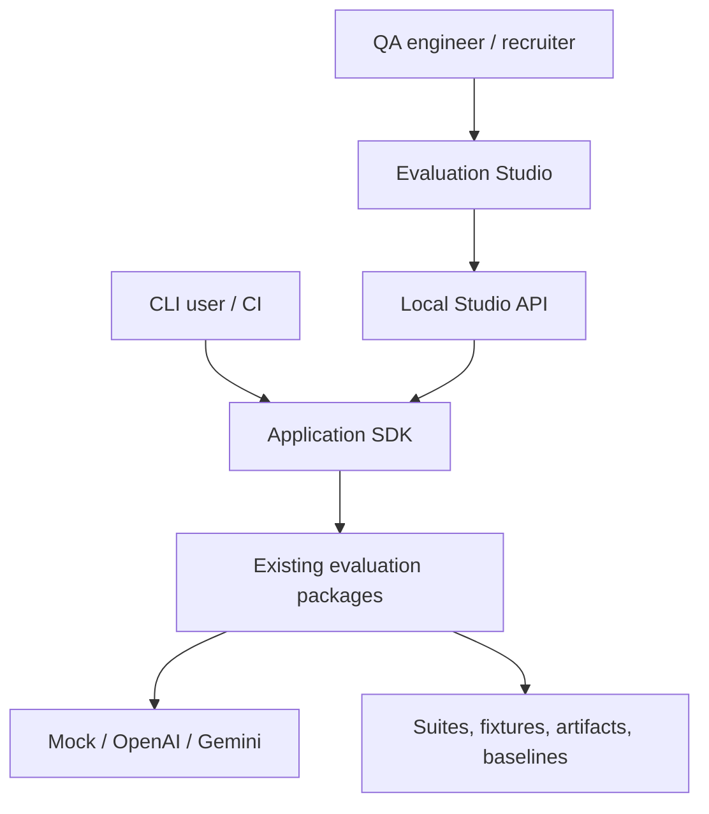
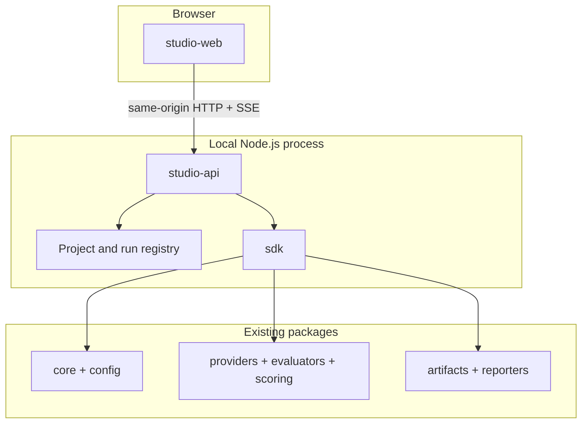
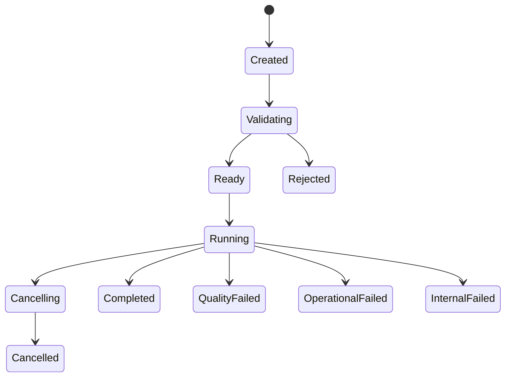

# Product Phase 2 — UI System Design

> **Project:** LLM Evaluation Framework (`llm-eval-kit`)  
> **Product increment:** Local Evaluation Studio  
> **AIDLC stage:** 2 — System Design  
> **Status:** REVIEW  
> **Date:** 2026-09-16  
> **Input:** Approved `AIDLC_P2_01_UI_Inception_and_Requirements.md`

## 1. Design objective

Add a visual local application without creating a second evaluation engine or weakening the CLI's reproducibility and security guarantees.

The design introduces three boundaries:

1. a public application SDK shared by CLI and Studio;
2. a loopback-only Studio API that owns filesystem, execution, and provider access; and
3. a React client that renders server state and canonical artifacts.

The browser is never trusted with API keys, unrestricted paths, provider calls, scoring decisions, or baseline writes.

## 2. System context



The Studio is an adapter over the same application operations as the CLI. Existing core, evaluator, provider, scoring, artifact, and reporter packages remain authoritative.

## 3. Container architecture



### Responsibilities

| Container | Responsibility | Must not do |
|---|---|---|
| `apps/studio-web` | Routes, forms, visualizations, accessibility, API/SSE consumption | Read filesystem, store secrets, call providers, calculate verdicts |
| `apps/studio-api` | Same-origin HTTP, session security, project registry, run lifecycle, downloads | Reimplement evaluators/scoring or trust browser paths |
| `packages/sdk` | Application use cases shared by CLI/API | Depend on React/Fastify or render UI |
| Existing packages | Evaluation execution and canonical evidence | Know about HTTP/browser state |

## 4. Proposed repository structure

```text
apps/
├── cli/
├── studio-api/
│   ├── src/http/
│   ├── src/projects/
│   ├── src/runs/
│   └── test/
└── studio-web/
    ├── src/app/
    ├── src/features/
    ├── src/components/
    ├── src/styles/
    └── test/

packages/
├── api-contracts/
├── sdk/
├── core/
├── config/
├── providers/
├── evaluators/
├── scoring/
├── artifacts/
└── reporters/
```

`api-contracts` contains versioned Zod schemas and inferred TypeScript types. It contains no server or frontend implementation.

## 5. Shared SDK design

### 5.1 Application facade

```ts
type EvaluationApplication = {
  validateProject(input: ValidateProjectInput): Promise<ValidationResult>;
  planRun(input: RunRequest): Promise<RunPlan>;
  run(input: RunRequest, control: RunControl): Promise<RunArtifact>;
  compare(input: CompareRequest): Promise<ComparisonArtifact>;
  promoteBaseline(input: PromoteBaselineRequest): Promise<BaselineArtifact>;
};

type RunControl = {
  signal: AbortSignal;
  onEvent(event: SafeRunEvent): void | Promise<void>;
};
```

The SDK composes existing packages and becomes the only supported application entry point. CLI commands are refactored to call this facade; behavior and exit codes remain unchanged.

### 5.2 SDK invariants

- Validation completes before paid provider calls.
- SDK inputs use resolved trusted resources, not browser paths.
- Every operation receives correlation IDs from its adapter.
- `RunArtifact` remains the authority for metrics and verdicts.
- Progress events are observational and cannot change scoring.
- Abort stops new scheduling and propagates to in-flight provider calls.
- Operational failure never becomes a quality failure.
- SDK functions do not read process environment directly; composition injects credential resolution.

## 6. Studio project manifest

The guided UI needs an explicit, versioned project manifest rather than guessing relationships between config, suite, fixtures, and demo scenarios.

```json
{
  "schemaVersion": "1.0",
  "id": "ecommerce-support",
  "name": "E-commerce Support",
  "targets": [
    { "id": "mock", "config": "./llmeval.config.json" },
    { "id": "openai", "config": "./llmeval.openai.config.json" },
    { "id": "gemini", "config": "./llmeval.gemini.config.json" }
  ],
  "suites": [
    {
      "id": "main",
      "file": "./suite.yaml",
      "fixtureSets": [
        { "id": "passing", "file": "./fixtures.json" },
        { "id": "critical-regression", "file": "./fixtures-regression.json" }
      ]
    }
  ],
  "scenarios": [
    {
      "id": "portfolio-pass",
      "targetId": "mock",
      "suiteId": "main",
      "fixtureSetId": "passing"
    },
    {
      "id": "refund-regression",
      "targetId": "mock",
      "suiteId": "main",
      "fixtureSetId": "critical-regression",
      "filters": { "caseIds": ["REFUND_001"] }
    }
  ]
}
```

Rules:

- manifest paths are relative to the manifest directory;
- canonical resolved paths must remain inside the configured workspace root;
- symlink targets are checked after realpath resolution;
- only allowlisted file types are accepted;
- duplicate IDs are rejected;
- every scenario references registered target, suite, and fixture-set IDs;
- target profiles resolve reviewed config files; browser requests cannot supply arbitrary endpoints or model IDs;
- manifest contains no credentials;
- API exposes opaque project/suite/fixture/scenario IDs, not resolved paths.

## 7. Local Studio API

### 7.1 Runtime profile

- Fastify-based Node.js application.
- Binds to `127.0.0.1` and optionally `::1`; no `0.0.0.0` default.
- Production mode serves the compiled React app and API from one origin.
- Development mode uses a Vite proxy so the browser still sees one origin.
- CORS is disabled by default.
- Host header and Origin are validated against the configured local origin.
- A random process session and CSRF token protect mutating operations.
- API version prefix is `/api/v1`.

### 7.2 Endpoints

| Method | Endpoint | Purpose |
|---|---|---|
| `GET` | `/api/v1/bootstrap` | Version, CSRF token, capabilities, safe provider readiness |
| `GET` | `/api/v1/projects` | List registered project summaries |
| `GET` | `/api/v1/projects/:projectId` | Project, suites, scenarios, safe defaults |
| `POST` | `/api/v1/projects/:projectId/validate` | Validate selected resources without provider calls |
| `POST` | `/api/v1/runs/plan` | Return selected case count and known call/cost estimate |
| `POST` | `/api/v1/runs` | Start one evaluation run |
| `GET` | `/api/v1/runs/:runId` | Return run session snapshot and artifact links |
| `GET` | `/api/v1/runs/:runId/events` | SSE progress with replay from `Last-Event-ID` |
| `POST` | `/api/v1/runs/:runId/cancel` | Request cooperative cancellation |
| `GET` | `/api/v1/artifacts` | List valid local run artifacts under the report root |
| `GET` | `/api/v1/artifacts/:artifactId` | Return safe artifact summary |
| `GET` | `/api/v1/artifacts/:artifactId/files/:kind` | Stream allowlisted artifact file |
| `POST` | `/api/v1/comparisons` | Compare compatible candidate and baseline IDs |
| `POST` | `/api/v1/baselines` | Promote reviewed run with overwrite guard |
| `GET` | `/api/v1/review-items` | List review items from valid artifacts |

### 7.3 Run request

```ts
type StudioRunRequest = {
  projectId: string;
  suiteId: string;
  fixtureSetId?: string;
  targetId: string;
  filters?: {
    caseIds?: string[];
    categories?: string[];
    severities?: Severity[];
    tags?: string[];
  };
  executionOverrides?: {
    concurrency?: number;
    timeoutMs?: number;
    maxRetries?: number;
    maxEstimatedCostUsd?: number;
  };
};
```

The server applies schema validation and configured bounds. The request cannot include API keys, arbitrary model endpoints, raw paths, output directories, or evaluator implementations.

### 7.4 API error contract

Errors use `application/problem+json`:

```ts
type StudioProblem = {
  type: string;
  title: string;
  status: number;
  detail: string;
  code: string;
  correlationId: string;
  fieldErrors?: Array<{ path: string; message: string }>;
};
```

Safe error detail is returned to the browser. Stack traces, secrets, absolute paths, raw provider bodies, and unredacted values remain server-side and are redacted before logging.

## 8. Run lifecycle and concurrency



`RunSessionState` is separate from canonical artifact status. UI sessions may be `CANCELLED`; the partial canonical artifact remains `OPERATIONAL_FAILED` and adds optional backward-compatible termination metadata:

```ts
type RunTermination = {
  kind: "CANCELLED";
  selectedCases: number;
  completedCases: number;
  requestedAt: string;
};
```

Existing parsers continue reading artifact schema v1 fields. Incomplete cancelled runs are never eligible for baseline promotion.

Default Studio policy allows one active run. A second start request returns `409 RUN_ALREADY_ACTIVE`. This keeps local resource and cost behavior predictable; the SDK itself remains capable of controlled concurrency inside a run.

## 9. Progress event design

```ts
type SafeRunEvent = {
  schemaVersion: "1.0";
  id: number;
  runId: string;
  timestamp: string;
  type:
    | "run.created"
    | "run.validated"
    | "run.started"
    | "case.started"
    | "case.completed"
    | "artifact.written"
    | "run.cancelling"
    | "run.completed"
    | "run.failed";
  progress: {
    selected: number;
    running: number;
    completed: number;
    passed: number;
    failed: number;
    warnings: number;
    errors: number;
  };
  caseId?: string;
  safeMessage?: string;
};
```

- Events contain no raw response, prompt, context, API key, or provider body.
- Server keeps a bounded per-run replay buffer.
- Browser reconnects with `Last-Event-ID`.
- If replay is no longer available, client refetches the run snapshot.
- UI batches visual updates to avoid rendering once per event in large suites.
- Canonical artifact, not the event stream, determines final metrics.

## 10. Filesystem and artifact design

### 10.1 Workspace registry

The server starts with explicit roots:

```text
workspace root → project manifests and referenced inputs
report root    → generated run directories and artifact index
baseline root  → promoted baseline files
```

All roots are canonicalized once. Every discovered or requested file is checked against its owning root after symlink resolution. The API returns opaque IDs derived from stable content/path hashes; it never returns unrestricted absolute paths.

### 10.2 Artifact index

Run discovery builds an in-memory index from schema-valid artifacts. It is refreshed after writes and may be rebuilt on restart. There is no database.

Invalid, incompatible, incomplete, or outside-root files are excluded with safe diagnostics. Artifact file downloads are allowlisted by kind:

- `run-json`;
- `html-report`;
- `human-review`;
- `redacted-logs`; and
- `comparison-json` when implemented.

### 10.3 Baseline promotion

Promotion uses artifact IDs and optimistic overwrite protection:

1. initial request uses `overwrite: false`;
2. existing target returns `409 BASELINE_EXISTS` plus a safe current hash;
3. UI shows explicit confirmation;
4. retry sends `overwrite: true` and `expectedCurrentHash`;
5. mismatch returns `409 BASELINE_CHANGED`.

Eligibility follows the existing SDK/CLI rule: the source must be a schema-valid, complete canonical run and promotion must be explicit. Cancelled or operationally incomplete artifacts are ineligible. If a complete `QUALITY_FAILED` run is selected, its status and gate failures remain visible in the confirmation; the UI does not silently redefine eligibility or quality.

## 11. Provider credential boundary

- Real provider keys are resolved only in the Node composition root from configured environment variable names.
- `GET /bootstrap` returns `{ provider: "openai", ready: true|false }`, never key names or values unless the key name is already public configuration metadata.
- Browser cannot submit or update provider keys.
- Missing credentials produce validation/readiness errors before execution.
- No silent fallback from real provider to mock.
- Default Studio scenario always uses mock.

## 12. Frontend architecture

### 12.1 Technology choices

| Concern | Choice |
|---|---|
| UI runtime | React + TypeScript + Vite |
| Routing | React Router |
| Server state | TanStack Query |
| Forms | React Hook Form with shared Zod contracts |
| Accessible primitives | Radix primitives where native HTML is insufficient |
| Styling | Design tokens + CSS Modules |
| Charts | Recharts with equivalent accessible tables/text |
| Unit/component tests | Vitest + React Testing Library + axe |
| Browser E2E | Playwright |

Redux is not introduced. Server state belongs in TanStack Query; live progress uses a feature-scoped reducer fed by SSE; transient form/view state stays local.

### 12.2 Feature boundaries

```text
features/
├── bootstrap/
├── projects/
├── run-config/
├── live-run/
├── run-result/
├── case-explorer/
├── comparison/
├── human-review/
└── artifacts/
```

Features consume the typed API client. They do not import server, provider, evaluator, or scoring package internals.

### 12.3 Routes

| Route | Screen |
|---|---|
| `/` | Overview and guided scenarios |
| `/runs/new` | New Run |
| `/runs/:runId/live` | Live Run |
| `/runs/:runId` | Run Result |
| `/runs/:runId/cases/:caseId` | Linkable Case Detail |
| `/compare` | Candidate/baseline comparison |
| `/review` | Human-review queue |
| `/artifacts` | Local artifact browser |

Unknown or stale IDs show recoverable not-found states rather than redirecting silently.

## 13. UI state and rendering rules

- Final status cards render canonical artifact fields only.
- Live counters are labelled preliminary until the artifact is written.
- `ERROR` uses a distinct visual token from quality `FAIL`.
- Critical failures appear before aggregate charts.
- Unknown cost/token data displays `Unavailable`, never `$0` or `0 tokens`.
- Redacted or omitted response data displays its canonical placeholder and explanation.
- Filters affect presentation only and never mutate metrics.
- Charts always provide a text/table equivalent.
- Case IDs, model IDs, hashes, and paths use monospace; body copy does not.

## 14. Visual system

The visual direction is a custom engineering console, not a generic AI chat interface.

### 14.1 Design tokens

| Token group | Direction |
|---|---|
| Surface | Warm-neutral or cool-neutral light layers with restrained borders |
| Text | High-contrast near-black primary; muted secondary that still meets AA |
| Pass | Green used with icon and label |
| Warning/review | Amber used with icon and label |
| Quality failure | Red used with icon and label |
| Operational error | Violet/blue used with icon and label, distinct from failure |
| Focus | Highly visible focus ring independent of verdict colors |
| Typography | Self-hosted sans variable font plus monospace for technical data |
| Motion | 120–240 ms functional transitions; disabled/reduced under user preference |

### 14.2 Layout

- Persistent left navigation on desktop; compact navigation on tablet.
- Maximum readable content width for narrative sections; data tables may use the full workspace.
- Summary uses a responsive grid, but critical gate reasons span the primary reading width.
- Case explorer uses sticky column headers and may add row virtualization only after profiling.
- Detail uses a dedicated route; a drawer may be an enhancement, not the only access path.

## 15. Security design and threat model

| Threat | Boundary/control | Verification |
|---|---|---|
| Path traversal | ID-based API, canonical containment, extension allowlist | Unit + E2E traversal cases |
| Symlink escape | `realpath` containment before read/write | Symlink security test |
| DNS rebinding/host spoofing | Loopback bind and strict Host allowlist | HTTP integration test |
| Cross-site request to localhost | Same-origin serving, Origin validation, CSRF token, strict session cookie | CSRF negative tests |
| Browser secret leakage | Server-only credential resolver; readiness boolean | Canary network/storage test |
| Stored/reflected XSS | React escaping, no unsafe HTML, CSP, safe artifact rendering | Script/event-handler E2E |
| Formula/content injection | No spreadsheet execution; downloads use safe content types | Artifact tests |
| Log injection | Structured logs and central redaction | Canary/newline tests |
| Baseline overwrite race | Expected-current-hash optimistic check | Conflict/concurrency test |
| Denial through huge input | File size/case count/event buffer/request body limits | Boundary tests |
| Malicious provider output | Treat all response/evidence as untrusted text | HTML/component security tests |

The server must not expose a “read arbitrary path” or “run arbitrary command” endpoint. Studio execution calls the SDK in-process, never shells out to the CLI.

## 16. Accessibility design

- Semantic headings, landmarks, forms, labels, tables, and buttons first.
- Keyboard completion for New Run → Live Run → Result → Case Detail → Compare.
- Focus moves to validation summary, run status changes, and modal confirmation appropriately.
- Progress and terminal states are announced through controlled live regions without flooding assistive technology.
- Every verdict has label/icon/text; color is supplemental.
- Dialogs trap and restore focus through tested accessible primitives.
- Charts have adjacent summaries or tables.
- Reduced motion is honored.
- Automated axe scans are necessary but not sufficient; Stage 3 includes manual keyboard checks.

## 17. Performance design

| Area | Control |
|---|---|
| Startup | Lazy-load route bundles; bootstrap payload stays small |
| 500-case table | Memoized filtering/sorting; profile before virtualization |
| Progress | Batch events and render at bounded cadence |
| Artifact detail | Load summary first; fetch detailed case evidence on demand |
| Logs | Download/stream file; do not load an unbounded log into DOM |
| History | Paginated/indexed artifact summaries |
| Charts | Aggregate server-provided canonical metrics; no raw case recomputation |

Performance measurements run in production build mode. Provider latency is reported separately from UI/API overhead.

## 18. Local startup and packaging

Development:

```bash
pnpm studio:dev
```

Portfolio/production-local mode:

```bash
pnpm studio:start
```

`studio:start` builds or uses the built React assets, starts one loopback server, prints the local URL, workspace root, and report root, and never opens a public listener implicitly.

The default command discovers the bundled e-commerce manifest. Custom workspace roots require an explicit CLI option and startup-time validation.

## 19. Compatibility and migration

1. Existing CLI commands and exit codes remain unchanged.
2. Existing `run.json` v1 artifacts remain readable.
3. New cancellation metadata is optional and backward compatible.
4. CLI moves to SDK composition through characterization/parity tests, not a big-bang rewrite.
5. Studio manifests add guided relationships but do not replace current config/suite formats.
6. Static HTML reporting remains supported.
7. No existing baseline is automatically migrated or promoted.

## 20. Verification architecture

| Layer | Evidence |
|---|---|
| Contracts | Zod schema unit/golden tests |
| SDK | Characterization, parity, cancellation, fault-injection tests |
| API | Fastify injection tests for auth, origin, validation, lifecycle, filesystem boundaries |
| Components | RTL interaction, accessibility, state and rendering tests |
| E2E | Playwright pass demo, regression demo, compare, baseline confirmation, security flows |
| Performance | 500-case filter/render and progress-update measurements |
| Security | Canary secrets, XSS payloads, traversal, symlink, CSRF and host tests |
| Compatibility | Existing v0.1 suites/artifacts/CLI full regression |

Exact test IDs, fixtures, coverage ownership, Definition of Ready/Done, and sprint tasks belong to Stage 3.

## 21. Delivery slices

1. **SDK parity slice:** CLI calls SDK with no visible behavior change.
2. **Read-only Studio slice:** bootstrap, project discovery, existing artifact overview/detail.
3. **Mock run slice:** validate, start, progress, canonical result.
4. **Regression slice:** guided `REFUND_001`, comparison, critical evidence.
5. **Control slice:** cancellation, baseline promotion, human review, artifact downloads.
6. **Hardening slice:** accessibility, performance, security, packaging, docs.

Every slice is demonstrable end-to-end and retains the existing CLI test suite.

## 22. Stage gate

**Status:** `AWAITING APPROVAL`

Stage 3 — Backlog & Test Design may begin only after approval of:

- shared SDK and no shell-based Studio execution;
- React/Vite client and Fastify loopback API;
- explicit project manifest and ID-based filesystem access;
- same-origin HTTP/SSE and security controls;
- one active Studio run by default;
- cancellation semantics and optional artifact termination metadata;
- frontend state, visual, accessibility, and performance architecture; and
- backward-compatibility/migration strategy.

No implementation begins before Stage 2 and Stage 3 pass.
