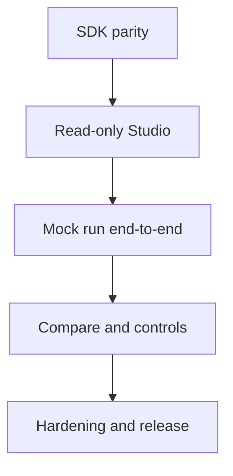

# Product Phase 2 — UI Backlog and Sprint Plan

> **Project:** LLM Evaluation Framework (`llm-eval-kit`)  
> **Product increment:** Local Evaluation Studio  
> **AIDLC stage:** 3 — Backlog & Test Design  
> **Status:** REVIEW  
> **Date:** 2026-09-16  
> **Inputs:** Approved UI Stage 1 requirements and Stage 2 system design/ADRs

## 1. Delivery strategy

Implementation follows vertical slices. Each sprint must produce a demonstrable path through the real shared SDK and canonical artifact. Layer-only progress is not accepted as a sprint outcome.



The existing CLI and v0.1 evidence remain green throughout the increment.

## 2. Epics

| Epic | Goal | Requirements |
|---|---|---|
| UI-E1 — Shared Application SDK | Give CLI and Studio one execution path | UI-FR-003–005, UI-FR-017–018; UI-NFR-002/009 |
| UI-E2 — Contracts and Local Registry | Discover only reviewed projects/artifacts safely | UI-FR-002, UI-FR-014–015; UI-NFR-001/009/010 |
| UI-E3 — Studio API and Run Control | Expose secure local HTTP/SSE operations | UI-FR-006–008, UI-FR-018; UI-NFR-001/004/005/011 |
| UI-E4 — Studio Experience | Provide the visual shell, configuration, and live run | UI-FR-001, UI-FR-004, UI-FR-007, UI-FR-019–020 |
| UI-E5 — Results and Investigation | Make canonical quality evidence understandable | UI-FR-009–011; UI-NFR-003/006/010 |
| UI-E6 — Compare, Review, and Artifacts | Complete regression and human-control workflows | UI-FR-012–016 |
| UI-E7 — Hardening and Release | Prove security, accessibility, performance, compatibility, and usability | All UI-NFR and acceptance criteria |

## 3. User stories

| Story | User outcome | Priority | Acceptance summary |
|---|---|---|---|
| UI-US-001 | As a CLI user, I retain identical behavior after SDK extraction | Must | Existing commands, exit codes, artifacts, and tests remain compatible |
| UI-US-002 | As an adapter author, I call typed application use cases | Must | Validate, plan, run, compare, and promote are exposed without CLI/Fastify dependencies |
| UI-US-003 | As a project owner, I can prove CLI/Studio parity | Must | Contract scenarios produce equivalent canonical decisions |
| UI-US-004 | As a Studio client, I consume versioned API contracts | Must | Requests/responses/events/problems validate through shared Zod schemas |
| UI-US-005 | As a demo author, I register projects and scenarios explicitly | Must | Versioned manifest resolves only contained reviewed resources |
| UI-US-006 | As a local user, I see only projects within configured roots | Must | Registry uses IDs, canonical containment, extension and symlink controls |
| UI-US-007 | As a returning user, I browse valid local run artifacts | Should | Index rebuilds from schema-valid artifacts without a database |
| UI-US-008 | As a local user, I start Studio safely with one command | Must | Loopback URL, roots, and readiness are printed; no public listener |
| UI-US-009 | As a browser client, I receive safe bootstrap/project data | Must | No secret or unrestricted absolute path is returned |
| UI-US-010 | As a user, I validate and plan before spending provider cost | Must | Invalid input makes zero provider calls; plan shows selected calls/known cost |
| UI-US-011 | As a user, I start and observe one controlled run | Must | Run lifecycle, correlation IDs, snapshot, and canonical result are available |
| UI-US-012 | As a user, I receive reconnectable live progress | Must | Ordered safe SSE events support replay and snapshot fallback |
| UI-US-013 | As a user, I cancel without losing completed evidence | Should | New work stops; partial evidence persists as operationally incomplete |
| UI-US-014 | As a user, I navigate a clear Studio shell | Must | Routes, navigation, responsive layout, and recoverable not-found states work |
| UI-US-015 | As a user with access needs, I use an accessible visual system | Must | Tokens, focus, contrast, primitives, reduced motion, and semantic states meet targets |
| UI-US-016 | As a recruiter, I understand the project from Overview | Must | Guided pass/regression scenarios and provider readiness are immediately visible |
| UI-US-017 | As a QA engineer, I configure a run safely | Must | Registered resources, filters, bounded overrides, validation, and plan are usable |
| UI-US-018 | As a user, I understand live progress | Must | Preliminary counters and terminal state are distinct and accessible |
| UI-US-019 | As a project owner, I see the authoritative run decision | Must | Status, gates, critical failures, categories, latency, and cost availability use artifact data |
| UI-US-020 | As a QA engineer, I filter and search cases | Must | ID/verdict/category/severity/evaluator/tag filters remain presentation-only |
| UI-US-021 | As an investigator, I inspect safe case evidence | Must | Definition, expected behavior, safe response, evaluations, evidence, usage, and errors are linkable |
| UI-US-022 | As a user, I distinguish quality and operational problems | Must | `FAIL`, `WARNING`, and `ERROR` have separate semantics and recovery guidance |
| UI-US-023 | As a project owner, I compare candidate and baseline | Must | Compatibility, classifications, category deltas, and critical regression are clear |
| UI-US-024 | As a reviewer, I promote a baseline explicitly | Must | Overwrite uses confirmation and expected-current-hash conflict protection |
| UI-US-025 | As a reviewer, I inspect low-confidence work | Should | Review items show reason/confidence and export action |
| UI-US-026 | As a user, I retrieve canonical evidence safely | Must | Only allowlisted files are opened/downloaded with safe content metadata |
| UI-US-027 | As a recruiter, I run prepared pass/regression stories | Must | No file editing or paid credential is required |
| UI-US-028 | As a maintainer, I release a reproducible Studio | Must | Security, a11y, performance, compatibility, docs, and CI gates pass |

## 4. Implementation tasks

### Sprint 6 — SDK and contracts

| Task | Output | Stories | Evidence | Depends | Estimate |
|---|---|---|---|---|---:|
| UI-T001 | Scaffold `sdk` and `api-contracts` workspace packages | 002, 004 | Build/type boundary tests | — | 0.5d |
| UI-T002 | Capture CLI characterization/golden behavior | 001, 003 | CLI commands/exit/artifact regression suite | — | 1.0d |
| UI-T003 | Define SDK application inputs, outputs, events, and dependency ports | 002 | Type/API review and unit tests | T001 | 1.0d |
| UI-T004 | Implement SDK validate and run-plan use cases | 002, 010 | Zero-call and plan tests | T003 | 1.0d |
| UI-T005 | Implement SDK run, compare, and promote facades | 002 | Integration tests over existing packages | T003 | 1.5d |
| UI-T006 | Migrate CLI composition to SDK without behavior changes | 001, 003 | Full CLI parity suite | T002, T004–005 | 1.5d |
| UI-T007 | Define versioned API request/response/problem/event schemas | 004 | Zod/golden compatibility tests | T001, T003 | 1.0d |
| UI-T008 | Define Studio manifest schema and bundled project manifest | 005, 027 | Valid/invalid/traversal manifest tests | T001 | 1.0d |

**Sprint outcome:** Existing CLI runs through the public SDK; the bundled project/scenarios and API contracts are versioned and testable.

### Sprint 7 — Secure read-only Studio

| Task | Output | Stories | Evidence | Depends | Estimate |
|---|---|---|---|---|---:|
| UI-T009 | Scaffold Fastify Studio API and composition root | 008 | Loopback startup and health tests | T001, T007 | 0.75d |
| UI-T010 | Add Host/Origin/CSRF/session/request-limit controls | 008, 009 | Security integration suite | T009 | 1.25d |
| UI-T011 | Implement canonical workspace/project registry | 005, 006 | Traversal, symlink, extension, duplicate tests | T008–010 | 1.5d |
| UI-T012 | Implement schema-valid artifact index and opaque IDs | 007 | Restart/rebuild/invalid artifact tests | T009–010 | 1.25d |
| UI-T013 | Implement bootstrap/project/artifact read endpoints | 009, 026 | API contract and secret canary tests | T011–012 | 1.0d |
| UI-T014 | Scaffold React/Vite app, typed client, query provider, router | 014 | Build and route smoke tests | T007 | 1.0d |
| UI-T015 | Implement application shell, navigation, error boundary, not-found states | 014, 022 | Component/a11y tests | T014 | 1.0d |
| UI-T016 | Implement design tokens and accessible primitive layer | 015 | Contrast/focus/reduced-motion tests | T014 | 1.25d |
| UI-T017 | Implement Overview and read-only artifact/result entry points | 007, 009, 016, 026 | Read-only Playwright vertical slice | T013–016 | 1.5d |

**Sprint outcome:** A safe, branded, read-only Studio starts locally and displays existing canonical evidence without exposing secrets or paths.

### Sprint 8 — Mock run vertical slice

| Task | Output | Stories | Evidence | Depends | Estimate |
|---|---|---|---|---|---:|
| UI-T018 | Implement validate and run-plan API endpoints | 010 | Invalid/valid/zero-call API tests | T004, T007, T011 | 1.0d |
| UI-T019 | Implement server run registry and lifecycle snapshots | 011 | State transition and active-run conflict tests | T005, T009 | 1.25d |
| UI-T020 | Add safe SDK progress emission and bounded server buffer | 011, 012 | Ordered/no-secret event tests | T003, T019 | 1.25d |
| UI-T021 | Implement replayable SSE endpoint and snapshot fallback | 012 | Reconnect/gap/terminal tests | T020 | 1.0d |
| UI-T022 | Implement New Run form, filters, overrides, validation, and plan | 017 | Form/component/a11y tests | T016, T018 | 1.5d |
| UI-T023 | Implement Live Run screen and accessible progress reducer | 018 | Progress batching/reconnect tests | T021–022 | 1.5d |
| UI-T024 | Implement canonical Result summary and gate panels | 019, 022 | Golden artifact rendering tests | T013, T019 | 1.25d |
| UI-T025 | Implement 500-case search/filter case explorer | 020 | Correctness and ≤200 ms test | T024 | 1.25d |
| UI-T026 | Implement linkable Case Detail with safe evidence | 021 | Redaction/XSS/component tests | T024–025 | 1.25d |
| UI-T027 | Connect guided 64-case pass and `REFUND_001` regression scenarios | 016, 027 | End-to-end pass/regression flows | T008, T022–026 | 1.0d |

**Sprint outcome:** A user can run and investigate the real mock suite visually; pass and critical-regression demos produce the same canonical decisions as CLI.

### Sprint 9 — Control and regression workflows

| Task | Output | Stories | Evidence | Depends | Estimate |
|---|---|---|---|---|---:|
| UI-T028 | Add cooperative abort and optional termination metadata to SDK | 013 | Cancellation/partial evidence tests | T005, T020 | 1.25d |
| UI-T029 | Implement cancel API and UI terminal flow | 013, 018 | Cancel E2E and refresh recovery | T019, T023, T028 | 1.0d |
| UI-T030 | Implement comparison API over registered artifact IDs | 023 | Compatibility/classification/regression tests | T005, T012 | 1.0d |
| UI-T031 | Implement Compare screen and accessible delta presentation | 023 | Critical/category comparison E2E | T016, T030 | 1.5d |
| UI-T032 | Implement baseline API with optimistic overwrite guard | 024 | Existing/changed hash conflict tests | T005, T012 | 1.0d |
| UI-T033 | Implement baseline confirmation and conflict UX | 024 | Keyboard/modal/overwrite E2E | T016, T032 | 1.0d |
| UI-T034 | Implement human-review index and Review screen | 025 | Warning/confidence/export tests | T012–013, T016 | 1.25d |
| UI-T035 | Implement allowlisted artifact download/open flow | 026 | Content-type, traversal, missing file tests | T012–013 | 0.75d |
| UI-T036 | Implement server-only provider readiness and validation UX | 009, 017 | Missing/present secret canary tests | T010, T013, T022 | 0.75d |
| UI-T037 | Complete loading, empty, stale, operational, and recovery states | 022 | Component and resilience E2E | T015, T019, T024 | 1.0d |

**Sprint outcome:** Studio supports comparison, guarded promotion, cancellation, review, downloads, and honest provider readiness without weakening CLI semantics.

### Sprint 10 — Hardening and release

| Task | Output | Stories | Evidence | Depends | Estimate |
|---|---|---|---|---|---:|
| UI-T038 | Complete WCAG 2.2 AA automated/manual remediation | 015, 028 | axe + keyboard/focus checklist | T017, T022–037 | 1.5d |
| UI-T039 | Complete threat-model security suite and remediation | 028 | Host/origin/CSRF/path/symlink/XSS/secret tests | T010–013, T026, T032, T035 | 1.5d |
| UI-T040 | Optimize startup, 500-case explorer, and progress rendering | 020, 028 | Production timing gates | T017, T023, T025 | 1.25d |
| UI-T041 | Run full CLI/SDK/API artifact parity and v0.1 regression suite | 001, 003, 028 | Compatibility matrix | All functional tasks | 1.0d |
| UI-T042 | Validate supported browsers and Linux/macOS execution | 028 | Browser matrix and macOS evidence | T038–041 | 1.0d |
| UI-T043 | Add `studio:dev`/`studio:start`, production assets, and CI jobs | 008, 028 | Fresh build/start and workflow artifacts | T009, T014, T041 | 1.25d |
| UI-T044 | Write quick start, architecture, security, limitation, and demo docs | 016, 027, 028 | Timed fresh-clone review | T043 | 1.0d |
| UI-T045 | Execute release-candidate verification and record evidence | 028 | Full release gate and execution record | T038–044 | 1.0d |

**Sprint outcome:** A reproducible, accessible, secure Local Evaluation Studio release candidate with complete technical evidence.

## 5. Sprint capacity and timeline

| Sprint | Ideal estimate | Full-time target |
|---|---:|---|
| Sprint 6 | 8.5 days | Weeks 1–2 |
| Sprint 7 | 10.5 days | Weeks 2–4 |
| Sprint 8 | 12.25 days | Weeks 4–6 |
| Sprint 9 | 10.5 days | Weeks 6–8 |
| Sprint 10 | 9.5 days | Weeks 8–10 |
| **Total** | **51.25 ideal days** | **Approximately 9–11 weeks full-time** |

At 15–20 hours/week, plan for approximately 18–24 weeks. This is a quality baseline, not a deadline. A portfolio-fast path can defer cancellation, human-review UI, real-provider readiness, and tablet optimization, but must not defer SDK parity, security boundaries, canonical result rendering, accessibility basics, or the pass/regression demo.

## 6. Critical path

```text
T001 → T003 → T005 → T006 → T007 → T009 → T010 → T011 →
T013 → T014 → T016 → T018 → T019 → T020 → T021 → T022 →
T023 → T024 → T026 → T027 → T038 → T039 → T041 → T043 → T045
```

## 7. Definition of Ready

A task may start only when:

- linked story, requirements, ADRs, and test specifications are known;
- acceptance behavior includes success, validation, and relevant failure states;
- API/schema changes are reviewed before implementation;
- security boundary and data classification are explicit;
- UI tasks include keyboard, loading, empty, error, and responsive considerations;
- fixture/evidence strategy is available;
- estimate is at most two ideal days or the task is split; and
- no unresolved decision can change the package or security architecture.

## 8. Definition of Done

- Implementation matches approved requirements and ADRs.
- Unit, contract, integration, component, and relevant E2E tests pass.
- CLI compatibility and canonical artifact semantics remain green.
- No duplicated scoring/provider/evaluator logic enters frontend/server adapters.
- Negative paths and security cases are covered.
- Keyboard/focus/labels/contrast are reviewed for UI changes.
- No secret, unrestricted path, raw stack, or unsafe HTML appears in browser evidence.
- Coverage remains at least 80% globally; new critical logic is meaningfully covered.
- Format, lint, typecheck, build, dependency audit, and CI pass.
- Documentation, traceability, screenshots, and execution evidence are updated.
- Changes are reviewed and merged through the protected workflow.

## 9. AI-assisted implementation protocol

AI may generate a task draft only from approved sources. For every task:

1. cite task/story/requirement/test IDs in the working plan;
2. inspect existing contracts before editing;
3. implement the smallest vertical behavior;
4. add negative and boundary tests before claiming completion;
5. run relevant and full quality gates;
6. review generated UI for accessibility and generic-template artifacts;
7. never invent a passing provider/security/benchmark result; and
8. write execution evidence from actual commands and artifacts.

Human review is mandatory for security controls, baseline behavior, visual direction, accessibility, and release gates.

## 10. Release strategy

- Working increment remains local-only and mock-first.
- Each sprint merges behind tested working routes; no dead placeholder navigation on `main`.
- Release version is selected at Stage 3 approval; recommendation is `v0.2.0` because the public user experience and SDK surface materially expand.
- Default release evidence includes source, built Studio, canonical pass/regression artifacts, screenshots, accessibility report, security results, and checksums if packaged.
- Paid-provider smoke remains opt-in and separately reported.
- No hosted deployment is implied by the Studio release.

## 11. Stage gate

**Status:** `AWAITING APPROVAL`

Implementation may start at Sprint 6 / UI-T001 only after the project owner approves this backlog together with the test strategy and traceability matrix.
