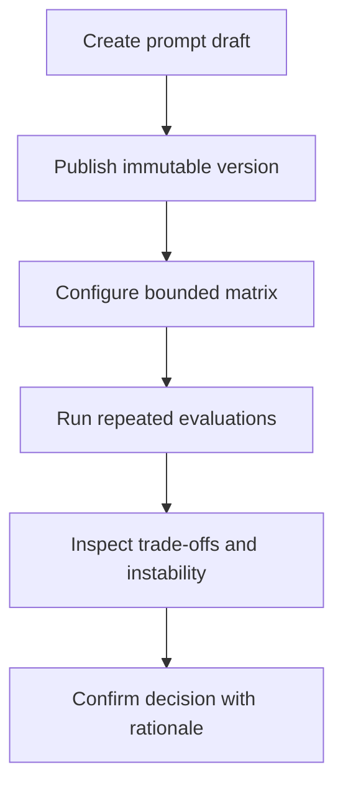

# Product Phase 3 — PromptOps Inception & Requirements

> **Project:** LLM Evaluation Framework (`llm-eval-kit`)  
> **Product increment:** Prompt Experimentation & Decision Support  
> **AIDLC stage:** 1 — Inception & Requirements  
> **Status:** APPROVED  
> **Date:** 2026-09-21  
> **Approved:** 2026-09-21 by project owner  
> **Input baseline:** v0.1.0 evaluation engine and completed Product Phase 2 Local Evaluation Studio

## 1. Purpose

Product Phase 2 made evaluation execution and investigation accessible through the Local Evaluation Studio. Product Phase 3 turns that capability into a controlled PromptOps workflow: users can version prompts, compare a small set of prompt/model variants, measure repeated-run stability, and record a reviewable promotion decision.

The increment is decision support, not autonomous prompt optimization. The framework produces evidence and a recommendation; a human remains accountable for promotion.

## 2. Problem statement

The current product can evaluate one configured target and compare its result with a baseline, but a prompt change is still managed outside the framework. This creates five practical gaps:

1. the exact prompt under test is not managed as a first-class immutable version;
2. A/B or prompt-by-model experiments require manual configuration and result collection;
3. one successful run can hide non-deterministic behavior;
4. quality, critical risk, latency, token usage, and cost are not presented as one decision surface; and
5. the reason for choosing or rejecting a candidate is not persisted as reviewable evidence.

## 3. Product goal

A QA engineer can create and publish a prompt version, compare it with a baseline across a controlled experiment matrix, repeat each cell to expose flakiness, inspect quality–risk–latency–cost trade-offs, and explicitly record whether to promote the candidate.

The workflow must remain reproducible and local-first:

- each published prompt version has immutable content and a SHA-256 hash;
- each experiment references exact prompt, suite, config, provider, and model inputs;
- every evaluation cell produces the existing canonical `run.json` evidence;
- experiment history and decisions are queryable without mutating run artifacts; and
- CLI, SDK, and Studio expose compatible behavior over one application layer.

## 4. Product principles

1. **Evidence before recommendation:** recommendations are projections over canonical artifacts, never substitutes for them.
2. **Immutable published prompts:** editing creates a new version; history is not rewritten.
3. **Risk before averages:** a critical regression can block promotion even when average quality improves.
4. **Repeated evidence over lucky runs:** stability is measured across 1–10 repetitions per matrix cell.
5. **Unknown is not zero:** unavailable usage or cost remains unavailable.
6. **Human-owned promotion:** the system recommends; an authorized local user confirms with rationale.
7. **One engine, multiple adapters:** CLI, SDK, and Studio use the same experiment services.
8. **Local-first control plane:** SQLite stores prompt/experiment workflow state; immutable files remain evaluation evidence.
9. **Bounded experimentation:** the matrix is deliberately small enough to understand and budget.
10. **Backward compatibility:** existing runs, baselines, CLI commands, and Studio workflows remain valid.

## 5. Target users

| Persona | Need | Phase 3 value |
|---|---|---|
| QA/SDET | Prove whether a prompt change is safe | Repeated, risk-based comparison with case evidence |
| AI quality engineer | Characterize instability and trade-offs | Matrix metrics, variance, critical-risk and cost views |
| AI application developer | Compare prompt/model candidates reproducibly | Immutable prompt versions and exact experiment inputs |
| Reviewer or lead | Approve a promotion with defensible evidence | Recommendation, guardrails, rationale, and export |
| Recruiter or interviewer | Understand PromptOps value quickly | Guided local experiment with a visible decision trail |

## 6. Primary user journeys

### Journey A — Publish a candidate

1. Create a draft under a stable prompt ID.
2. Edit and validate the draft.
3. Publish it as an immutable version.
4. Verify its SHA-256 hash and rendered content.

### Journey B — Run a controlled experiment

1. Choose the current baseline and one or more candidates.
2. Select the suite, provider/model targets, and 1–10 repetitions.
3. Review the full execution plan and estimated upper bounds before execution.
4. Run the matrix through the shared SDK.
5. Preserve every completed canonical artifact if a later cell fails or the experiment is cancelled.

### Journey C — Make a promotion decision

1. Compare quality, critical regressions, latency, tokens, cost, and stability.
2. Drill into runs and cases using existing Studio evidence views.
3. Review the generated `PROMOTE_CANDIDATE`, `KEEP_BASELINE`, or `NO_DECISION` recommendation and its reasons.
4. Confirm or override the recommendation with a required rationale.
5. Export the experiment and decision as JSON or Markdown.

## 7. Scope

### Must scope

- Prompt registry with stable IDs, drafts, immutable published versions, and SHA-256 hashes.
- Draft-to-publish lifecycle with schema validation and collision protection.
- A/B and bounded matrix experiments with 2–4 variants.
- 1–10 repetitions per matrix cell.
- Exact input snapshots and canonical `run.json` per completed evaluation run.
- Quality, critical-risk, latency, token, cost, and stability comparison.
- Explicit recommendation states: `PROMOTE_CANDIDATE`, `KEEP_BASELINE`, `NO_DECISION`.
- Human confirmation or override with mandatory rationale.
- Local SQLite control plane for registry, experiment history, and decisions.
- JSON and Markdown export.
- Compatible CLI, SDK, and Studio workflows.
- Mock-first deterministic portfolio scenario requiring no paid provider.

### Should scope

- Resumable experiment orchestration without rerunning completed compatible cells.
- Cancellation that stops new cells and preserves completed evidence.
- Configurable risk and trade-off guardrails within reviewed bounds.
- Search/filter for prompts, experiments, and decisions.
- Side-by-side drill-down to existing run and case evidence.

### Could scope

- Lightweight experiment naming and notes.
- Duplicate-from-version workflow for faster draft creation.
- Static, read-only experiment summary export for portfolio demonstration.

### Out of scope

- RAG/retrieval evaluation or document-grounding pipelines.
- AI-agent trajectory, tool-use, or autonomous-agent safety evaluation.
- Autonomous prompt generation, optimization, or self-promotion.
- Hosted multi-user SaaS, authentication, RBAC, teams, billing, or tenancy.
- Remote database, hosted artifact storage, or synchronization service.
- GitHub App, automatic pull-request mutation, or required external CI integration.
- Fine-tuning, model training, or dataset labeling platform.
- Replacing human review or approving a candidate without an explicit human action.
- Unbounded grid search or statistically unsupported claims of model superiority.

## 8. Functional requirements

| ID | Requirement | Priority | Acceptance summary |
|---|---|---|---|
| P3-FR-001 | List and inspect prompts | Must | Users can find prompt IDs and inspect lifecycle, versions, hashes, and safe metadata |
| P3-FR-002 | Create a prompt draft | Must | A draft is created under a validated stable prompt ID without changing published history |
| P3-FR-003 | Edit a prompt draft | Must | Template, variables, metadata, and notes can change only while the version is a draft |
| P3-FR-004 | Validate prompt content | Must | Invalid templates, unsupported variables, and malformed metadata block publication with actionable errors |
| P3-FR-005 | Publish an immutable prompt version | Must | Publication assigns a monotonic version and SHA-256 content hash; published content cannot be edited |
| P3-FR-006 | Create a new draft from a published version | Should | Editing a published version produces a separate draft with lineage rather than mutation |
| P3-FR-007 | Configure experiment identity | Must | Experiment stores a stable ID, name, optional note, creator context, and timestamps |
| P3-FR-008 | Select bounded variants | Must | An experiment contains 2–4 exact prompt/model variants and rejects duplicate or unresolved references |
| P3-FR-009 | Configure repetitions | Must | Each matrix cell accepts an integer from 1 through 10 and exposes total planned run count |
| P3-FR-010 | Select evaluation inputs | Must | Suite, config, dataset/fixtures, filters, provider, model, and allowed overrides resolve through registries |
| P3-FR-011 | Validate and plan before execution | Must | Dry planning makes zero provider calls and returns exact cells, repetitions, bounds, incompatibilities, and warnings |
| P3-FR-012 | Execute through the shared engine | Must | Every cell invokes the SDK/core pipeline; no experiment-only evaluator or verdict path is introduced |
| P3-FR-013 | Preserve exact experiment inputs | Must | Experiment records prompt, suite, config, dataset, provider/model, evaluator, pricing, and relevant hashes |
| P3-FR-014 | Persist canonical run evidence | Must | Every completed repetition references an immutable canonical `run.json`; SQLite does not replace it |
| P3-FR-015 | Track lifecycle and progress | Must | Planned, running, completed, cancelled, partial, and failed states plus bounded aggregate progress are recoverable |
| P3-FR-016 | Cancel safely | Should | Cancellation stops scheduling new cells, signals active work, and preserves all completed evidence |
| P3-FR-017 | Resume compatible work | Should | A partial experiment can reuse completed cells only when all compatibility hashes match |
| P3-FR-018 | Compare quality and critical risk | Must | Results show aggregate quality, category/case deltas, gate outcomes, and critical regressions before averages |
| P3-FR-019 | Compare latency, usage, and cost | Must | Results show distributions and totals when available; unavailable values are never rendered as zero |
| P3-FR-020 | Measure repeated-run stability | Must | Per-cell agreement, dispersion, flaky case count, and repetition coverage are calculated from canonical runs |
| P3-FR-021 | Generate a bounded recommendation | Must | Guardrails yield only `PROMOTE_CANDIDATE`, `KEEP_BASELINE`, or `NO_DECISION` with machine-readable reasons |
| P3-FR-022 | Record a human decision | Must | Confirmation or override requires the selected version, reviewer action, rationale, evidence hash, and timestamp |
| P3-FR-023 | Browse and investigate history | Must | Users can search/filter experiments and open linked run/case evidence without recomputing verdicts |
| P3-FR-024 | Export experiment evidence | Must | JSON and Markdown exports contain inputs, aggregates, recommendation, decision, rationale, and canonical artifact references |

## 9. Non-functional requirements

| ID | Requirement | Target |
|---|---|---|
| P3-NFR-001 | Reproducibility | Published prompt and experiment input hashes uniquely identify the tested inputs; reruns expose any drift |
| P3-NFR-002 | Immutability | Published prompt content, canonical run artifacts, and recorded decisions are append-only; corrections create new records |
| P3-NFR-003 | Security | Loopback-only defaults, server-side credentials, parameterized SQLite access, validated paths, escaped content, and no secret-bearing API payloads |
| P3-NFR-004 | Privacy | Existing raw-response retention/redaction policy applies to experiment views and exports; SQLite must not become a raw-response cache |
| P3-NFR-005 | Reliability | A process interruption cannot corrupt published prompts or completed run evidence; writes are transactional/atomic |
| P3-NFR-006 | Performance | Planning a maximum 4-variant × 10-repetition matrix completes within 1 second excluding file discovery; viewing 40 run summaries remains responsive on reference hardware |
| P3-NFR-007 | Scalability bounds | One experiment is limited to 4 variants and 10 repetitions per cell; concurrency and budgets remain governed by existing engine limits |
| P3-NFR-008 | Compatibility | Existing v0.1 artifacts, CLI behavior, baselines, and Product Phase 2 Studio workflows remain readable and operational |
| P3-NFR-009 | Consistency | CLI, SDK, and Studio contract tests produce equivalent experiment plans, metrics, recommendations, and decision records |
| P3-NFR-010 | Accessibility | New Studio journeys target WCAG 2.2 AA, keyboard completion, visible focus, status announcements, and non-color-only meaning |
| P3-NFR-011 | Testability | Unit, contract, integration, CLI, API/UI, fault, and deterministic mock E2E coverage protect critical paths; repository coverage remains at least 80% |
| P3-NFR-012 | Observability | Safe correlation IDs link experiment, cell, repetition, and run; logs stay bounded and redact prompt variables or secrets where policy requires |

## 10. Information architecture

| Surface | Primary purpose | Main information/actions |
|---|---|---|
| Prompt Registry | Manage prompt lifecycle | Search prompts, inspect versions/hashes, create or edit draft, publish |
| Experiment Builder | Define controlled comparison | Baseline/candidates, targets, suite, filters, repetitions, plan and bounds |
| Live Experiment | Observe orchestration | Matrix progress, cell states, cancellation, partial evidence, recovery |
| Experiment Result | Make the trade-off visible | Recommendation, quality/risk, stability, latency, usage, cost, guardrail reasons |
| Variant Detail | Investigate one matrix cell | Repetitions, distribution, flaky cases, linked canonical runs |
| Decision Review | Preserve human accountability | Confirm/override, rationale, evidence hash, export |
| Experiment History | Recover and compare work | Search/filter experiments, statuses, decisions, and exports |

Existing Run Result, Case Detail, Compare, Human Review, and Artifacts views remain authoritative for run-level evidence.

## 11. Decision model

The recommendation is deterministic over reviewed inputs and policy thresholds. It does not use an LLM judge to decide whether a candidate should be promoted.

| Recommendation | Minimum meaning |
|---|---|
| `PROMOTE_CANDIDATE` | Candidate passes all blocking quality/risk/stability/budget guardrails and demonstrates the required improvement or non-inferiority |
| `KEEP_BASELINE` | Candidate is validly evaluated but violates a blocking guardrail or is materially worse than the baseline |
| `NO_DECISION` | Evidence is incomplete, incompatible, unavailable, too unstable, or insufficient to support either outcome |

Stage 2 must define the exact policy schema and tie-breaking semantics. A recommendation never mutates the active baseline or published prompt pointer.

## 12. Acceptance criteria

1. A user can create, validate, and publish a prompt version whose content and SHA-256 hash cannot be changed in place.
2. A published version can be used as a baseline or candidate by CLI, SDK, and Studio through the same application service.
3. An experiment rejects fewer than 2 or more than 4 variants and repetitions outside 1–10.
4. Planning resolves the complete matrix and makes zero provider calls.
5. The bundled mock scenario runs at least two prompt variants repeatedly without credentials or paid calls.
6. Every completed repetition produces and references a valid canonical `run.json`; experiment storage does not duplicate or replace that artifact.
7. Cancellation or a failed cell preserves completed runs and yields an explicit partial/terminal state.
8. Result views place critical regressions and incompatible evidence ahead of average quality gains.
9. Stability metrics identify a deliberately flaky mock case across repeated runs.
10. Unknown token usage or price produces unavailable cost, never a zero-cost claim.
11. The recommendation is one of the three approved states and includes machine-readable guardrail reasons.
12. Promotion is impossible without an explicit human confirmation or override and a non-empty rationale tied to the exact evidence hash.
13. JSON and Markdown exports reproduce the same inputs, aggregates, recommendation, and recorded decision as the application view.
14. Existing CLI, Studio, artifacts, and baseline workflows pass backward-compatibility regression tests.

## 13. Success metrics

| Metric | Target |
|---|---:|
| Time to publish a candidate and plan the bundled experiment | ≤5 minutes after Studio starts |
| Mock portfolio experiment completion | ≤10 minutes on reference hardware |
| Published prompt versions with valid SHA-256 identity | 100% |
| Completed repetitions with canonical artifact references | 100% |
| Critical regression detection in decision policy | 100% of seeded critical scenarios |
| CLI/SDK/Studio parity scenarios | 100% |
| Decisions with rationale and evidence hash | 100% |
| Default demo provider cost | USD 0 |
| Browser/API-exposed secret values | 0 |
| Global automated test coverage | ≥80% |

## 14. Constraints and assumptions

| ID | Constraint / assumption | Rationale |
|---|---|---|
| P3-A-001 | SQLite is the local control-plane store | Prompt/version relationships, experiment history, and decisions require transactions and queries |
| P3-A-002 | `run.json` remains canonical evaluation evidence | Prevents database state from replacing the tested, portable artifact contract |
| P3-A-003 | Published prompt identity is `promptId + version + SHA-256 hash` | Makes prompt inputs immutable and auditable |
| P3-A-004 | Existing provider/evaluator/scoring contracts are reused | Avoids a second execution engine and preserves parity |
| P3-A-005 | Deterministic business guardrails precede probabilistic judging | Promotion risk must not depend solely on another model's opinion |
| P3-A-006 | Matrix size is capped at 4 variants and 10 repetitions | Keeps cost, interpretability, and local orchestration bounded |
| P3-A-007 | The product remains local-first and single-user | Auth, tenancy, synchronization, and hosted operations are separate product problems |
| P3-A-008 | Real providers remain opt-in | Default tests and portfolio demo must remain deterministic and free |
| P3-A-009 | Provider pricing is configured, not hard-coded | Pricing changes independently of the product release |
| P3-A-010 | Phase 2 visual and security principles remain binding | Prompt content is untrusted input and credentials stay server-side |

## 15. Risk register

| Risk | Impact | Control |
|---|---|---|
| A lucky run is promoted | Hidden non-determinism reaches production | Repetitions, stability metrics, minimum evidence guardrail |
| Average quality hides critical harm | Unsafe candidate appears better | Severity-first blocking policy and critical-case drill-down |
| SQLite becomes a second artifact source | Conflicting evidence and migration burden | Store references/aggregates only; `run.json` remains canonical |
| Prompt history is rewritten | Experiment cannot be reproduced | Immutable publish transaction and hash verification |
| Matrix causes uncontrolled spend | Unexpected provider cost | Hard size caps, dry plan, budgets, opt-in real providers |
| Unknown cost is shown as zero | Misleading trade-off decision | Explicit unavailable state and policy handling |
| Recommendation is treated as approval | Human accountability is lost | Separate recommendation and decision records; rationale required |
| Resume combines incompatible cells | Invalid aggregate result | Exact hash compatibility before reuse |
| Prompt content leaks secrets or executes markup | Security/privacy incident | Validation, escaping, redaction, no browser-held credentials |
| Scope expands into optimization/RAG/agents | Delayed, incoherent increment | Explicit exclusions and change control at phase gates |

## 16. Human-in-the-loop checkpoints

Human approval is required for:

- this inception and requirements baseline;
- Stage 2 architecture, SQLite schema, migrations, and threat model;
- recommendation policy and default guardrails;
- the mock experiment and deliberately flaky test oracle;
- visual design for trade-off and stability views;
- every prompt promotion decision; and
- final release evidence for Product Phase 3.

## 17. Traceability seed

| Existing source | Product Phase 3 extension |
|---|---|
| `PromptSpec` and config prompt hash | P3-FR-001–006, P3-NFR-001–002 |
| Shared CLI/Studio SDK | P3-FR-010–012, P3-NFR-009 |
| Canonical `run.json` and artifact index | P3-FR-013–015, P3-NFR-004–005 |
| Baseline comparison and risk gate | P3-FR-018, P3-FR-021 |
| Usage, latency, and configured pricing | P3-FR-019 |
| Cancellation and partial artifacts | P3-FR-015–017 |
| Explicit baseline promotion | P3-FR-022 and acceptance criterion 12 |
| Studio evidence and artifact views | P3-FR-023–024 |
| Existing security/redaction controls | P3-NFR-003–004, P3-NFR-012 |

Full requirement-to-component, ADR, story, task, and test traceability will be created in Stages 2 and 3.

## 18. Phase gate

**Status:** `PASSED`

The project owner approved this baseline on 2026-09-21, including:

- Prompt Experimentation & Decision Support as the Product Phase 3 direction;
- immutable draft-to-publish prompt versions identified by SHA-256;
- 2–4 variants and 1–10 repetitions per matrix cell;
- quality, critical risk, latency, token, cost, and stability as the decision axes;
- `PROMOTE_CANDIDATE`, `KEEP_BASELINE`, and `NO_DECISION` as the only recommendation states;
- mandatory human confirmation/override with rationale;
- local-first SQLite for workflow state while `run.json` remains canonical evidence;
- CLI, SDK, and Studio compatibility; and
- the stated scope exclusions.

Stage 2 — System Design and ADRs may begin. No Product Phase 3 implementation starts before Stage 2 and Stage 3 gates pass.
