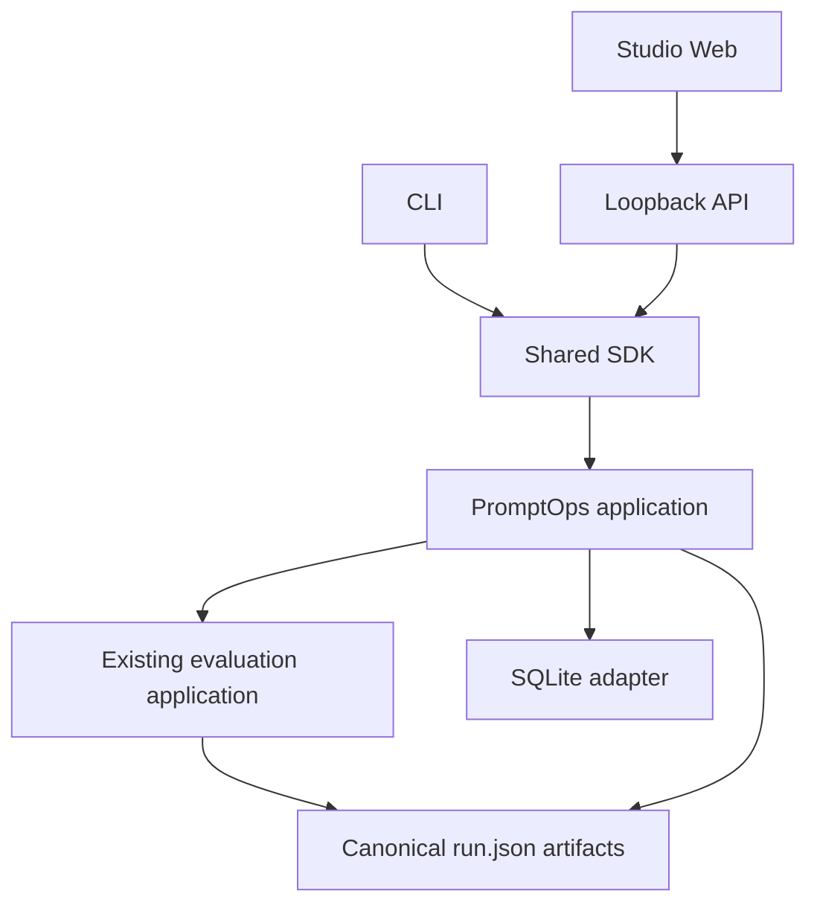
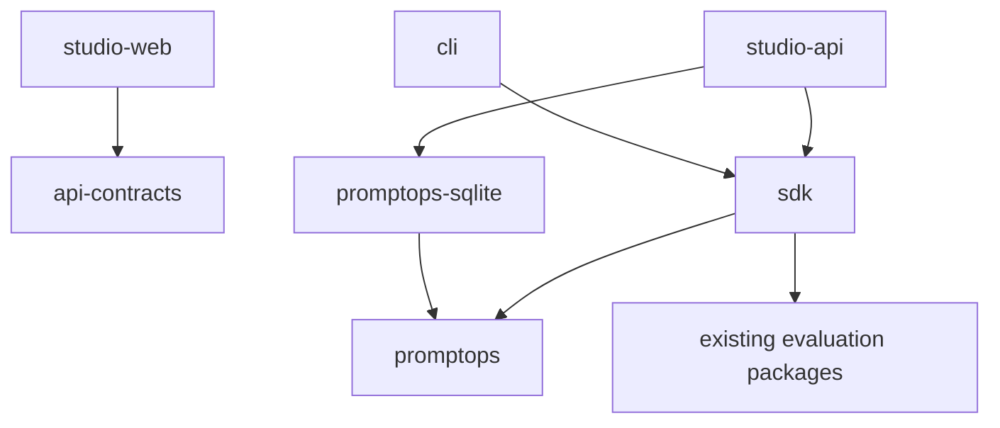
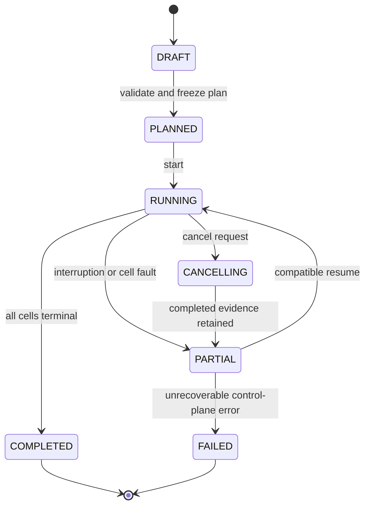
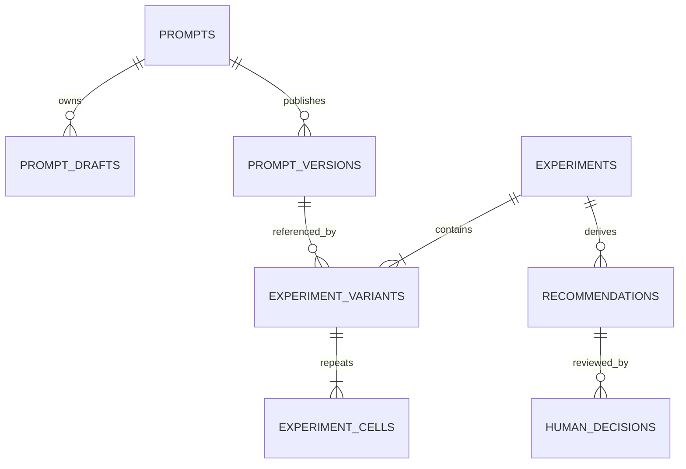

# Product Phase 3 — PromptOps System Design

> **Project:** LLM Evaluation Framework (`llm-eval-kit`)  
> **Product increment:** Prompt Experimentation & Decision Support  
> **AIDLC stage:** 2 — System Design  
> **Status:** APPROVED  
> **Date:** 2026-09-21  
> **Approved:** 2026-09-21 by project owner  
> **Input baseline:** approved Product Phase 3 Stage 1 at merge commit `7905fc553645b032a80245573f09cde1b7d1b077`

## 1. Design objective

Add PromptOps experimentation without creating a second evaluation engine or a second source of evaluation truth.

The design introduces:

- immutable prompt versions;
- bounded prompt/model experiment plans;
- repeated-run stability measurement;
- deterministic recommendation policy;
- append-only human decisions; and
- local, queryable workflow history.

Existing evaluation behavior remains authoritative. Every experiment repetition executes through the shared SDK and writes the existing canonical `run.json` artifact.

## 2. Goals and non-goals

### Goals

1. Make prompt content an immutable, hash-addressed input.
2. Run 2–4 exact prompt/model variants with 1–10 repetitions each.
3. Preserve exact plan, policy, input hashes, canonical run references, and decisions.
4. Derive quality, risk, stability, latency, usage, and cost from validated artifacts.
5. Keep CLI, SDK, Studio API, and Studio UI semantically equivalent.
6. Preserve partial evidence across cancellation, provider faults, and process restart.
7. Keep the default portfolio experiment offline, deterministic, and free.

### Non-goals

- autonomous prompt generation or optimization;
- automatic promotion or baseline mutation;
- RAG or AI-agent evaluation;
- remote database, synchronization, accounts, or multi-user workflow;
- changing the provider/evaluator/scoring contracts;
- storing raw provider responses in SQLite; and
- making statistically universal model-quality claims from a small local experiment.

## 3. Context and trust boundaries



Trust rules:

- prompt templates, case input, provider output, judge evidence, filenames, and browser input are untrusted;
- provider secrets stay in the server process;
- the browser uses opaque IDs and never supplies database or artifact paths;
- SQLite contains templates and workflow metadata, but not rendered case prompts or raw responses;
- canonical artifacts remain immutable evidence; and
- derived recommendations never write a baseline or activate a prompt automatically.

## 4. Package architecture

### New packages

| Package | Responsibility | Forbidden responsibilities |
|---|---|---|
| `packages/promptops` | Domain types, ports, template parser/renderer, planner, aggregation, stability metrics, recommendation policy | HTTP, React, SQLite APIs, filesystem traversal, provider SDKs |
| `packages/promptops-sqlite` | `node:sqlite` adapter, embedded migrations, transactions, repositories | Recommendation logic, artifact parsing, UI contracts |

### Extended packages/applications

| Component | Extension |
|---|---|
| `packages/sdk` | `createPromptOpsApplication` facade composed from ports plus the existing `EvaluationApplication` |
| `packages/api-contracts` | Versioned prompt, experiment, event, decision, and export schemas |
| `apps/cli` | `prompt` and `experiment` command groups over the shared facade |
| `apps/studio-api` | Loopback composition, opaque registries, PromptOps endpoints, experiment SSE |
| `apps/studio-web` | Prompt Registry, Experiment Builder, Live Experiment, Result, and Decision Review routes |
| `packages/core` | One optional request-renderer port and existing `promptHash` metadata population only |
| `packages/artifacts` | Safe artifact loading/hash service; no SQLite dependency |

### Dependency direction



Forbidden dependencies:

- `promptops` → SQLite, Fastify, React, CLI framework, or provider SDK;
- `core` → `promptops`, SQLite, Studio, or filesystem;
- `studio-web` → SQLite, SDK, provider, evaluator, scoring, or filesystem packages;
- `promptops-sqlite` → Studio or evaluation engine internals; and
- reporters → PromptOps decision logic.

## 5. Core domain model

### Prompt aggregate

```ts
type PromptId = string;
type PromptVersionNumber = number;

type PromptTemplate = {
  schemaVersion: "1.0";
  system?: string;
  user: string;
  declaredVariables: string[];
};

type PublishedPromptVersion = {
  promptId: PromptId;
  version: PromptVersionNumber;
  parentVersion?: PromptVersionNumber;
  template: PromptTemplate;
  contentHash: string; // lowercase SHA-256
  publishedAt: string;
};
```

A mutable draft has a separate opaque `draftId`, optimistic `revision`, optional `parentVersion`, and timestamps. A draft does not receive a published version number. Publication creates the next monotonic version and deletes/archives the draft in the same transaction.

### Experiment aggregate

```ts
type ExperimentState =
  | "DRAFT"
  | "PLANNED"
  | "RUNNING"
  | "CANCELLING"
  | "PARTIAL"
  | "COMPLETED"
  | "FAILED";

type ExperimentVariant = {
  variantId: string;
  label: string;
  prompt: { promptId: string; version: number; hash: string };
  targetId: string;
  targetHash: string;
};

type ExperimentPlan = {
  schemaVersion: "1.0";
  experimentId: string;
  projectId: string;
  suiteId: string;
  fixtureSetId?: string;
  filters?: CaseFilters;
  variants: ExperimentVariant[]; // 2–4
  repetitions: number; // 1–10
  policy: RecommendationPolicy;
  compatibilityHash: string;
  planHash: string;
};
```

A variant is the exact tuple of published prompt version plus registered target configuration. The matrix contains `variants.length × repetitions` cells, with a hard maximum of 40 cells.

### Recommendation and decision

```ts
type RecommendationState = "PROMOTE_CANDIDATE" | "KEEP_BASELINE" | "NO_DECISION";

type ExperimentRecommendation = {
  state: RecommendationState;
  selectedVariantId?: string;
  evidenceHash: string;
  policyHash: string;
  reasons: RecommendationReason[];
  createdAt: string;
};

type DecisionOutcome = "PROMOTE_CANDIDATE" | "KEEP_BASELINE" | "DEFER";

type HumanDecision = {
  action: "ACCEPT_RECOMMENDATION" | "OVERRIDE_RECOMMENDATION";
  outcome: DecisionOutcome;
  selectedVariantId?: string;
  recommendationId: string;
  evidenceHash: string;
  reviewerLabel: string;
  rationale: string;
  createdAt: string;
};
```

Decision rows are append-only. A correction creates a later decision; history is never overwritten. `reviewerLabel` is descriptive local metadata, not authenticated identity.

## 6. Prompt canonicalization and hashing

Published prompt identity is:

```text
promptId + version + SHA-256(canonical PromptTemplate JSON)
```

Canonicalization rules:

1. UTF-8 input and output.
2. Normalize line endings to `\n`.
3. Preserve meaningful leading/trailing template whitespace.
4. Sort object keys recursively.
5. Preserve array order except `declaredVariables`, which is validated unique and sorted before hashing.
6. Serialize without insignificant JSON whitespace.
7. Hash only semantic template content, not timestamps, notes, draft IDs, or database row IDs.

Publication transaction:

1. read draft with expected revision;
2. parse and validate template;
3. canonicalize and compute hash;
4. acquire the next prompt version number under transaction;
5. insert immutable version with unique `(prompt_id, version)` and `(prompt_id, content_hash)` constraints;
6. remove the mutable draft; and
7. commit atomically.

Publishing identical content for the same prompt is rejected with `PROMPT_CONTENT_ALREADY_PUBLISHED`.

## 7. Safe template language

The first version uses a deliberately non-Turing-complete placeholder grammar.

Allowed placeholders:

- `{{input.user}}`
- `{{input.context}}`
- `{{variables.<identifier>}}`

Rules:

- no expressions, loops, conditionals, includes, helper calls, property traversal, or JavaScript evaluation;
- identifiers use the existing safe identifier grammar;
- undeclared or missing variables are validation errors before provider execution;
- unknown placeholders block publication;
- `input.context` may be optional only when the template does not reference it; and
- rendered text is sent to the provider as text and escaped again when displayed in HTML/React.

The renderer implements a pure port:

```ts
interface PromptRenderer {
  validate(template: PromptTemplate, suite: EvaluationSuite): PromptValidationResult;
  render(template: PromptTemplate, testCase: EvaluationCase): GenerationRequestContent;
}
```

`core` receives an optional pure `renderGenerationRequest` dependency. Without it, existing behavior is byte-for-byte compatible. With it, the returned system/user/context/variables are used and `RunMetadata.promptHash` is populated.

## 8. Planning and compatibility

Planning performs no provider calls and no database mutation beyond saving an explicitly requested draft experiment.

The planner resolves:

- published prompt versions and hashes;
- registered targets and target hashes;
- suite and fixture identifiers;
- selected case IDs and definition hashes;
- evaluator configuration and judge target;
- execution bounds and cost-budget configuration;
- recommendation policy; and
- exact cells/repetition indices.

### Compatibility hash

The compatibility hash includes inputs that must remain equal across variants:

- project ID;
- suite ID, suite hash, selected case IDs, and definition hashes;
- fixture/dataset hash;
- filters;
- evaluator specifications;
- judge target and judge configuration;
- quality-gate semantics version;
- metric definitions version; and
- raw-response retention policy.

It intentionally excludes the tested prompt hash and target provider/model because those define the variant.

The plan hash covers the compatibility hash plus ordered variants, repetitions, recommendation policy, execution bounds, and pricing snapshots.

Any drift after planning produces `PLAN_STALE`; execution never silently rebuilds a plan.

## 9. Experiment lifecycle



State transitions use compare-and-set semantics inside a transaction. Invalid transitions return `EXPERIMENT_STATE_CONFLICT`.

`COMPLETED` means all planned cells have canonical artifacts. It does not mean a candidate passed the quality gate.

## 10. Orchestration model

### Scheduling

- one active experiment per local control-plane database;
- one active matrix cell at a time;
- each cell delegates case concurrency, retry, timeout, and budget behavior to the existing evaluation engine;
- cell order is stable: baseline first, then remaining variant order, then repetition index;
- the default portfolio experiment uses mock fixtures and deterministic IDs/clocks where tests require them.

Sequential cells avoid multiplying provider concurrency and preserve UI-ADR-009's resource guarantee. Future parallel cell execution requires a new ADR and explicit global rate/cost coordination.

### Cell execution protocol

1. transactionally claim the next `PENDING` cell as `RUNNING` with an attempt number;
2. execute through `EvaluationApplication.run` with the published prompt renderer;
3. atomically write canonical `run.json` using the existing artifact service;
4. compute the artifact SHA-256 from persisted bytes;
5. transactionally mark the cell terminal with run ID, opaque artifact ID/reference, and artifact hash;
6. emit a safe aggregate event; and
7. continue unless cancellation or a stop policy applies.

SQLite transactions never remain open during provider or filesystem work.

### Cancellation

Cancellation:

- transactionally changes the experiment to `CANCELLING`;
- stops claiming new cells;
- propagates `AbortSignal` to the active evaluation run;
- preserves the partial canonical artifact produced by the current engine; and
- finishes as `PARTIAL`, not as a quality decision.

### Resume

Resume is allowed only when:

- current plan hash equals the frozen plan hash;
- published prompt/target/compatibility hashes still match;
- completed cell artifact files exist, parse successfully, and match stored hashes; and
- no other experiment is active.

Valid completed cells are reused. A missing, changed, or invalid artifact makes the cell `STALE` and blocks resume until the user starts a new plan; it is never silently rerun into the old evidence set.

## 11. Canonical evidence and evidence-set hash

`run.json` remains the canonical evidence for each repetition. SQLite stores only:

- opaque artifact ID;
- workspace-contained relative locator;
- run ID;
- artifact SHA-256;
- schema/status summaries required for indexing; and
- safe operational error metadata.

It does not store generation text, evaluator evidence, case context, or raw response content.

The experiment evidence-set hash is:

```text
SHA-256(canonical JSON of planHash + ordered terminal cell artifact hashes/statuses)
```

Recommendations and human decisions bind to this evidence hash. Adding, removing, or changing any artifact invalidates the previous recommendation for promotion purposes but does not delete it.

## 12. Stability and aggregate metrics

Only parse-valid canonical artifacts with a matching compatibility hash contribute to aggregates.

Per variant:

- planned and valid repetition coverage;
- mean, minimum, maximum, and population standard deviation of pass rate;
- mean score when score coverage is complete;
- critical failure count and newly failing critical case IDs;
- per-case verdict agreement;
- flaky case IDs;
- latency total, mean, p50, and p95 when present;
- token totals and mean when usage coverage is complete; and
- cost total and mean when cost coverage is complete.

Per-case verdict agreement:

```text
maximum count of one verdict / valid repetition count
```

A case is flaky when more than one distinct verdict appears across valid repetitions. Variant agreement is the arithmetic mean of per-case agreement over matched cases. ERROR remains operational uncertainty and is never converted to FAIL.

Quantiles use a documented deterministic nearest-rank algorithm. Unknown usage/cost remains `UNAVAILABLE`; partial coverage is displayed explicitly and cannot satisfy a blocking cost guardrail.

## 13. Recommendation policy

The recommender is a pure deterministic function over a validated aggregate snapshot and versioned policy.

### Policy v1

```ts
type RecommendationPolicyV1 = {
  version: "1.0";
  baselineVariantId: string;
  minimumValidRepetitions: number; // default 3, range 1–10
  minimumMeanPassRate: number; // default inherited quality gate
  maximumPassRateRegressionPoints: number; // default 0
  minimumVerdictAgreement: number; // default 0.95
  maximumFlakyCaseRate: number; // default 0.05
  blockOnCriticalRegression: true;
  maximumLatencyRegressionPercent?: number;
  maximumCostRegressionPercent?: number;
  requireCompleteUsageForLatencyGate: boolean;
  requireCompleteCostForCostGate: boolean;
};
```

### Decision precedence

1. `NO_DECISION` when evidence is incomplete, incompatible, stale, operationally unreliable, below minimum repetitions, or missing coverage required by an enabled guardrail.
2. `KEEP_BASELINE` when a candidate has a new critical regression, fails its existing quality gate, exceeds quality/stability/budget guardrails, or is materially inferior.
3. `PROMOTE_CANDIDATE` when at least one candidate is eligible and all blocking guardrails pass.
4. If multiple candidates are eligible, rank by mean pass-rate delta, then verdict agreement, then complete cost, then latency.
5. If the top candidates remain tied on all available ranking axes, return `NO_DECISION` rather than choosing by label or row order.

Every result includes ordered machine-readable reason codes and human-readable safe explanations. Probabilistic judge output may contribute to canonical run verdicts but does not directly choose a prompt.

## 14. Human decision and promotion boundary

Recommendation and decision are separate records.

- Accepting a recommendation requires non-empty rationale.
- Overriding requires non-empty rationale and an explicit outcome/variant.
- `PROMOTE_CANDIDATE` decisions require exact recommendation ID and current evidence hash.
- `NO_DECISION` maps to the human outcome `DEFER` when accepted.
- A decision does not change an existing evaluation baseline or delete prompt versions.
- The existing guarded baseline promotion remains a separate action and must receive the accepted decision/evidence hash when Phase 3 integrates the workflow.

This boundary prevents the analytics layer from becoming a deployment or release authority.

## 15. SQLite adapter

### Runtime choice

Use the built-in `node:sqlite` `DatabaseSync` API behind a `PromptOpsStore` port. Stage 3 must raise the minimum Node.js runtime to `>=22.13.0`, where `node:sqlite` no longer requires the experimental flag. The adapter remains isolated because the Node 22 API is experimental and may require replacement.

The runtime decision follows the official [Node.js SQLite API history](https://nodejs.org/api/sqlite.html), which records introduction in Node 22.5.0 and removal of the feature flag in Node 22.13.0.

Reasons:

- no ORM or native addon dependency;
- bundled with the supported Node runtime;
- transactions, foreign keys, strict tables, and prepared statements;
- sufficient for one bounded local writer; and
- easy in-memory database for adapter tests.

All SQL uses prepared statements. Extension loading is disabled. Database APIs are synchronous, but operations are bounded and contain no artifact blobs or long-running aggregation.

### Database location and pragmas

Default path:

```text
<workspace>/.llm-eval-kit/promptops.sqlite
```

Startup settings:

```sql
PRAGMA foreign_keys = ON;
PRAGMA journal_mode = WAL;
PRAGMA synchronous = FULL;
PRAGMA busy_timeout = 5000;
```

The path is resolved server-side inside the configured workspace. Browser requests never select it.

### Logical schema



Tables:

| Table | Purpose | Key integrity rules |
|---|---|---|
| `schema_migrations` | Applied migration version/name/checksum/time | checksum mismatch fails startup |
| `prompts` | Stable prompt identity and display metadata | immutable primary ID; timestamps |
| `prompt_drafts` | Mutable working content | UUID ID; optimistic revision; max one draft per prompt initially |
| `prompt_versions` | Immutable published template | unique prompt/version and prompt/hash; update/delete blocked by repository |
| `experiments` | Identity, frozen plan/policy, state, hashes | state transition compare-and-set; plan immutable after PLANNED |
| `experiment_variants` | Ordered prompt/target tuples | 2–4 per frozen plan; exact hashes |
| `experiment_cells` | Variant repetition execution/reference | unique experiment/variant/repetition; append attempt metadata |
| `recommendations` | Derived snapshot bound to evidence/policy | append-only; exact evidence hash |
| `human_decisions` | Human acceptance/override/rationale | append-only; references recommendation and evidence hash |

JSON columns contain versioned, schema-validated canonical JSON. Frequently queried state, IDs, hashes, and timestamps remain typed columns and indexed.

### Migration protocol

1. open the database with foreign keys enabled and extensions disabled;
2. acquire an immediate transaction;
3. create/read `schema_migrations`;
4. verify the checksum of every applied embedded migration;
5. apply missing migrations in ascending order;
6. run `PRAGMA foreign_key_check` and migration assertions;
7. commit; or rollback and fail startup with a safe code.

Migrations are forward-only in normal startup. Before the first migration of an existing file, create an atomic local backup. Stage 3 must specify the recovery command and retention limit. Tests cover fresh, upgrade, interrupted, checksum mismatch, and corrupt database cases.

## 16. Application ports

```ts
interface PromptRepository {
  createPrompt(input: CreatePrompt): Promise<Prompt>;
  saveDraft(input: SaveDraft, expectedRevision: number): Promise<PromptDraft>;
  publishDraft(draftId: string, expectedRevision: number): Promise<PublishedPromptVersion>;
  getVersion(ref: PromptVersionRef): Promise<PublishedPromptVersion | undefined>;
}

interface ExperimentRepository {
  saveDraft(input: ExperimentDraft): Promise<Experiment>;
  freezePlan(id: string, plan: ExperimentPlan): Promise<Experiment>;
  claimNextCell(id: string): Promise<ExperimentCell | undefined>;
  completeCell(input: CompleteCell): Promise<void>;
  appendRecommendation(input: ExperimentRecommendation): Promise<string>;
  appendDecision(input: HumanDecision): Promise<string>;
}

interface ArtifactEvidenceRepository {
  write(artifact: RunArtifact): Promise<ArtifactReference>;
  loadVerified(reference: ArtifactReference): Promise<RunArtifact>;
}
```

Repositories return domain values, not SQLite rows. The SDK owns orchestration and transaction boundaries exposed by the repository methods.

## 17. Studio API design

All endpoints remain under same-origin `/api/v1`, use existing Host/Origin/CSRF/session controls, and return versioned Zod contracts.

| Method | Endpoint | Purpose |
|---|---|---|
| `GET` | `/api/v1/prompts` | List prompt summaries |
| `POST` | `/api/v1/prompts` | Create prompt and initial draft |
| `GET` | `/api/v1/prompts/:promptId` | Prompt, drafts, published versions |
| `PUT` | `/api/v1/prompt-drafts/:draftId` | Save with expected revision |
| `POST` | `/api/v1/prompt-drafts/:draftId/publish` | Validate and atomically publish |
| `POST` | `/api/v1/prompts/:promptId/drafts` | Create draft from published version |
| `GET` | `/api/v1/experiments` | Search/filter history |
| `POST` | `/api/v1/experiments` | Create experiment draft |
| `POST` | `/api/v1/experiments/:id/plan` | Validate and freeze plan |
| `POST` | `/api/v1/experiments/:id/start` | Start eligible planned/partial experiment |
| `POST` | `/api/v1/experiments/:id/cancel` | Request cooperative cancellation |
| `GET` | `/api/v1/experiments/:id` | Snapshot, safe aggregates, recommendation/decision |
| `GET` | `/api/v1/experiments/:id/events` | SSE with bounded replay and snapshot fallback |
| `POST` | `/api/v1/experiments/:id/recommendations` | Recompute against current verified evidence |
| `POST` | `/api/v1/experiments/:id/decisions` | Append human decision with rationale |
| `GET` | `/api/v1/experiments/:id/exports/:format` | Allowlisted `json` or `markdown` export |

Mutations require CSRF. Optimistic revision/evidence hashes use `409 Conflict` for stale writes. Problem codes are safe and do not include paths, SQL, prompt variable values, or provider text.

## 18. CLI design

```text
llm-eval prompt list
llm-eval prompt create
llm-eval prompt draft save
llm-eval prompt publish
llm-eval prompt show

llm-eval experiment plan
llm-eval experiment run
llm-eval experiment resume
llm-eval experiment cancel
llm-eval experiment show
llm-eval experiment decide
llm-eval experiment export --format json|markdown
```

CLI accepts prompt/experiment IDs and registered project inputs. Arbitrary artifact paths remain limited to existing expert commands and are resolved through the same safe artifact parser. Stable exit-code mapping extends the current scheme:

- `0`: operation completed / recommendation available;
- `1`: quality recommendation is `KEEP_BASELINE`;
- `2`: invalid input or stale plan;
- `3`: incomplete/operationally unreliable evidence or `NO_DECISION`;
- `4`: internal/control-plane failure.

Exact command flags and output snapshots belong to Stage 3 tasks, not this design gate.

## 19. Studio information architecture

| Route | Purpose | Key behavior |
|---|---|---|
| `/prompts` | Prompt registry | Search, lifecycle, versions, hashes |
| `/prompts/:promptId` | Prompt detail | Draft editor, lineage, immutable versions |
| `/experiments/new` | Experiment builder | Baseline/candidates, targets, repetitions, plan bounds |
| `/experiments/:id/live` | Live experiment | Matrix progress, active cell, cancel, recovery |
| `/experiments/:id` | Experiment result | Recommendation first, risk/stability/trade-off evidence |
| `/experiments/:id/variants/:variantId` | Variant detail | Repetitions, flaky cases, distributions, linked runs |
| `/experiments/:id/decision` | Human decision | Confirm/override, selected candidate, rationale |

Visual rules remain technical-minimalist and risk-first:

- critical regressions and incompatibility precede charts;
- no generic chatbot composition;
- prompt text uses a restrained editor, not an AI-writing surface;
- trade-offs use labeled tables/plots with textual equivalents;
- cost/usage unavailable states remain explicit;
- animations are limited to state/progress feedback and honor reduced motion; and
- keyboard users can complete publish → plan → result → decision.

## 20. Export contract

`experiment.json` is a versioned portable evidence index, not a replacement for linked `run.json` files.

It contains:

- experiment identity, plan, plan hash, and policy hash;
- prompt ID/version/hash and target hash for every variant;
- cell status, run ID, artifact hash, and portable relative reference;
- aggregate metrics and coverage;
- recommendation, reason codes, and evidence hash;
- latest decision plus append-only decision history; and
- explicit unavailable fields.

Markdown is a deterministic projection of the same export contract. It escapes untrusted content and includes no raw response or rendered case prompt. Export generation reloads verified artifacts and never trusts cached aggregate JSON alone.

## 21. Security and privacy design

| Threat | Control |
|---|---|
| SQL injection | Prepared statements only; no dynamic identifier from user input |
| Database path manipulation | Startup-owned contained path; no browser path parameter |
| Malicious prompt markup/script | Render as text; CSP; HTML escaping; no `dangerouslySetInnerHTML` |
| Template code execution | Fixed placeholder parser; no `eval`, expressions, includes, or helpers |
| Secret in template/variable | Server-side credentials; templates exclude rendered values; redaction canaries in API/export tests |
| Symlink/artifact escape | Existing canonical containment after symlink resolution; opaque artifact IDs |
| Stale evidence promotion | Exact evidence hash required for recommendation and decision |
| Database tampering/corruption | Migration checksums, foreign-key check, constrained schema, verified artifact hashes, safe startup failure |
| Denial through huge input | Prompt, note, rationale, result count, and query limits; hard 40-cell matrix cap |
| Cross-site local mutation | Existing Host/Origin/session/CSRF controls on every mutation |
| Sensitive raw response copied into DB | Store only references/summaries; repository tests reject generation/evidence payload columns |

Suggested bounds for Stage 3 specifications:

- prompt template: 32 KiB combined;
- prompt metadata/notes: 8 KiB;
- rationale: 4 KiB;
- history page size: 100 maximum;
- SSE buffer: existing bounded policy, scoped per active experiment.

## 22. Error taxonomy

New safe error families:

| Family | Examples | HTTP/CLI meaning |
|---|---|---|
| Prompt validation | `PROMPT_TEMPLATE_INVALID`, `PROMPT_VARIABLE_MISSING` | 400 / invalid input |
| Optimistic conflict | `DRAFT_REVISION_CONFLICT`, `EVIDENCE_HASH_CONFLICT` | 409 / refresh required |
| Plan compatibility | `PLAN_STALE`, `VARIANT_INCOMPATIBLE` | 409 or exit 2 |
| Lifecycle conflict | `EXPERIMENT_ALREADY_ACTIVE`, `EXPERIMENT_STATE_CONFLICT` | 409 |
| Evidence failure | `ARTIFACT_MISSING`, `ARTIFACT_HASH_MISMATCH`, `EVIDENCE_INCOMPLETE` | no decision / exit 3 |
| Control-plane failure | `DATABASE_BUSY`, `MIGRATION_FAILED`, `DATABASE_CORRUPT` | 503/500 / exit 4 |

Provider/evaluator/quality errors retain their existing types. The API never returns SQL strings, absolute paths, stack traces, prompt text, or raw provider content in problems.

## 23. Observability

Safe correlation hierarchy:

```text
experimentId → cellId → repetitionIndex → runId → caseId/attemptId
```

Events include identifiers, lifecycle state, counts, safe error codes, duration, and usage summaries. They exclude template content, rendered prompt, case context, responses, judge evidence, API keys, SQL, and absolute paths.

SSE retains monotonic IDs, bounded replay, heartbeat, gap detection, and snapshot fallback from Product Phase 2.

## 24. Performance and capacity

- hard maximum 40 cells per experiment;
- one active cell prevents multiplicative concurrency;
- planning target ≤1 second excluding first-time file discovery;
- database queries use indexed IDs/state/timestamps and pagination;
- artifact parsing/aggregation occurs outside SQLite transactions;
- result endpoints may cache an aggregate only with its evidence hash;
- stale cache is discarded when evidence hash changes; and
- Studio renders repetition tables incrementally and keeps live events bounded.

No database or UI optimization may change the canonical metric/recommendation semantics.

## 25. Backward compatibility

1. Existing CLI commands and Studio routes remain unchanged.
2. Existing `run.json` schema `1.0` remains readable.
3. Phase 3 initially uses the existing optional `metadata.promptHash`; prompt ID/version live in the experiment evidence index.
4. Runs without `promptHash` remain valid outside PromptOps but cannot satisfy a PromptOps cell.
5. Existing baseline files remain filesystem artifacts and are never imported automatically.
6. UI-ADR-012 is superseded only for the narrow PromptOps control plane; local-only/no-auth remains binding.
7. Removing the PromptOps database does not delete canonical run artifacts.
8. SQLite failure does not alter evaluation artifacts already written.

## 26. Test architecture direction

Stage 3 must create detailed specifications for:

- canonicalization/hash golden vectors;
- template grammar, missing variables, injection, and size limits;
- draft revision conflict and immutable publication;
- fresh/upgrade/interrupted/corrupt/checksum-mismatch migrations;
- repository contract parity between in-memory fakes and SQLite;
- plan/hash drift and compatibility boundaries;
- 2/4 variant and 1/10 repetition boundaries;
- cancellation, process restart, artifact loss/tamper, and resume;
- flaky-case and aggregate golden datasets;
- every recommendation precedence branch and tie;
- missing usage/cost coverage;
- append-only decision/evidence conflict;
- CLI/SDK/API/Studio parity;
- Host/Origin/CSRF, SQL injection, XSS, path/symlink, and secret canaries;
- accessibility and keyboard journeys; and
- full regression of current CLI/Studio/artifacts/baselines.

Deterministic mock tests are required on every PR. Real-provider experiments remain opt-in and cannot replace mock release evidence.

## 27. Delivery slices for Stage 3 planning

The architecture supports these vertical slices; estimates and task IDs belong to Stage 3:

1. PromptOps domain contracts, template parser, and in-memory ports.
2. SQLite adapter, migrations, immutable prompt lifecycle, and CLI prompt flow.
3. Experiment planning, hashing, mock two-variant repeated execution, and canonical artifacts.
4. Stability aggregates and deterministic recommendation policy.
5. Studio API/contracts, experiment SSE, cancellation, and recovery.
6. Prompt/experiment/decision UI plus JSON/Markdown export.
7. Security, parity, performance, accessibility, portability, and release evidence.

Every slice must run end-to-end, include tests, and preserve the prior release gates.

## 28. Accepted review decisions

The project owner accepted the following decisions on 2026-09-21:

1. `node:sqlite` behind an adapter and minimum Node `>=22.13.0`, accepting that the Node 22 API is experimental;
2. one active experiment and sequential matrix-cell execution;
3. the restricted placeholder grammar;
4. policy v1 defaults: minimum 3 repetitions, 95% agreement, maximum 5% flaky cases, zero pass-rate regression;
5. append-only decision records with separate guarded baseline promotion; and
6. UI-ADR-012's narrow supersession for local PromptOps control-plane storage.

## 29. Stage gate

**Status:** `PASSED`

The project owner approved this architecture and P3-ADR-001 through P3-ADR-012 on 2026-09-21. Stage 3 may now create the backlog, detailed test specifications, traceability matrix, Definition of Ready/Done, and sprint sequencing. No Product Phase 3 implementation begins until Stage 3 also passes.
