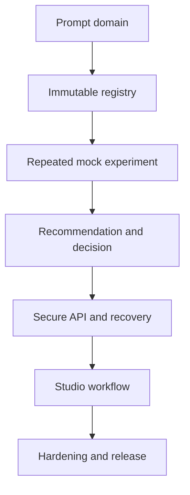

# Product Phase 3 — PromptOps Backlog & Sprint Plan

> **Project:** LLM Evaluation Framework (`llm-eval-kit`)  
> **Product increment:** Prompt Experimentation & Decision Support  
> **AIDLC stage:** 3 — Backlog & Test Design  
> **Status:** PROPOSED — OWNER REVIEW REQUIRED  
> **Date:** 2026-09-21  
> **Inputs:** Approved Product Phase 3 Stage 1 requirements and Stage 2 System Design/P3-ADR-001–012

## 1. Delivery strategy

Implementation uses vertical slices. Every sprint must execute a real user-visible or CLI workflow through the shared SDK and leave verifiable evidence. Package scaffolding, schemas, database tables, or UI placeholders alone do not satisfy a sprint outcome.



The v0.1 evaluation engine and Product Phase 2 Local Evaluation Studio remain green throughout.

## 2. Prioritization rules

1. Must stories on the critical path precede Should/Could work.
2. Prompt publication, experiment evidence, recommendation safety, and backward compatibility cannot be deferred.
3. SQLite never becomes evaluation truth; tasks that duplicate `run.json` evidence are rejected.
4. Default tests remain mock-first and cost USD 0.
5. Real-provider smoke is opt-in and never substitutes for deterministic release evidence.
6. Any architecture change requires a new ADR before task implementation.
7. A task enters a sprint only when Definition of Ready is satisfied.
8. Tasks are split when estimated above two ideal days.

## 3. Epics

| Epic | Goal | Requirements |
|---|---|---|
| P3-E1 — Prompt Domain & Safe Rendering | Define immutable prompt identity and safe deterministic rendering | P3-FR-001–006, 010–013; P3-NFR-001–004, 008–009 |
| P3-E2 — Local PromptOps Control Plane | Persist prompt and workflow state transactionally without replacing artifacts | P3-FR-001–007, 013–017, 022–023; P3-NFR-002–005, 007–008 |
| P3-E3 — Experiment Planning & Orchestration | Plan and execute bounded repeated prompt/model variants | P3-FR-007–017; P3-NFR-001, 005–009, 012 |
| P3-E4 — Evidence, Stability & Recommendation | Turn verified canonical runs into honest deterministic decision support | P3-FR-018–022; P3-NFR-001–002, 004, 006, 009 |
| P3-E5 — CLI/API & Recovery | Expose equivalent secure operations and recover interrupted local work | P3-FR-001–024; P3-NFR-003–005, 008–009, 012 |
| P3-E6 — PromptOps Studio Experience | Make publish, experiment, investigation, and decision workflows accessible | P3-FR-001–024; P3-NFR-003–004, 006, 009–010 |
| P3-E7 — Export, Hardening & Release | Prove compatibility, security, performance, portability, and portfolio value | P3-FR-023–024; all P3-NFR and acceptance criteria |

## 4. User stories

| Story | User outcome | Priority | Acceptance summary |
|---|---|---|---|
| P3-US-001 | As a maintainer, I add PromptOps without changing existing evaluation semantics | Must | Dependency rules and legacy characterization remain green |
| P3-US-002 | As an adapter author, I use pure PromptOps domain ports | Must | Domain imports no SQLite, HTTP, React, filesystem, or provider SDK |
| P3-US-003 | As a prompt author, I create a stable prompt and draft | Must | Valid identifiers, size bounds, initial revision, and metadata persist |
| P3-US-004 | As a prompt author, I edit a draft safely | Must | Expected revision prevents lost updates and errors are actionable |
| P3-US-005 | As a prompt author, I validate placeholders against a suite | Must | Unknown, undeclared, or missing data blocks publication/run planning |
| P3-US-006 | As a prompt author, I publish an immutable version | Must | Monotonic version and canonical SHA-256 are atomic and unchangeable |
| P3-US-007 | As a prompt author, I branch a new draft from a version | Should | Lineage is recorded without mutating the parent |
| P3-US-008 | As a reviewer, I inspect version history and hashes | Must | Draft and published lifecycle remain clearly distinct |
| P3-US-009 | As a local user, I retain PromptOps history across restarts | Must | SQLite migration/recovery opens valid history safely |
| P3-US-010 | As a maintainer, I receive safe failure on corrupt or incompatible storage | Must | Startup fails closed with backup/recovery guidance, not data loss |
| P3-US-011 | As an experiment author, I create a named experiment draft | Must | Identity, note, project, suite, and policy are versioned/validated |
| P3-US-012 | As an experiment author, I select 2–4 exact variants | Must | Each prompt/target tuple resolves to exact hashes; duplicates are rejected |
| P3-US-013 | As an experiment author, I choose 1–10 repetitions | Must | Plan expands to at most 40 stable ordered cells |
| P3-US-014 | As a cost-conscious user, I review a dry plan before execution | Must | Exact cells, upper bounds, policy, warnings, and unavailable cost are visible with zero provider calls |
| P3-US-015 | As a user, I execute the bundled repeated mock experiment | Must | Two variants × three repetitions produce six canonical artifacts at USD 0 |
| P3-US-016 | As a user, I observe one controlled active experiment | Must | Stable lifecycle, active cell, counts, correlation IDs, and terminal state are recoverable |
| P3-US-017 | As a user, I cancel without losing completed evidence | Should | New cells stop, active cell receives abort, completed artifacts remain |
| P3-US-018 | As a user, I resume only compatible partial work | Should | Exact plan/evidence validation reuses valid cells and blocks stale/tampered evidence |
| P3-US-019 | As an investigator, I see quality and critical-risk differences first | Must | New critical regressions and quality gates precede averages/charts |
| P3-US-020 | As an AI quality engineer, I measure repeated-run stability | Must | Coverage, dispersion, verdict agreement, and flaky cases are deterministic |
| P3-US-021 | As a project owner, I compare latency, tokens, and cost honestly | Must | Complete/partial/unavailable coverage is explicit and zero is never fabricated |
| P3-US-022 | As a reviewer, I receive a deterministic recommendation | Must | Only three approved states and ordered reason codes are produced |
| P3-US-023 | As a reviewer, I understand ties and insufficient evidence | Must | Policy precedence returns `NO_DECISION` instead of arbitrary winner |
| P3-US-024 | As a reviewer, I confirm or override with rationale | Must | Append-only decision binds to recommendation and current evidence hash |
| P3-US-025 | As a release owner, I keep baseline promotion explicit | Must | A decision alone cannot mutate an evaluation baseline |
| P3-US-026 | As a CLI user, I manage prompts with stable commands | Must | CLI and SDK prompt results/errors are semantically equivalent |
| P3-US-027 | As a CLI user, I plan, run, resume, inspect, decide, and export experiments | Must | Stable exit codes distinguish quality, invalid input, no decision, and internal failure |
| P3-US-028 | As a Studio client, I use versioned safe PromptOps API contracts | Must | Unknown fields/paths/secrets are rejected; mutations enforce CSRF/session controls |
| P3-US-029 | As a browser user, I manage drafts and publish versions accessibly | Must | Keyboard, validation, focus, lineage, and immutable states work |
| P3-US-030 | As a browser user, I build and observe a bounded experiment | Must | Plan, matrix progress, cancel, reconnect, and recovery are usable |
| P3-US-031 | As a reviewer, I investigate variants and linked runs | Must | Risk, stability, trade-offs, repetitions, flaky cases, and run evidence are accessible |
| P3-US-032 | As a reviewer, I record a decision and export evidence | Must | Rationale and evidence conflict behavior are explicit; JSON/Markdown agree |
| P3-US-033 | As a returning user, I search PromptOps history | Must | Paginated filters return safe prompt/experiment/decision summaries |
| P3-US-034 | As a recruiter, I complete the PromptOps portfolio story locally | Must | Publish → repeated experiment → risk-first recommendation → human decision completes without credentials |
| P3-US-035 | As a maintainer, I release a secure compatible PromptOps increment | Must | Security, migration, accessibility, performance, portability, parity, docs, and release gates pass |

## 5. Implementation tasks and sprint sequencing

### Sprint 11 — Prompt domain and compatibility foundation

| Task | Output | Stories | Evidence | Depends | Estimate |
|---|---|---|---|---|---:|
| P3-T001 | Raise runtime contract to Node `>=22.13.0`; scaffold `promptops` and `promptops-sqlite` packages | 001–002, 035 | Workspace build, engine/version and dependency-boundary tests | — | 0.75d |
| P3-T002 | Define prompt, experiment, recommendation, decision, port, and safe error domain types | 002, 011–024 | Type/API review and exhaustive enum tests | T001 | 1.25d |
| P3-T003 | Implement canonical JSON and SHA-256 golden contract | 006, 012, 018, 024 | Cross-platform golden vectors and mutation tests | T002 | 1.0d |
| P3-T004 | Implement restricted placeholder tokenizer/parser and size limits | 005 | Grammar, injection, malformed-token and boundary tests | T002 | 1.25d |
| P3-T005 | Implement pure suite-aware validation and prompt renderer | 005, 015 | Missing/unknown/optional variable and render golden tests | T004 | 1.5d |
| P3-T006 | Add optional runner request-renderer port and existing `promptHash` population | 001, 015 | Legacy/default characterization plus rendered mock run | T003, T005 | 1.5d |
| P3-T007 | Define versioned PromptOps API/export/problem/event schemas | 028, 032 | Strict Zod contract and compatibility tests | T002 | 1.25d |
| P3-T008 | Add golden prompt, plan, flaky-run, tamper, and secret-canary fixtures | 001, 034–035 | Fixture validation and no-secret baseline | T003–T007 | 1.0d |

**Sprint outcome:** Existing workflows remain unchanged, while a pure published prompt can safely render a mock evaluation request and place its hash in canonical `run.json`.

### Sprint 12 — SQLite and immutable prompt lifecycle

| Task | Output | Stories | Evidence | Depends | Estimate |
|---|---|---|---|---|---:|
| P3-T009 | Implement contained SQLite composition, pragmas, lifecycle, and in-memory test factory | 009–010 | Open/close/path/pragma tests | T001–T002 | 1.25d |
| P3-T010 | Implement checksummed forward migrations, backup, and startup integrity checks | 009–010 | Fresh/upgrade/interrupted/checksum/corrupt tests | T009 | 1.75d |
| P3-T011 | Create strict prompt/draft/version schema and repository mappings | 003–010 | Repository contract, constraints, pagination tests | T009–T010 | 1.5d |
| P3-T012 | Implement create/save draft with optimistic revision | 003–005 | Lost-update, validation, size, rollback tests | T011, T004–T005 | 1.25d |
| P3-T013 | Implement atomic publish, monotonic version, duplicate-hash guard, and lineage | 006–008 | Immutability, concurrency, rollback, lineage tests | T003, T011–T012 | 1.5d |
| P3-T014 | Implement shared SDK prompt application facade | 003–008 | In-memory/SQLite adapter contract parity | T011–T013 | 1.0d |
| P3-T015 | Add `prompt` CLI commands and stable error/exit behavior | 026 | CLI snapshot/E2E over temporary database | T014 | 1.5d |
| P3-T016 | Add secure prompt API endpoints and prompt-service integration tests | 028 | Host/origin/CSRF/revision/XSS/secret tests | T007, T014 | 1.5d |

**Sprint outcome:** A prompt can be created, edited, validated, published immutably, listed, and inspected through the same SDK from CLI and API; state survives restart.

### Sprint 13 — Experiment planning and repeated mock execution

| Task | Output | Stories | Evidence | Depends | Estimate |
|---|---|---|---|---|---:|
| P3-T017 | Create experiment/variant/cell schema, repositories, and state transitions | 011–013, 016 | Constraint/CAS/lifecycle repository tests | T009–T010, T002 | 1.5d |
| P3-T018 | Implement project/suite/fixture/target resolution and compatibility hash | 012–014 | Drift, duplicate, safe-ID and golden hash tests | T003, T007–T008 | 1.5d |
| P3-T019 | Implement plan validation, 2–4/1–10 bounds, cell expansion, and plan hash | 011–014 | Boundary, order, maximum-40, zero-call tests | T017–T018 | 1.5d |
| P3-T020 | Implement `createPromptOpsApplication` orchestration facade | 011–016, 026–028 | Port fake/integration and application contract tests | T006, T014, T017–T019 | 1.5d |
| P3-T021 | Implement sequential cell claim/scheduler and one-active-experiment guard | 015–016 | Order, conflict, retry ownership, budget tests | T017, T020 | 1.5d |
| P3-T022 | Implement artifact write/load/hash verification bridge | 015, 018 | Atomic write, parse, hash, containment, tamper tests | T003, T006, T021 | 1.25d |
| P3-T023 | Implement cooperative experiment cancellation and partial state | 017 | Abort propagation, no-new-cell, partial artifact tests | T021–T022 | 1.25d |
| P3-T024 | Deliver CLI two-variant × three-repetition mock vertical slice | 015–018, 027, 034 | Six canonical artifacts, stable lifecycle, USD 0 E2E | T015, T019–T023 | 1.5d |

**Sprint outcome:** The CLI plans and executes the bundled repeated mock experiment through the real engine, producing six verified canonical artifacts with safe partial/cancel behavior.

### Sprint 14 — Stability, recommendation, decision, and export

| Task | Output | Stories | Evidence | Depends | Estimate |
|---|---|---|---|---|---:|
| P3-T025 | Implement verified evidence-set loader and evidence hash | 018–021, 024 | Missing/stale/order/hash golden tests | T022 | 1.25d |
| P3-T026 | Implement repetition coverage, pass-rate distribution, and verdict agreement | 019–020 | Golden/property/rounding tests | T025 | 1.5d |
| P3-T027 | Implement flaky-case detection and deterministic nearest-rank quantiles | 020–021 | Deliberate flaky fixture and quantile edge tests | T025–T026 | 1.25d |
| P3-T028 | Implement availability-aware latency/token/cost aggregates | 021 | Full/partial/unavailable/zero distinction tests | T025–T027 | 1.25d |
| P3-T029 | Implement recommendation policy v1 precedence and reason codes | 019–023 | Every `NO_DECISION`/`KEEP_BASELINE`/promotion branch | T026–T028 | 1.75d |
| P3-T030 | Implement eligible-candidate ranking, tie handling, and policy hashing | 022–023 | Rank axes, unavailable axis, exact tie tests | T029, T003 | 1.25d |
| P3-T031 | Implement append-only human decisions and guarded promotion handoff | 024–025 | Accept/override/rationale/stale evidence/no-auto-write tests | T017, T025, T029–T030 | 1.5d |
| P3-T032 | Implement versioned JSON export and deterministic safe Markdown projection | 032 | Golden parity, escaping, redaction, linked-artifact tests | T025–T031, T007 | 1.5d |

**Sprint outcome:** Verified repeated evidence produces deterministic stability/trade-off metrics, one safe recommendation, an append-only human decision, and equivalent JSON/Markdown evidence.

### Sprint 15 — Secure experiment API, progress, history, and recovery

| Task | Output | Stories | Evidence | Depends | Estimate |
|---|---|---|---|---|---:|
| P3-T033 | Add experiment draft/plan/start/cancel/snapshot endpoints | 011–018, 028 | Strict API contract, state, zero-call and CSRF tests | T007, T020–T024 | 1.75d |
| P3-T034 | Add server experiment registry and startup reconciliation | 009–010, 016, 018 | Restart, orphaned RUNNING cell, conflict tests | T017, T021–T023 | 1.5d |
| P3-T035 | Add safe bounded experiment SSE, replay, heartbeat, and snapshot fallback | 016–017, 030 | Ordering, reconnect, gap, payload-canary tests | T007, T033–T034 | 1.5d |
| P3-T036 | Implement resume reconciliation for valid, missing, invalid, and tampered artifacts | 018 | Exact reuse/block/new-plan tests | T022, T025, T034 | 1.5d |
| P3-T037 | Add recommendation and human-decision endpoints with evidence conflicts | 022–025, 028, 032 | Policy/evidence/rationale/conflict API tests | T029–T031, T033 | 1.25d |
| P3-T038 | Add paginated prompt/experiment/decision history queries | 008, 033 | Filter, cursor/order, bound, restart tests | T011, T017, T031 | 1.25d |
| P3-T039 | Add allowlisted JSON/Markdown export endpoints | 032 | Content type/disposition/redaction/path tests | T032–T033 | 0.75d |
| P3-T040 | Complete API/SQLite threat and fault suite with remediation | 010, 028, 035 | SQL/path/symlink/body/lock/corruption/secret tests | T009–T039 | 1.75d |

**Sprint outcome:** The loopback API securely runs, streams, cancels, resumes, investigates, decides, and exports PromptOps work across process restarts.

### Sprint 16 — PromptOps Studio workflow

| Task | Output | Stories | Evidence | Depends | Estimate |
|---|---|---|---|---|---:|
| P3-T041 | Add PromptOps routes, typed client hooks, navigation, and error boundaries | 028–033 | Route/contract/loading/error component tests | T007, T016, T033–T039 | 1.25d |
| P3-T042 | Implement prompt registry/detail/editor/version-lineage screens | 029 | Validation, revision conflict, XSS, keyboard tests | T016, T041 | 1.75d |
| P3-T043 | Implement publish confirmation, immutable state, and focus recovery | 029 | Publish/duplicate/stale revision accessibility E2E | T042 | 1.0d |
| P3-T044 | Implement experiment builder, variant tuples, repetitions, dry plan, and warnings | 030 | 2/4, 1/10, unavailable cost, zero-call component/E2E | T033, T041 | 1.75d |
| P3-T045 | Implement live matrix, active cell, SSE reconnect, cancel, and recovery UX | 030 | Progress/cancel/refresh/restart E2E | T035–T036, T041, T044 | 1.75d |
| P3-T046 | Implement risk-first experiment result and stability/trade-off presentation | 031 | Critical-first, flaky, unavailable, table/chart equivalence tests | T037, T041 | 1.75d |
| P3-T047 | Implement variant/repetition detail with links to canonical run/case views | 031 | Link, missing artifact, redaction, keyboard tests | T038, T041, T046 | 1.25d |
| P3-T048 | Implement decision review, rationale, conflict, history, and export UX | 032–033 | Accept/override/defer/export/history E2E | T037–T039, T041, T046 | 1.75d |
| P3-T049 | Deliver accessible bundled PromptOps portfolio journey | 029–035 | Publish → 2×3 run → recommendation → decision Playwright E2E | T042–T048 | 1.5d |

**Sprint outcome:** A keyboard user can publish a candidate, run the repeated mock experiment, inspect critical/stability/cost evidence, and record/export a human decision.

### Sprint 17 — Hardening and release candidate

| Task | Output | Stories | Evidence | Depends | Estimate |
|---|---|---|---|---|---:|
| P3-T050 | Prove CLI/SDK/API/Studio semantic parity | 001, 026–028, 035 | Normalized parity matrix | All functional tasks | 1.5d |
| P3-T051 | Run and remediate full v0.1/Product Phase 2 compatibility suite | 001, 035 | Existing CLI/Studio/artifact/baseline evidence | All functional tasks | 1.25d |
| P3-T052 | Complete migration, crash, lock, corruption, artifact-tamper, and backup recovery matrix | 009–010, 018, 035 | Fault-injection execution evidence | T010, T034, T036, T040 | 1.5d |
| P3-T053 | Meet plan/history/result/SSE performance and memory budgets | 016, 020–021, 033, 035 | Maximum 40-cell and history benchmarks | T035, T038, T045–T048 | 1.25d |
| P3-T054 | Complete WCAG 2.2 AA remediation and manual keyboard/zoom review | 029–035 | axe plus manual accessibility record | T042–T049 | 1.5d |
| P3-T055 | Verify Node 22.13+/24, Linux/macOS, Chromium/Firefox portability | 009, 034–035 | Runtime/OS/browser matrix | T001, T049–T054 | 1.25d |
| P3-T056 | Complete security, dependency, secret, and data-retention review | 028, 032, 035 | Threat gate, audit and canary evidence | T040, T049–T055 | 1.25d |
| P3-T057 | Write quick start, PromptOps architecture, recovery, limitation, and demo documentation | 034–035 | Timed fresh-clone documentation review | T050–T056 | 1.0d |
| P3-T058 | Execute release-candidate verification and record Sprint 11–17 evidence | 034–035 | Full release gate, artifacts, checksums, execution records | T050–T057 | 1.25d |

**Sprint outcome:** A secure, accessible, reproducible PromptOps release candidate with complete compatibility, migration, recovery, performance, and portfolio evidence.

## 6. Estimates and timeline

| Sprint | Focus | Ideal estimate | Full-time target |
|---|---|---:|---|
| 11 | Domain and compatibility | 9.5 days | Weeks 1–2 |
| 12 | SQLite and prompt lifecycle | 11.25 days | Weeks 2–4 |
| 13 | Planning and repeated execution | 11.5 days | Weeks 4–6 |
| 14 | Aggregation and decision | 11.25 days | Weeks 6–8 |
| 15 | API and recovery | 11.25 days | Weeks 8–10 |
| 16 | Studio workflow | 13.75 days | Weeks 10–13 |
| 17 | Hardening and release | 11.75 days | Weeks 13–15 |
| **Total** |  | **80.25 ideal days** | **Approximately 14–17 weeks full-time** |

At 15–20 hours/week, plan approximately 30–40 weeks. Estimates are risk allowances, not deadlines.

### Portfolio-fast path

The first strong portfolio milestone ends at Sprint 14: CLI prompt publication, a repeated 2×3 mock experiment, stability analysis, deterministic recommendation, human decision, and exports. Sprint 15–17 remain mandatory for the final Product Phase 3 release; they are not silently removed.

## 7. Critical path

```text
T001 → T002 → T003 → T004 → T005 → T006 → T009 → T010 →
T011 → T012 → T013 → T014 → T017 → T018 → T019 → T020 →
T021 → T022 → T024 → T025 → T026 → T029 → T030 → T031 →
T032 → T033 → T034 → T035 → T036 → T037 → T041 → T044 →
T045 → T046 → T048 → T049 → T050 → T051 → T056 → T058
```

## 8. Definition of Ready

A task may start only when:

- story, requirements, ADRs, acceptance behavior, and test IDs are linked;
- success, validation, boundary, operational failure, and recovery states are explicit;
- schema/API/database changes have reviewed compatibility and migration behavior;
- data classification states whether content belongs in SQLite, artifact, log, API, browser, and export;
- prompt-template work includes injection and missing-variable cases;
- recommendation work includes precedence, unavailable metrics, tie, and stale-evidence cases;
- UI work includes keyboard, focus, loading, empty, error, conflict, responsive, and reduced-motion behavior;
- fixture and evidence strategy exists without paid credentials;
- estimate is at most two ideal days or task is split;
- dependency tasks are merged and green; and
- no unresolved decision can change package, persistence, security, or evidence architecture.

## 9. Definition of Done

- Implementation matches approved requirements and P3-ADR-001–012.
- The vertical sprint outcome is demonstrable through real SDK composition.
- Unit, contract, repository, migration, integration, CLI, API, component, and relevant browser tests pass.
- Existing CLI, Studio, artifact schema, baseline, quality-gate, and redaction behavior remain green.
- `run.json` remains canonical; SQLite contains no forbidden raw generation/evaluator/case payload.
- Negative, boundary, cancellation, restart, stale/tamper, and security paths are covered where relevant.
- Recommendation reason branches are explicitly tested; aggregate coverage cannot hide missing policy behavior.
- UI changes meet keyboard/focus/labels/contrast/reduced-motion requirements.
- No secret, absolute path, raw stack, SQL, unsafe HTML, rendered case prompt, or raw response appears in unsafe evidence.
- Global statements, branches, functions, and lines remain at least 80%.
- Format, lint, typecheck, build, dependency audit, secret scan, and required CI pass.
- Documentation, traceability, migrations, recovery notes, and execution record are updated.
- Changes are reviewed and merged through protected workflow.

## 10. Sprint quality gates

| Gate | Every sprint | Release-only additions |
|---|---|---|
| Static | Format, lint, typecheck, build, dependency boundaries | Clean production package and license review |
| Automated | Unit/contract/integration and relevant CLI/API/UI E2E | Full browser/runtime/OS, fault, performance, accessibility matrix |
| Coverage | Global ≥80%; critical new branches explicitly exercised | No accepted critical branch gap |
| Security | Secret canary, safe errors, no unsafe paths/content | Full threat suite, audit, tracked-secret scan |
| Compatibility | Existing affected workflows and artifacts | Full v0.1 + Product Phase 2 matrix |
| Evidence | Actual commands, artifacts, hashes, failures, remediation | Release checklist and Sprint 11–17 execution record completeness |

Critical or High defects block sprint exit. Medium defects require an owner, rationale, and explicit deferral. Low cosmetic defects may be deferred without changing decision semantics.

## 11. AI-assisted implementation protocol

AI may implement only an approved Ready task. For every task:

1. cite task/story/requirement/ADR/test IDs in the working plan;
2. inspect current contracts, migrations, and characterization tests first;
3. implement the smallest vertical behavior;
4. add negative, boundary, and fault tests before claiming completion;
5. never relax thresholds, schema strictness, redaction, or security to make a test pass;
6. never invent a provider, performance, accessibility, security, or migration result;
7. run targeted tests, then the relevant full gates;
8. review generated UI for accessibility and generic dashboard artifacts;
9. update traceability and execution evidence from actual outputs; and
10. stop for human review on architecture, migration, recommendation, security, or promotion-policy changes.

## 12. Release strategy

- Recommended version: `v0.3.0` because PromptOps adds persistent domain state, new SDK/API/CLI surfaces, and a material Studio workflow.
- The default release remains local-only, single-user, mock-first, and free.
- SQLite files and reports are runtime data and must not be committed.
- Release evidence includes canonical mock runs, experiment export, migration/recovery results, threat/accessibility/performance reports, and checksums.
- Optional real-provider smoke is separately labelled with explicit budget and never blocks deterministic release.
- No hosted service, authentication, autonomous optimization, RAG, agent testing, or GitHub App is implied.

## 13. Stage gate

**Status:** `PENDING OWNER REVIEW`

No Product Phase 3 implementation is authorized by this backlog. Stage 3 passes only after the project owner approves the stories, 58 tasks, test strategy/specifications, traceability matrix, Definition of Ready/Done, quality gates, estimates, and Sprint 11–17 sequencing.
