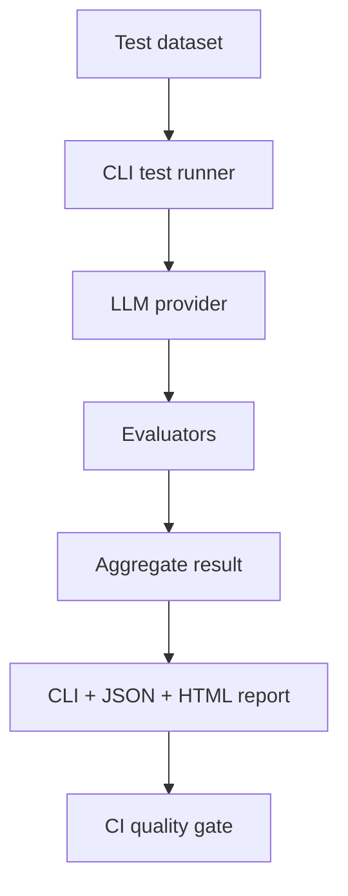
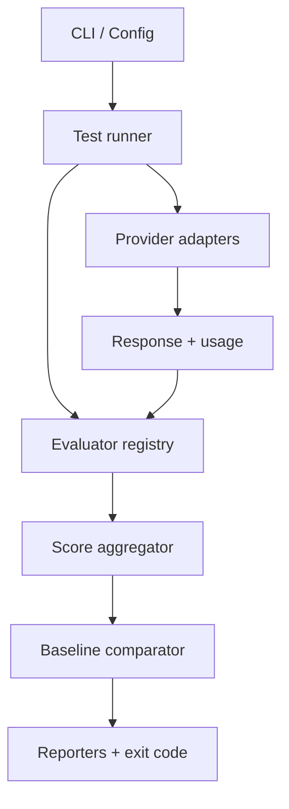

# LLM Evaluation Framework — Prototype Specification

> **Document status:** Baseline v0.1  
> **Date:** 2026-09-14  
> **Product type:** Open-source portfolio project / AI Quality Engineering tool  
> **Working positioning:** *Playwright for LLM Quality*

## 1. Product vision

Xây dựng một framework bằng TypeScript để kiểm thử, benchmark và phát hiện regression trong các ứng dụng sử dụng Large Language Model (LLM).

Framework biến việc đánh giá câu trả lời AI từ hoạt động thủ công, khó lặp lại thành một quy trình có:

- test dataset có cấu trúc;
- tiêu chí đánh giá có thể cấu hình;
- kết quả `PASS`, `FAIL`, `WARNING` kèm bằng chứng;
- so sánh baseline với candidate;
- quality gate cho CI/CD;
- theo dõi chất lượng, latency, token usage và chi phí.

## 2. Vấn đề cần giải quyết

Output của phần mềm truyền thống thường có thể so sánh trực tiếp với expected result. Output của LLM không deterministic: hai câu trả lời khác nhau vẫn có thể cùng đúng, và một câu nghe tự nhiên vẫn có thể sai chính sách hoặc bịa thông tin.

Các team đang phát triển chatbot, RAG hoặc AI agent thường gặp bốn vấn đề:

1. Không biết prompt mới có thực sự tốt hơn prompt cũ.
2. Không có regression suite đủ ổn định để chặn thay đổi gây giảm chất lượng.
3. Manual review tốn thời gian và không scale khi số lượng test case tăng.
4. Chọn model dựa trên cảm giác thay vì dữ liệu về quality, cost và latency.

## 3. Đối tượng sử dụng

| Persona | Mục tiêu chính |
|---|---|
| QA / AI Quality Engineer | Thiết kế evaluation cases, chạy regression và phân tích failure |
| Prompt Engineer | So sánh prompt versions và xác định regression |
| AI/Application Developer | Kiểm tra thay đổi model, prompt, RAG hoặc business logic trước khi merge |
| Engineering Lead | Đặt quality gate và quyết định release dựa trên dữ liệu |
| Product Owner | Theo dõi chất lượng, rủi ro và ROI của tính năng AI |

## 4. Giá trị cốt lõi

Framework phải trả lời được năm câu hỏi:

1. Câu trả lời có đúng và bám vào context không?
2. Model có làm đúng instruction và business rule không?
3. Thay đổi hiện tại tốt hơn hay kém hơn baseline?
4. Chất lượng đạt được có xứng đáng với cost và latency không?
5. Có failure nghiêm trọng nào cần chặn deployment không?

## 5. Use cases chính

### 5.1 Prompt regression testing

Chạy cùng một dataset với prompt baseline và prompt candidate. Framework so sánh pass rate, category scores, hallucination/groundedness failure, latency và cost; sau đó fail quality gate nếu regression vượt threshold.

### 5.2 Model benchmarking

Chạy cùng prompt và dataset trên nhiều model/provider để đánh giá quality–cost–latency trade-off.

### 5.3 Customer-support AI

Kiểm tra factual accuracy, groundedness, policy compliance, tone và instruction following đối với chatbot hỗ trợ khách hàng.

### 5.4 RAG evaluation

Phân tách lỗi retrieval và generation bằng các metric như context relevance, context coverage, answer relevance và groundedness.

### 5.5 AI agent testing — hướng mở rộng

Kiểm tra tool selection, forbidden actions, task completion và safety. Chức năng này không thuộc MVP.

## 6. User flow của MVP



Luồng sử dụng:

1. Người dùng tạo test case bằng JSON/YAML.
2. Người dùng chọn prompt, model, evaluator và threshold trong config.
3. CLI gọi model, thu response, latency, token usage và estimated cost.
4. Evaluators chấm response theo các rule của từng test case.
5. Aggregator tạo verdict ở cấp evaluator, test case, category và test run.
6. Reporter sinh kết quả cho terminal, JSON và HTML.
7. Process trả exit code khác `0` nếu quality gate thất bại để chặn CI.

## 7. Phạm vi MVP v0.1

### In scope

- CLI chạy evaluation suite cục bộ và trong GitHub Actions.
- Dataset ở định dạng JSON hoặc YAML, được validate trước khi chạy.
- Provider adapters cho OpenAI và Gemini.
- Mock provider để test framework mà không gọi API thật.
- Evaluators:
  - exact match;
  - contains / must-not-contain;
  - regular expression;
  - JSON Schema;
  - LLM-as-a-Judge cho relevance, groundedness và instruction following.
- Severity: `LOW`, `MEDIUM`, `HIGH`, `CRITICAL`.
- Retry có kiểm soát cho lỗi mạng/rate limit; không retry assertion failure.
- Thu thập latency, tokens và estimated cost.
- Report: terminal, JSON và HTML tĩnh.
- Baseline comparison và regression threshold.
- CI quality gate với exit code rõ ràng.
- Secrets chỉ lấy từ environment variables; không ghi API key vào report/log.

### Out of scope của MVP

- Web dashboard và user authentication.
- Database server hoặc multi-user workspace.
- Visual prompt editor.
- Human-review UI hoàn chỉnh.
- Vector database và retrieval pipeline nội bộ.
- AI agent/tool execution.
- Fine-tuning hoặc training model.
- Production SaaS, billing và tenant isolation.

## 8. Cấu trúc test case đề xuất

```yaml
id: REFUND_001
name: Reject return request after policy window
category: refund_policy
severity: CRITICAL

input:
  user: "I bought this product 20 days ago. Can I return it?"
  context: "Customers can return products within 14 days of purchase."

expected:
  behavior: "Politely reject the return request and mention the 14-day policy."
  must_contain:
    - "14 days"
  must_not_contain:
    - "30 days"

evaluators:
  - type: contains
  - type: must_not_contain
  - type: llm_judge
    criteria:
      - groundedness
      - instruction_following

thresholds:
  minimum_score: 0.90
```

## 9. Kết quả chạy đề xuất

```json
{
  "runId": "run_20260914_001",
  "testId": "REFUND_001",
  "model": "provider/model-name",
  "verdict": "FAIL",
  "severity": "CRITICAL",
  "scores": {
    "groundedness": 0.42,
    "instructionFollowing": 0.93
  },
  "failures": [
    {
      "evaluator": "must_not_contain",
      "reason": "Response contains forbidden claim: 30 days"
    }
  ],
  "usage": {
    "latencyMs": 1280,
    "inputTokens": 120,
    "outputTokens": 54,
    "estimatedCostUsd": 0.0008
  }
}
```

## 10. Evaluation policy

Các deterministic evaluator luôn có độ ưu tiên cao hơn LLM-as-a-Judge khi cùng kiểm tra một business rule cụ thể.

### Verdict ở cấp test case

- `FAIL`: bất kỳ required deterministic check nào fail; hoặc weighted score thấp hơn threshold.
- `WARNING`: score nằm trong vùng cần human review hoặc judge confidence thấp.
- `PASS`: mọi required check pass và score đạt threshold.
- `ERROR`: provider/evaluator không tạo được kết quả hợp lệ sau số lần retry cho phép.

### Quality gate mặc định

- Bất kỳ test case `CRITICAL` nào fail → block.
- Overall pass rate dưới 90% → block.
- Một category giảm hơn 3 percentage points so với baseline → block.
- Error rate của provider/evaluator trên 2% → run không hợp lệ, block.
- Không được dùng overall average để che giấu failure ở category quan trọng.

Threshold phải cấu hình được theo project và category.

## 11. Kiến trúc logical



Các module dự kiến:

| Module | Trách nhiệm |
|---|---|
| `core` | Test orchestration, types, lifecycle và error model |
| `providers` | Chuẩn hóa cách gọi OpenAI, Gemini và mock provider |
| `evaluators` | Rule-based checks và LLM-as-a-Judge |
| `scoring` | Aggregate score, severity và verdict |
| `baseline` | So sánh candidate với kết quả chuẩn |
| `reporters` | Terminal, JSON và HTML report |
| `cli` | Commands, config loading và exit code |

## 12. Tech stack đã chọn cho MVP

| Thành phần | Lựa chọn |
|---|---|
| Language/runtime | TypeScript, Node.js 22 LTS |
| Package management | pnpm workspace |
| Validation | Zod + JSON Schema/Ajv |
| Automated tests | Vitest |
| CLI | Commander.js |
| Logging | Pino |
| HTML report | Static HTML generated từ run result |
| CI | GitHub Actions |
| Packaging | Docker sau khi CLI flow ổn định |

MVP không dùng database. Dataset, baseline và reports là file-based để giảm thời gian triển khai và giữ framework dễ chạy trong CI.

## 13. CLI prototype

```bash
# Validate dataset và configuration
pnpm llmeval validate --config llmeval.config.ts

# Chạy evaluation suite
pnpm llmeval run --suite datasets/customer-support.yaml

# So sánh với baseline
pnpm llmeval run \
  --suite datasets/customer-support.yaml \
  --baseline baselines/customer-support.json

# Ghi nhận run hiện tại làm baseline mới
pnpm llmeval baseline save --run reports/run_20260914_001.json
```

## 14. ROI và success metrics

### ROI model

```text
ROI = (Lợi ích quy đổi - Chi phí xây dựng và vận hành) / Chi phí × 100%
```

Lợi ích cần đo:

- số giờ manual review tiết kiệm mỗi release;
- số regression được phát hiện trước production;
- thời gian từ prompt change đến quyết định release;
- chi phí giảm được khi chọn model có quality/cost tốt hơn;
- số incident hoặc bad responses có thể tránh được.

### KPI mục tiêu cho bản portfolio

| KPI | Mục tiêu |
|---|---:|
| Reproducible sample cases | ≥ 50 |
| Evaluator types | ≥ 5 |
| Provider adapters | 2 real + 1 mock |
| Automated test coverage cho core logic | ≥ 80% |
| Local run success without paid API | 100% bằng mock provider |
| Baseline regression detection | Có demo pass và fail rõ ràng |
| CI quality gate | Tự động block một PR mẫu |
| Secret leakage trong logs/reports | 0 |

## 15. Demo scenario chính

1. Baseline prompt trả đúng chính sách đổi trả 14 ngày.
2. Candidate prompt tạo câu trả lời tự nhiên hơn nhưng bịa chính sách 30 ngày.
3. Overall score có thể vẫn cao, nhưng test `REFUND_001` là `CRITICAL` và groundedness fail.
4. Framework hiển thị affected tests, metric regression và cost/latency delta.
5. GitHub Actions trả trạng thái failed và chặn merge.

Scenario này chứng minh rõ giá trị AI Quality Engineering thay vì chỉ chứng minh khả năng gọi LLM API.

## 16. Các giai đoạn sau MVP

### v0.2

- semantic similarity;
- concurrent execution và rate-limit budget;
- prompt/model matrix benchmarking;
- richer cost configuration;
- flakiness detection qua repeated runs.

### v0.3

- GitHub PR annotations;
- baseline history;
- category trend;
- human-review queue dạng file/export.

### v1.0

- React dashboard;
- persistent database;
- human-in-the-loop workflow;
- role-based access;
- RAG và AI-agent evaluation plugins.

## 17. Nguyên tắc sản phẩm

1. Evidence trước score: mọi failure phải có lý do có thể điều tra.
2. Deterministic trước probabilistic: business rule rõ ràng không giao hoàn toàn cho AI judge.
3. Critical risk trước average: một lỗi nghiêm trọng không được hòa tan trong điểm trung bình.
4. Reproducible by default: config, dataset, model và prompt version phải được lưu trong run metadata.
5. Human-in-the-loop khi confidence thấp: framework hỗ trợ quyết định của con người, không giả định judge luôn đúng.

## 18. Định nghĩa hoàn thành prototype

Prototype được xem là đủ rõ để chuyển sang system design khi:

- product vision và target users được chấp nhận;
- phạm vi MVP và out-of-scope không còn mâu thuẫn;
- evaluation policy có verdict và quality gate rõ ràng;
- demo scenario có thể triển khai bằng test data cụ thể;
- stack kỹ thuật và giới hạn file-based của MVP được chấp nhận;
- acceptance criteria của AIDLC Phase 1 được duyệt.

---

Tài liệu này là baseline sản phẩm. Mọi thay đổi phạm vi phải được ghi bằng decision record và cập nhật version của tài liệu.
